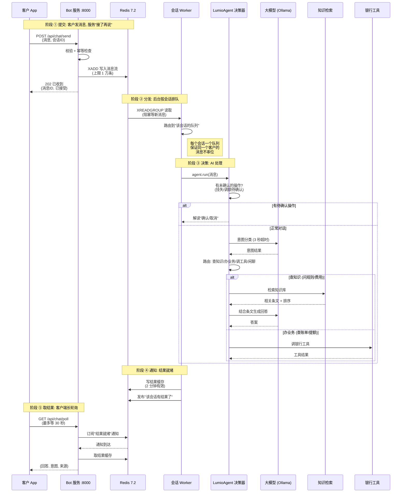
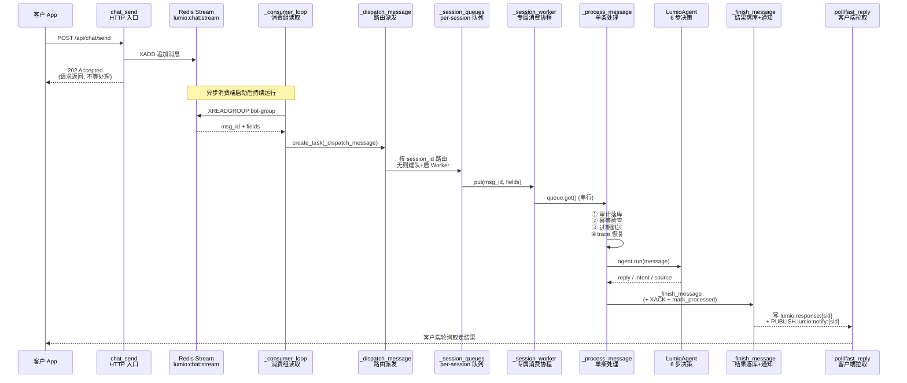
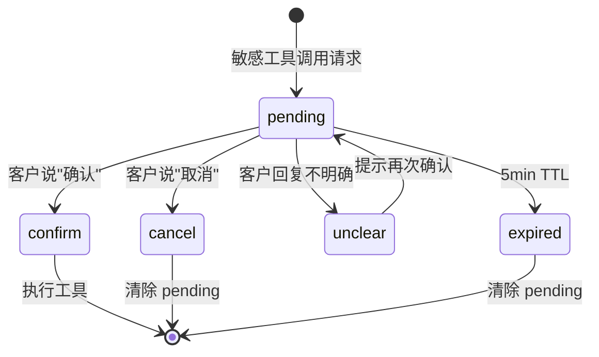

# 第 3 章: Bot 自助问答

> 本章深入 Lumio Bot 自助问答服务的全链路设计. Bot 是 Lumio 流量最大的服务, 银行客户日均百万级对话都从这里开始.

**先讲个业务场景**: 一位客户深夜给银行打电话想问"上个月账单多少钱". 系统要做的不是"接电话", 而是三件事:
1. **立刻告诉客户"收到"** — 不能让他对着电话干等
2. **后台慢慢算** — 查账单、翻历史、调模型, 可能花 2~5 秒
3. **算完主动通知** — 客户不用一直占着线路

这就是本章的核心矛盾: **对话是"一问一答"的同步交互, 但 AI 处理是"多步流水线"的异步计算**. 怎么把两者接起来, 还要扛住百万级并发、不能让一条消息丢、不能让同一个客户的几句话乱序——就是 Bot 服务要解决的全部问题.

看完本章你会理解: 消息怎么"接了再说" (异步入口), 怎么保证"不丢不乱" (Redis Stream + per-session Worker), 整条消息处理流 (3.4 完整路径) 怎么从 HTTP 一路走到结果回写, `LumioAgent` 怎么 6 步决策, 工具调用怎么等客户确认, LLM 挂了怎么仍服务客户.

## 3.1 全链路时序图

### 3.1.1 先看图: 一次完整对话的 5 个阶段



### 3.1.2 逐阶段解读 (对应刚才的银行场景)

**阶段 ① 提交 — "接了再说"**
客户发"上个月账单多少钱", 服务**只做登记就返回"已收到"**, 不现场算. 就像银行柜台的叫号机: 先取号, 再等叫号, 而不是堵在柜台前等业务办完. 好处: 请求瞬间返回, 服务能同时收下海量消息, 不被最慢的一次 AI 调用拖住.

**阶段 ② 分发 — "按号排队"**
后台有个"叫号员" (Consumer Group, 机制见 3.3.1) 把消息从 Redis 里读出来, 按客户会话分到各自的队列. **每个会话一个队列、一个处理员** — 这是全章最重要的一句话: 同一个客户连发的 10 条消息, 处理顺序和发送顺序完全一致, 不会出现"第 3 条先被回答、第 2 条后到"的乱序事故.

**阶段 ③ 决策 — "AI 开始干活"**
`LumioAgent` 决策器先看两件事: ① 这个会话有没有**挂着没确认的操作** (比如上轮要办挂失, 等客户说"确认") — 有就先处理确认; ② 没有的话, 先判断客户想干嘛 (查知识 / 办业务 / 闲聊), 再分派给对应流程. 查知识 = 去知识库检索条文 + 让大模型组织语言; 办业务 = 调银行工具 (但敏感操作只"提议", 等客户点头才真办).

**阶段 ④ 通知 — "算好了, 喊你"**
结果写进 Redis 缓存 (2 分钟有效), 同时广播一声"这个会话有结果了". 像奶茶店做好了一杯, 喊号让顾客来取.

**阶段 ⑤ 取结果 — "客户来取"**
客户端在等的时候, 不是干等, 而是每 30 秒问一次"好了吗" (长轮询). 听到广播立刻取走结果. 为什么用"轮询"而不是"服务器主动推"? 因为 HTTP 长轮询实现简单、兼容性好、银行内网防火墙友好 — 不需要维护常驻的 WebSocket 连接 (WS 通道在 ws_router.py 有独立实现, 属于增强项).

### 3.1.3 为什么这 5 步能扛住百万并发

| 环节 | 解决什么问题 | 代价 |
|---|---|---|
| 异步提交 (202) | 请求不阻塞, 吞吐量大 | 客户端要多一步"取结果" |
| 消息流 + 消费组 | 多实例共享消费, 单条消息不丢 | 要处理"重复投递" (见 3.3) |
| 每会话一个队列 | 同客户消息有序 | 每个活跃会话占一个协程 |
| 结果缓存 + 广播 | 客户端不用重复查询 | 缓存要设 TTL 防堆积 |
| 长轮询 | 兼容性好, 无需常驻连接 | 最多等 30 秒, 超时要重试 |

## 3.2 入口: `POST /api/chat/send`

**业务背景**: 客户点了"发送", 前端把消息交给这个接口. 接口的职责只有一句话 — **确认收到, 别让客户等**. 它不做任何"思考": 不分类、不检索、不调模型. 这些全部交给后台异步完成.

`agent/lumio/services/bot/router.py:951` `chat_send` 端点是整个 Bot 服务的入口. 它**不直接处理**消息, 只做两件事: 写 Redis Stream + 立即返回 202.

```python
# 简化版, 完整实现见 router.py:951-1018
@router.post("/api/chat/send")
async def chat_send(body: ChatSendRequest, request: Request) -> dict:
    """异步入口: 写 Stream + 立即返回 202"""
    # 1. 校验 (max_length=2000)
    if len(body.message) > 2000:
        raise DocumentFormatError("消息超过 2000 字符", code=2003)

    # 2. 幂等性检查 (按 request_id)
    # 3. 写 Redis Stream
    msg_id = await redis.xadd(
        "lumio:chat:stream",
        {"session_id": body.session_id, "message": body.message,
         "customer_id": body.customer_id, "request_id": body.request_id},
        maxlen=10000,  # 流最大长度, 防止 Redis 内存爆
    )
    return {"accepted": True, "request_id": body.request_id, "msg_id": msg_id}
```

**关键设计**: 立即返回 202, 不等处理. 客户端接着用 `GET /api/chat/poll` 长轮询结果. 这是**异步 API 模式** — 银行场景下, 客户电话打过来, 客服系统提交后立刻知道"已收到", 不阻塞前端.

**这个"写消息流"的动作意味着什么**: Redis Stream 里的每条消息都带着客户 ID、会话 ID、内容, 像银行柜台的一叠业务单据. 后续任何一个 Worker 实例都能从单据堆里取走处理 — 这就是 Bot 服务可以水平扩展的基础: 加机器 = 加处理员, 单据不会丢.

### 3.2.1 客户端幂等 (双击/重试保护)

请求体支持可选 `client_message_id` (≤64 字符). 同一 client_message_id 重复提交:

```python
# router.py:1151-1160 (简化)
client_idem_key = f"lumio:processed:{body.client_message_id}" if body.client_message_id else None
if client_idem_key and await redis_client.get(client_idem_key):
    # 已处理过 → 直接返回已接受, 不进 Stream (双击/网络重试不重复执行 agent)
    return ChatSendResponse(accepted=True, message_id=body.client_message_id, session_id=session_id)
```

- 幂等键与消费侧 `_mark_processed` (TTL 300s) 同一前缀, 覆盖 XAUTOCLAIM 60s 重投窗口
- 客户端重复 POST 但未带 `client_message_id` → 服务端生成新 ID, 作为两条独立消息处理 (可能触发队列合并)

### 3.2.2 per-customer 会话上限

同一客户多设备/多标签页无限开会话会耗尽 Redis state + 守卫资源. `chat_send` 用 ZSET
`lumio:customer_sessions:{customer_id}` 计数 (score=最后活跃时间):

```python
# 清理 24h 前记录 → zcard 计数 → 超上限 (默认 3) 拒绝新会话
if active >= get_settings().bot.max_sessions_per_customer:
    raise BusinessError(f"同时进行的会话数量已达上限 ({max_sessions})，请先结束其他会话")
```

- 仅限制**新会话** (body 未带 session_id); 已带 session_id 的续聊不受影响
- 上限可配: `BOT_MAX_SESSIONS_PER_CUSTOMER` (默认 3)

## 3.3 Redis Stream 设计

**先回答"为什么需要消息流"**: 银行客服是**多实例部署** — 可能 3 台机器同时在跑 Bot 服务. 客户的消息发到哪台? 如果每台机器各自为政, 客户连发 3 条消息可能被 3 台机器同时处理, 回答乱套. 解决方式: 所有消息先进一个**公共的"消息池"** (Redis Stream), 任何实例从池子里取消息处理 — 谁有空谁取, 单条消息只被取走一次. 这就是"消息流 + 消费组"模式.

**Stream 的数据模型**: 每条消息是 (entry_id, fields) 二元组, entry_id 由 `时间戳-序号` 组成 (如 `1697000000000-0`), 全局唯一且按追加序递增; fields 是 `{session_id, message, customer_id, channel, ...}` 的键值对。写入只能追加 (XADD), 读取按 id 序 (XREADGROUP), 上限 `MAXLEN 10000` 近似裁剪最旧条目 — 消费端整体故障时消息池持续堆高, 上限保证 Redis 内存有界 (宁可丢最旧, 不能让 Redis 内存爆掉拖垮整个系统, 见 3.3.3)。

`agent/lumio/services/bot/router.py:68-194` 集中实现 Redis Stream 的 4 个关键概念.

### 3.3.1 Consumer Group — "取号叫号"

这段脚本在启动期初始化 Stream 与消费组: `XGROUP CREATE ... $ MKSTREAM` 表示从**当前时刻 (null id) 之后**的新消息开始建组, `MKSTREAM` 在 Stream 不存在时自动创建 (幂等, 已存在则抛错忽略):

```python
# router.py:68-77
XGROUP_CREATE_SCRIPT = """
XGROUP CREATE lumio:chat:stream bot-group $ MKSTREAM
"""
```

**Consumer Group** `bot-group` 是 Redis 5.0+ 引入的多消费者协调机制. 多个 Worker 实例共享一个组, 每条消息**只被一个 Worker 消费** (at-least-once, "至少一次": 保证不丢, 但可能重复 — 见 3.3.2). 这等价于 Kafka 的 partition + consumer group, 但实现更轻.

**打个比方**: 消息池 = 银行叫号屏, 消费组 = 柜台的 10 个窗口. 每个客户 (消息) 被叫到一个窗口, 不会同时出现在两个窗口. 3 台机器上的 Worker 就是窗口, 谁空闲谁接待下一位.

### 3.3.2 PEL (Pending Entries List) + XAUTOCLAIM — "窗口突然关了怎么办"

**业务场景**: 窗口 (Worker) 正在处理客户消息时, 机器宕机了 — 这条消息算"处理完"还是"没处理"? 如果算处理完, 消息丢了, 客户白等; 如果算没处理, 谁来接手?

`router.py:204-265` `_claim_stale` 处理"消费者崩溃后消息卡住"问题:

```python
# 简化版
async def _claim_stale(self):
    """XAUTOCLAIM 兜底, 60s 超时 + 3 次重试转死信"""
    while True:
        claimed = await redis.xautoclaim(
            "lumio:chat:stream", "bot-group", "worker-{id}",
            min_idle_time=60_000,  # 60s 未确认
            start_id="0-0",
            count=10,
        )
        for msg_id, fields in claimed:
            retry_count = await redis.hincrby("lumio:chat:retry_count", msg_id, 1)
            if retry_count > 3:
                await redis.xadd("lumio:chat:dead_letter", fields)
                await redis.xack("lumio:chat:stream", "bot-group", msg_id)
            else:
                await self._dispatch_message(msg_id, fields)
```

**关键设计**: 60s 未确认 → 自动接管, 最多重试 3 次 → 失败转死信 `lumio:chat:dead_letter`. 防止单 Worker 崩溃导致消息丢失.

**原理**: Redis 会给每条"被取走但没确认"的消息记一笔账 (PEL 待确认列表). 后台每 30 秒检查一次: 有消息超过 60 秒没确认, 说明原 Worker 可能挂了, 就把它"认领"过来重新处理. 重试 3 次还失败 → 进死信队列 (管理端可查看/重放, 见第 8 章), 客户消息不会无声消失.

**"至少一次" (at-least-once) 的含义**: 这条设计保证"消息不丢", 但代价是"可能重复处理" — 比如 Worker 处理到一半宕机, 重启后消息被重新投递, 客户可能收到两次回答. 所以消费端必须做**幂等** (同一消息只真正处理一次), 见 3.2.1 的 `client_message_id` 和消费侧的 `_mark_processed`.

### 3.3.3 MAXLEN 10000 — "单据堆不能无限高"

Stream 设上限 10000 条, 超长自动裁剪. 防止 Redis 内存无限增长. 在 dev 环境不重要, 生产环境是必选.

**业务含义**: 万一消费端整体故障 (比如 Redis 网络分区), 消息池会持续堆高. 上限保证 Redis 内存有界 — 宁可丢最老的消息, 不能让 Redis 内存爆掉拖垮整个系统.

## 3.4 消息处理流:从 HTTP 到结果的完整路径

在展开 3.5 (Worker) 之前,先把**一条消息从 HTTP 进入到结果回写**的整条路径捋清楚.后续每一节的子节都是这条主链上的一个环节.



**主链上的 6 个角色** (后面 3.5/3.6 会逐个展开):

| # | 角色 | 代码位置 | 单一职责 | 协作方式 |
|---|---|---|---|---|
| 1 | `chat_send` HTTP 入口 | `router.py:951` | 校验 + 写 Stream + 立刻 202 | 同步路径, 毫秒级返回 |
| 2 | `_consumer_loop` 后台读取 | `router.py:78` 起 | XREADGROUP 阻塞读 + XAUTOCLAIM 兜底 | 长驻协程, 每实例 1 个 |
| 3 | `_dispatch_message` 派发 | `router.py:328` | 按 session_id 路由到队列, 首条触发 Worker | 短任务, 立刻结束 |
| 4 | `per-session Queue` 串行化 | `router.py:85` | 同会话消息 FIFO | asyncio.Queue, 每会话 1 个 |
| 5 | `_session_worker` 专属消费 | `router.py:347` | 串行取消息 + 调 Agent + XACK + 空闲退出 | 每活跃会话 1 个协程 |
| 6 | `_process_message` 单条处理 | `router.py` 内 | 幂等/过期/Audit/Trace/调 Agent/落结果 | 由 Worker 串行调用 |

**谁先做、谁后做**: 客户端只跟 ① 交互 (毫秒级),后面 ②~⑥ 全是异步. 任何一个角色挂掉, 上一级都有兜底: Stream 数据持久化 → 60s 接管; Worker 崩溃 → 同会话队列被其他实例消费; Agent 超时 → 走快速兜底话术; 客户端断网 → 30s 内重连重试. 这就是 Bot 服务"任何单点失败都不丢消息、不卡客户"的工程基础.

## 3.5 per-session Worker: 串行消费

**业务场景**: 客户在对话框里连发 3 条消息 — "在吗?" → "我的卡丢了" → "怎么挂失?". 这 3 条几乎同时到达. 如果被 3 个 Worker 并行处理, 回答顺序可能变成"怎么挂失"的答案先到、"我的卡丢了"后到 — 客户看到的对话完全错乱. 更糟的是, 第 3 条消息的意图依赖前两条的上下文 ("怎么挂失"承接"卡丢了"), 顺序一乱, AI 理解就错.

**解法**: 给每个会话配一个**专属处理员** (per-session Worker), 该会话的消息永远只由它按顺序处理 — 像银行柜台一对一的服务专员, 一个客户全程一个专员接待, 谁先来谁先办.

**为什么消费组还不够 — 顺序问题**: Consumer Group 只保证"一条消息只被一个 consumer 读到", 不保证"同一会话的消息被同一 worker 按序处理". 批量 XREADGROUP 后消息经 `create_task` 并行分发, 同一会话的两条消息可能被两个协程同时处理 — 顺序颠倒, 且后一条的意图依赖前一条的上下文 ("怎么挂失"承接"卡丢了"), 顺序一乱 AI 理解就错.

### 3.5.1 Worker 是什么 — 协程,不是进程/线程

**一句话定义**: `_session_worker` 是 Bot 服务进程内的一个 `asyncio` 协程 (coroutine), 由事件循环调度, 跟同进程内的其他协程共用一个 OS 线程.

- **不是独立进程** — 几千个活跃会话 = 几千个协程, 全部跑在 Bot 服务那一个 Python 进程里, 共享一个事件循环;
- **不是独立线程** — asyncio 协程不占 OS 线程, 阻塞操作会让整个事件循环停摆 (这就是为什么下游 IO 全用 `await`);
- **不是常驻的** — 队列空 300 秒就自动 `return` 退出, 释放协程栈和队列内存, 新消息到来时按需重建;
- **不是有状态的** — 它的全部状态就是 `_session_queues[session_id]` 这个 asyncio.Queue, 进程重启即清空 (真正的会话状态在 Redis 的 SessionState 里, 不在 Worker 里).

### 3.5.2 Worker 的核心职责 — 5 步生命周期

`_session_worker` 被 `_dispatch_message` 首次触发, 进入以下循环, 直到空闲退出:

| 步骤 | 动作 | 关键代码 | 失败兜底 |
|---|---|---|---|
| ① 阻塞取消息 | `await asyncio.wait_for(queue.get(), timeout=300)` | `router.py:366` | TimeoutError → break 退出 |
| ② 审计落库 | `write_chat_message` 写 PostgreSQL `chat_messages` 表 | `router.py:380-391` | 落库失败仅记日志, 不阻塞处理 |
| ③ 过期跳过 | `now - enqueue_time > message_ttl` → 走超时话术 + 标 `source=timeout` | `router.py:415-436` | 过期消息不浪费 LLM 调用 |
| ④ 调 Agent | `await agent.run(session_id, message)` 经 6 步决策返回结果 | `router.py:703` | 全局 `wait_for` 超时 → 走 timeout 话术 |
| ⑤ 落结果 + 确认 | `_finish_message` 写结果缓存 + `PUBLISH` 通知 + `XACK` 标记消费完成 + `_mark_processed` 幂等键 | `router.py:692-698` | 任何一步异常都进入 `finally` 走 XACK, 避免 PEL 堆积 |

**这 5 步里最关键的是 ④ 调 Agent** — 它把"消息已被接收"的承诺, 兑现为"客户能看到的回答". ①~③ 是预处理 (审计/去重), ⑤ 是收尾 (通知/确认), 都是围绕 ④ 的支撑.

### 3.5.3 per-session Queue + Worker 的形态

每个 session_id 一个常驻 `asyncio.Queue` + 一个专属消费协程 (`_session_worker`). 消息经 `_dispatch_message` 路由进该会话的队列 (队列不存在则现场创建 Worker), 由它串行消费:

- 消费循环: `queue.get()` → 交给 Agent 处理 → `XACK` 确认 → 取下一条;
- **同一会话严格串行, 不同会话并行** — 客户消息按发送顺序处理, 各会话之间互不阻塞;
- **空闲回收**: `asyncio.wait_for(queue.get(), timeout=300)` 5 分钟无消息 → Worker 退出并注销 (`_session_queues.pop`), 新消息到来时自动重建 — 高峰期 1000 个活跃会话对应 1000 个协程, 低谷自动收缩, 无常驻泄漏.

`router.py:289-340` `_session_worker` 实现:

```python
# 简化版 — 关键逻辑: 取一条 → 处理 + XACK; 300s 无消息退出
async def _session_worker(self, session_id: str) -> None:
    """per-session 串行消费, 300s 空闲自动退出"""
    queue: asyncio.Queue = self._session_queues[session_id]
    while True:
        try:
            msg_id, fields = await asyncio.wait_for(queue.get(), timeout=300.0)
        except asyncio.TimeoutError:
            # 300s 无消息, 退出 Worker 释放资源
            del self._session_queues[session_id]
            return
        try:
            await self._process_message(msg_id, fields)
        except Exception as exc:
            logger.exception("process message failed", msg_id=msg_id, exc=exc)
        finally:
            await redis.xack("lumio:chat:stream", "bot-group", msg_id)
            queue.task_done()
```

**实现说明**: 有序性不依赖锁 — 旧实现用 per-session Lock 串行化, 现改为每会话一个 asyncio.Queue (router.py:81-83), 队列天然 FIFO, 省去锁竞争.

**这里有个取舍要讲清楚**: 每个会话一个 Worker, 意味着一个客户的 3 条消息是**排队逐个处理**的 — 第 1 条处理完才轮到第 2 条. 如果每条要 2 秒, 第 3 条要等 6 秒. 会不会太慢? 答案看下一节 3.5.4 — **排队中的消息会被合并**, 一次 AI 调用回答多条, 实际等待远小于逐条之和.

### 3.5.4 队列合并: 软打断语义

用户生成期间连发多条消息 → 不排队等待逐条处理, 而是**合并进一次 LLM 调用** (上限 5 条 / 4000 字符, 超限放回队列不丢失):

```python
# router.py:514-521 (简化)
merged_message = (
    f"（用户连续发送了 {len(merged_contents) + 1} 条消息，请一次性综合回复）\n"
    + message + "\n" + "\n".join(merged_contents)
)
```

**语义标记是关键**: 前缀明确告知 LLM 这是多条连续消息, 避免把合并文本当成一句混乱的话.
被合并消息逐一审计落库 (`source="merged"`) 并立即 XACK — 过期排队消息 (8s TTL) 直接跳过并提示.

**对刚才场景的回答**: 客户连发"在吗? / 我的卡丢了 / 怎么挂失?" — Worker 正在处理第 1 条时, 第 2、3 条进入队列. 处理第 1 条前先"看一眼队列", 把后面两条一起合并成一次调用: 大模型一次性看到三句连续的话, 完整理解"客户卡丢了要挂失", 一次回答到位. 客户不用等三条消息轮番处理.

**这算"打断"吗?** 算一种**软打断**: 用户最新的话不会被旧回答覆盖, 而是和新消息一起被综合处理. 真正的"硬打断" (正在生成的回答被取消) 在 WebSocket 流式通道实现 (ws_router.py 的 cancel 协议), 见后续章节.

### 3.5.5 快速兜底: domain 键对齐 + 冷却

Semaphore (默认 10) 满荷时, 系统**不排队死等** — 立刻用 `<5ms` 正则快速兜底话术 (`_FAST_REPLIES`) 回应 (挂失 → "正在优先处理", 账单 → "稍后返回"), 并写 `lumio:fast_reply:{session_id}` 冷却时间戳 (`fast_reply_cooldown=5s`), 冷却期内同一会话不重复兜底, 避免连续模板话术。RuleLoader 返回的是
domain (`card`/`bill`/`limit`), 与话术键名 (`lost_card`/`bill_query`) 不一致 → 通过别名映射对齐:

```python
_DOMAIN_TO_FAST_KEY = {"card": "lost_card", "complaint": "complaint",
                       "bill": "bill_query", "limit": "limit_query", ...}
```

**冷却期**: `BOT_FAST_REPLY` 后写 `lumio:fast_reply:{session_id}` 时间戳
(`fast_reply_cooldown=5s`) — 冷却期内同一会话不再二次快速兜底, 避免连续模板话术.

## 3.6 `LumioAgent` 6 步决策树

**业务背景**: 消息到了 Worker, 现在要"真正思考"了. 但"思考"不等于"什么都交给大模型" — 银行场景里, 有些话不能乱说 (挂失要转人工), 有些事不能乱做 (调额要确认), 有些问题不能乱答 (知识要查库). 所以 `LumioAgent` 是一个**规则优先的决策器**: 能用规则判断的绝不让模型自由发挥, 模型只负责"分类"和"生成"两件最需要它的事.

**用一个真实对话走一遍 6 步**: 客户说"我想把额度提到 8 万".

| 步骤 | 做什么 | 结果 |
|---|---|---|
| 1 问候/告别快速路径 | "在吗"/"再见" 不调模型, 直接回模板 | 本例跳过 |
| 2 待确认操作拦截 | 上轮是否挂了"调额待确认"? 有则先解读确认/取消 | 本例无 |
| 3 意图分类 | 规则 + 模型判断"想干嘛" | `LIMIT_QUERY` (提额) |
| 4 路由 | 按意图分派: 查知识 / 办业务 / 调工具 / 闲聊 | 业务类 |
| 5 业务处理 | 敏感操作 → 确认状态机; 有工具 → 调工具 | 生成"确认调额"话术 |
| 6 兜底 | 以上任何一步失败 → 降级话术 | 仅在异常时 |

`agent/lumio/services/bot/bot_agent.py:92` 是 Bot 服务的核心, 类结构清晰:

```python
# bot_agent.py:92 (简化)
class LumioAgent:
    """确定性路由主类, 纯规则引擎, LLM 仅用于内容生成"""

    def __init__(self, llm, retriever, mcp_client, ...):
        self.llm = llm
        self.retriever = retriever
        self.mcp_client = mcp_client
        self.slot_tracker = SlotTracker()
        self.memory = CustomerMemory()

    async def run(
        self, session_id: str, user_input: str, customer_id: str
    ) -> BotResponse:
        # 1. 快速问候/告别
        if is_greeting(user_input):
            return BotResponse(content=GREETING_RESPONSE, source="template")
        if is_farewell(user_input):
            return BotResponse(content=FAREWELL_RESPONSE, source="template")

        # 2. pending_action 拦截
        pending = await self.memory.get_pending_action(session_id)
        if pending:
            return await self._handle_pending_action(session_id, user_input, pending)

        # 3. 分类 (LLM, 3s 超时)
        intent = await asyncio.wait_for(
            self._classify(user_input), timeout=3.0
        )

        # 4. 路由
        if intent.label in KNOWLEDGE_INTENTS:
            return await self._handle_knowledge(session_id, user_input, intent)
        if intent.label in BUSINESS_INTENTS:
            return await self._handle_business(session_id, user_input, intent)
        if intent.label in TOOL_INTENTS and self.mcp_client.has_tool(intent.tool_name):
            return await self._handle_tool(session_id, user_input, intent)

        # 5. 兜底
        return BotResponse(content=FALLBACK_SYSTEM_PROMPT.format(input=user_input), source="fallback")
```

**关键设计**: 6 步严格顺序, 每步有 fallback. LLM 仅在第 3 步分类 + 第 4 步生成时用, 其他都是**纯规则**. 这就是"确定性路由主类"含义 — 业务流程可预测, LLM 不黑盒.

### 3.6.1 `_handle_knowledge` 知识类 (bot_agent.py:201-249)

```python
# 简化
async def _handle_knowledge(self, session_id, user_input, intent):
    # 1. RAG 检索
    chunks = await self._retrieve(user_input)
    # 2. 历史摘要 (异步, 不阻塞)
    summary_task = asyncio.create_task(self._ensure_summary(session_id))
    # 3. 拼 prompt
    context = self._build_session_memory(session_id, user_input, chunks)
    # 4. LLM 生成
    answer = await self.llm.chat(context, system=KNOWLEDGE_SYSTEM_PROMPT)
    summary_task.cancel()  # 取消未完成的摘要
    return BotResponse(content=answer, source="llm", chunks=chunks)
```

**关键设计**: 历史摘要与 LLM 生成**并行**, 摘要结果写入 Redis 供下一轮用. 这一轮不阻塞.

### 3.6.2 `_handle_business` 业务类 (bot_agent.py:250-340)

业务类更复杂, 因为涉及挂失/投诉/调额等**敏感操作**:

```python
# 简化
async def _handle_business(self, session_id, user_input, intent):
    # 1. 危险操作直接转人工
    if intent.label == IntentLabel.CARD_LOSS:
        return await self._initiate_transfer(
            session_id,
            reason="card_loss",
            template=BUSINESS_TRANSFER_TEMPLATE["card_loss"]
        )

    # 2. 有工具 → 走 MCP
    if intent.tool_name and self.mcp_client.has_tool(intent.tool_name):
        return await self._handle_tool(session_id, user_input, intent)

    # 3. 无工具 → LLM 兜底生成
    answer = await self.llm.chat(user_input, system=BUSINESS_SYSTEM_PROMPT)
    return BotResponse(content=answer, source="llm")
```

**关键设计**: `CARD_LOSS` (挂失) 不让 LLM 处理, 直接走 `_initiate_transfer` 转人工. 银行场景下, 挂失是高风险操作, 不可能让 AI 自由发挥.

### 3.6.3 `_handle_tool` 工具类 (bot_agent.py:341-401)

工具类走 MCP 工具循环, 详见 [第 17 章 工具调用与确认状态机](chapters/17-tool-calling-and-confirmation.md). 本节仅列关键摘要:

- **5 工具意图**: BILL_QUERY (账单查询) / TRANSACTION_QUERY (交易查询) / LIMIT_QUERY (额度查询) / INSTALLMENT_INQUIRY (分期咨询) / REWARD_QUERY (积分查询)
- **渐进式暴露**: `select_tools_for_intent` 按意图+置信度裁剪, 默认关闭 (零回归)
- **4 分支循环**: 无 tool_call / 护栏拒绝 / 敏感 pending / 非敏感执行
- **5 态确认**: pending / confirm / cancel / unclear / expired, 详细状态机见 17.4 节

### 3.6.4 `_handle_pending_action` 确认状态机 (bot_agent.py:402-535)

**这是 Bot 设计最精彩的部分**. 敏感工具 (挂失/调额/兑换) 不立即执行, 而是**等客户确认**. 详细 5 态状态机 / `PendingAction` 字段 / `detect_confirmation` 关键词优先级见 [第 17.4 节 5 态确认状态机](chapters/17-tool-calling-and-confirmation.md#174-5-态确认状态机). 本节仅给个高层摘要:

```python
# 简化
async def _handle_pending_action(self, session_id, user_input, pending):
    decision = detect_confirmation(user_input)
    # decision ∈ {Confirm, Cancel, Unclear, Expired}

    if decision == Confirm:
        result = await self.mcp_client.call_tool(pending.tool_name, pending.arguments)
        await self.memory.clear_pending_action(session_id)
        return BotResponse(content=f"已执行 {pending.tool_name}: {result}", source="tool")

    if decision == Cancel:
        await self.memory.clear_pending_action(session_id)
        return BotResponse(content="已取消", source="template")

    if decision == Unclear:
        return BotResponse(content="请明确回复『确认』或『取消』", source="template")

    if decision == Expired:
        await self.memory.clear_pending_action(session_id)
        return BotResponse(content="操作已超时取消", source="template")
```

**5 态状态机图**:



**关键设计**: `pending_action` 存 Redis (`lumio:session:{id}:pending_action` Hash), 跨轮持久化. 客户这一轮说"调额到 5 万", 下一轮说"确认", 就能定位到原工具调用. `detect_confirmation` (tool_executor.py:75) 解析自然语言, **cancel 关键词优先** (规避"不确认"歧义).

## 3.7 槽位追踪: `SlotTracker`

> **本章保留摘要, 槽位与上下文注入的联动见 [第 15 章 上下文工程](chapters/15-context-engineering.md)** + [附录 A.4.1 上下文工程术语](appendix/A-glossary.md#a41-上下文工程术语-第-15-章).

**先讲个业务场景**: 客户到柜台办"信用卡分期", 柜员得先填一张申请表: "分多少金额?" "分几期?" 客户不可能一次把信息说全, 柜员只能一项一项问. **槽位 (slot) 就是这张申请表上的信息项** — 完成某个业务意图所需的关键信息, 一项就是一个槽. 客户一次说全 → 直接办; 说一半 → 机器人追问缺的那几项; 跨多轮补齐 → 才触发业务动作. 这套"一项一项收信息"的机制, 叫**槽位填充** (slot filling). 槽位还分两种: **必填槽** (缺了必须追问, 否则业务办不下去) 和**可选槽** (缺了不追问, 用默认值或直接跳过).

`agent/lumio/services/bot/slot_tracker.py` 实现**多轮槽位填充**. 以"办分期"为例 — 客户说"我想办分期", 一次说不全"分多少、分几期"两个必填信息:

```python
# 简化
class SlotTracker:
    """槽位追踪, 跨轮持久化到 Redis lumio:slot:{session_id}"""

    async def fill(self, session_id: str, intent: str, slots: dict) -> dict:
        """填充槽位, 返回剩余待填槽"""
        current = await self._load(session_id, intent)
        merged = {**current, **slots}
        missing = self._check_required(intent, merged)
        await self._save(session_id, intent, merged, missing)
        return missing

    async def is_complete(self, session_id: str, intent: str) -> bool:
        return len(await self._get_missing(session_id, intent)) == 0
```

**关键设计**: 客户说"我想办分期" → 缺 `amount` (分期金额) / `period` (分期期数) 两个必填槽 → Bot 按预设话术问"请问您想分期的金额是多少?" → 客户答"5000" → `amount` 已填, 还缺 `period` → 再问"您希望分几期?" → 客户答"分 12 期" → 齐了 → 触发分期工具调用 (分期申请是敏感写操作, 仍走 [5 态确认状态机](chapters/17-tool-calling-and-confirmation.md#174-5-态确认状态机)). 槽位数据跨轮持久化在 Redis `lumio:slot:{session_id}`, 客户中途岔开问别的问题再回来, 已填的槽不丢.

**7 意图 × 10 槽位映射表** (意图与槽位均标中文含义):

| 意图 | 意图含义 | 必填槽 | 可选槽 |
|---|---|---|---|
| INSTALLMENT_INQUIRY | 分期咨询 (办分期 / 查分期) | amount (分期金额) / period (分期期数) | — |
| BILL_QUERY | 账单查询 | — | period (账单周期) |
| LIMIT_QUERY | 额度查询 / 提额 | — | card_type (卡种) |
| CARD_LOSS | 卡片挂失 | card_tail (卡号后四位) | phone_number (预留手机号) |
| COMPLAINT | 投诉 | issue_detail (问题详情) | — |
| TRANSACTION_QUERY | 交易明细查询 | — | period (查询时段) / amount (交易金额) |
| REWARD_QUERY | 积分查询 | — | card_type (卡种) |

**注意**: 槽位名是程序里的**通用字段标识**, 具体含义随意图变化 — 同是 `amount`, 在分期咨询里是"分期金额", 在交易查询里是"交易金额"; 同是 `period`, 在账单查询里是"账单周期", 在交易查询里是"查询时段". 必填槽缺失时 Bot 主动追问 (追问话术定义在代码 `SlotDef.prompt`), 可选槽缺失不追问. 另注: `CARD_LOSS` 虽定义了验证槽位, 但当前实现里挂失是高风险操作, 直接转人工坐席验证, 不走槽位填充.

实体抽取 (entity_pool) 自动联动: `PHONE → phone_number` (手机号) / `DATE → period` (时间) 等 7 映射. 完整实体→槽位映射 + 三段式 prompt 注入 (已收集/待收集/追问提示) 见 [第 15 章](chapters/15-context-engineering.md).

## 3.8 3 级降级: 不拒客

**业务背景**: 每年信用卡账单日, 全行客户同时涌入查账单 — 流量是平时的 10 倍. 更糟的是, 大模型服务可能恰好在这时被挤爆 (它比我们更忙). 这时候如果 Bot 直接返回"系统繁忙, 请稍后再试", 等于把客户拒之门外 — 银行客服的 KPI 是"接起率", 客户打不进电话是要上新闻的.

**设计原则: 服务可以变差, 但不能拒绝**. 模型忙 → 用模板话术; 模板也没有 → 引导转人工; 人工也满 → 至少告诉客户"排队中". 层层兜底, 保证客户永远得到"回应", 而不是"拒绝".

`agent/lumio/services/bot/router.py:79, 92-98` 实现了"Semaphore 满载不拒客"原则:

```python
# 简化
class BotWorkerPool:
    def __init__(self, max_concurrent: int):
        self.semaphore = asyncio.Semaphore(max_concurrent)  # 默认 10
        self._fast_replies = {
            "card_loss": "挂失请直接拨打 95xxx 或前往任一网点, 24 小时受理.",
            "overload": "系统繁忙, 您可以稍后再拨, 或直接前往任一网点.",
            ...
        }

    async def _process_with_limit(self, msg):
        if not self.semaphore.locked() or self.semaphore._value > 0:
            async with self.semaphore:
                return await self._process_message(*msg)
        # 满载走快速模板, 不阻塞客户
        BOT_FAST_REPLY.inc()
        return BotResponse(content=self._fast_replies["overload"], source="template")
```

**关键设计**: 银行客服高峰时段瞬时涌入 10x 流量, Semaphore 满载时**不能 503 拒客**, 走 `_FAST_REPLIES` 紧急话术. 客户在电话里听到"系统繁忙"是巨大舆情风险, 必须有降级话术兜底.

**降级层次** (degradation.py 完整 4 级):

| 等级 | 触发 | 行为 |
|---|---|---|
| **NORMAL** | 健康 | LLM → 检索摘要 → 模板 |
| **DEGRADED** | LLM 熔断 2 次 | 跳过 LLM → 检索摘要 → 模板 |
| **FALLBACK** | 显式触发 | 跳过 LLM → 模板 (无检索) |
| **Bot Semaphore 满** | 10 个并发 | 走 `_FAST_REPLIES` 紧急话术 |

## 3.9 文件上传 50MB 限制

**业务背景**: 客户传个 PDF (信用卡章程/流水单) 让 Bot 解读 — 这是知识库的入口, 也是 DoS 攻击的高发点. 如果不对上传设限, 1GB 的文件直接进 Redis Stream + 大模型, 内存和 token 都会被瞬间打爆.

`agent/lumio/services/bot/router.py:1194-1270` `upload_document` 端点有双重限制:

```python
# 简化
MAX_UPLOAD_SIZE = 50 * 1024 * 1024  # 50MB
ALLOWED_EXTENSIONS = {".pdf", ".docx", ".md", ".html", ".txt", ".xlsx"}

@router.post("/api/kb/documents")
async def upload_document(file: UploadFile, request: Request):
    # 1. Content-Length 头预检 (拒绝明显超限)
    if int(request.headers.get("content-length", 0)) > MAX_UPLOAD_SIZE:
        raise DocumentFormatError("文件超过 50MB 上限", code=2010)

    # 2. 扩展名白名单
    ext = Path(file.filename).suffix.lower()
    if ext not in ALLOWED_EXTENSIONS:
        raise DocumentFormatError(f"不支持的格式 {ext}", code=2010)

    # 3. 读 body 二次检查 (Content-Length 可能被伪造)
    content = await file.read()
    if len(content) > MAX_UPLOAD_SIZE:
        raise DocumentFormatError("文件超过 50MB 上限", code=2010)

    # 4. 上传 MinIO + 异步摄入
    ...
```

**设计动机**: 入口不设限, 1MB 消息 / 1GB 文件都能进 Redis Stream + LLM, 引发 DoS 风险. 因此 message `max_length=2000` + 文件 50MB + 扩展名白名单三道关.

## 3.10 客户画像 + 知识图谱

> **本章保留摘要, 详细机制见 [第 16 章 客户记忆与知识图谱](chapters/16-customer-memory-and-kg.md)** + [附录 A.4.2 / A.4.3 术语](appendix/A-glossary.md).

`bot/customer_memory.py` 与 `bot/knowledge_graph.py` 实现**跨会话增强**:

- **CustomerMemory**: 跨 90 天 SQL `string_agg` 聚合, 推断卡种 (platinum/diamond/gold/standard) / VIP 等级 (private_banking/wealth_management/vip, max-score 评分) / 风险偏好 (R1~R4 累加). `apply_learned_profile` 用 CAS patch 写入 SessionState, **不覆盖已显式声明**.
- **KnowledgeGraph**: 5 实体 (信用卡/账单/额度/分期/挂失) × 3 关系 × 8 谓词的内存版图谱, 仅在 `_handle_knowledge` 分支注入 RAG 上下文 (Markdown `## 知识图谱补充信息:` 格式).

这些都是渐进增强, 当前不是核心路径. 触发时机 / 失败兜底 / 设计取舍 (正则 vs LLM / 90 天 window / 内存版 vs Neo4j) 见 [第 16 章](chapters/16-customer-memory-and-kg.md).

## 3.11 监控指标

`shared/metrics.py` 发射 12 个 Bot 相关指标 (含 3 个全局复用) — 运维看这些指标就能回答"系统现在忙不忙、回答得好不好、有没有被拒"：

| 指标 | 类型 | 含义 | Labels | 位置 |
|---|---|---|---|---|
| `lumio_fast_reply_total` | Counter | **并发满载时走了几次快速兜底话术** (越高说明越忙) | - | router.py:393 |
| `lumio_agent_responses_total` | Counter | **Bot 回答次数, 按来源分类** (llm=模型答/模板答/降级答/工具答) | source (llm/template/fallback/tool_*) | router.py:566 |
| `lumio_bot_semaphore_utilization` | Gauge | **并发槽位占用率 0~1** (接近 1 = 快满载了) | - | router.py:811 (0~1) |
| `lumio_active_workers` | Gauge | **当前活跃的会话处理员数** (高峰多、低谷少, 自动伸缩) | - | router.py:810 |
| `lumio_stream_length` | Gauge | **消息池积压量** (持续上涨 = 消费跟不上) | - | router.py:809 |
| `lumio_stream_pending_total` | Gauge | **待确认消息数** (挂起/崩溃的消息, 异常时上涨) | - | router.py:808 (PEL pending) |
| `tool_confirmations_total` | Counter | **敏感操作确认各状态次数** (确认/取消/不明确/过期) | decision (pending/confirm/cancel/unclear/expired) | bot_agent.py:416/447/458/468 |
| `tool_calls_total` | Counter | **工具调用次数与成败** | tool, status | tool_executor.py:298/309 |
| `tool_guard_denials_total` | Counter | **工具被护栏拦截次数** (角色不够/金额超限) | tool, reason | tool_executor.py:378 |
| `http_requests_total` | Counter | **接口调用次数** (按方法/路径/状态码) | method, endpoint, status | 全局 |
| `http_request_duration_seconds` | Histogram | **接口响应耗时分布** (看 P99 是否超标) | method, endpoint | 全局 |
| `llm_call_duration_seconds` | Histogram | **大模型调用耗时** (看是不是 LLM 拖慢了回答) | model, method | llm.py:174/250 |

## 3.12 测试覆盖

`agent/tests/` 中 Bot 相关测试:

- `test_bot_api.py` (e2e, CI 排除): 完整 chat 流程
- `test_bot_agent_new.py` (unit, 25+ 用例): LumioAgent 决策树
- `test_bot_memory.py` (unit, 24 用例): 客户记忆 + Redis
- `test_confirmation.py` (unit, 15 用例): 5 态确认状态机
- `test_tool_guard.py` (unit, 17 用例): 工具护栏白名单 + 额度
- `test_chat_poll.py` (e2e, CI 排除): 长轮询验证
- `test_session_lifecycle_e2e.py` (e2e, CI 排除): 会话生命周期

## 3.13 本章小结

Bot 自助问答服务是 Lumio 流量最大的入口. 回到开头的银行场景, 现在你能完整回答"一条客户消息从发出到收到回答, 系统都做了什么":

1. **接了再说 (3.1 / 3.2)** — 异步提交, 消息进 Redis Stream, 客户立刻收到 202
2. **不丢不乱 (3.3)** — 消费组保证单条只被处理一次, 60s 兜底接管崩溃 Worker, PEL + XAUTOCLAIM 防丢
3. **路由派发 (3.4.3)** — `_dispatch_message` 按 session_id 投到 per-session Queue, 首条触发 Worker
4. **专属消费 (3.5)** — 每会话一个 `_session_worker` 协程, 同客户消息严格串行, 空闲 300s 退出
5. **单条处理 (3.5.2)** — 审计落库 / 幂等检查 / 过期跳过 / 调 Agent / XACK, 5 步生命周期
6. **规则优先决策 (3.6)** — LumioAgent 6 步: 先处理待确认操作, 再分类路由, 敏感操作等客户确认
7. **永不拒客 (3.8)** — Semaphore 满荷走 5ms 模板兜底, 模型忙走降级话术, 层层保接起率

**6 个角色一条链**: chat_send (HTTP) → _consumer_loop (Stream) → _dispatch_message (路由) → _session_queues (FIFO) → _session_worker (消费) → _process_message (处理) → _finish_message (落结果). 任何一个角色挂掉, 上一级都有兜底 (Stream 持久化 / XAUTOCLAIM 接管 / Agent 超时走模板 / 客户端 30s 重连重试) — 这就是 Bot 服务"任何单点失败都不丢消息、不卡客户"的工程基础.

设计哲学一句话: **异步吸收流量, 队列保证有序, 规则保证安全, 降级保证可用** — 四条合起来, 就是银行客服系统"百万并发下不丢消息、不错顺序、不违规操作、不拒绝客户"的全部秘密.

> **下一章预告**: [第 4 章 坐席辅助引擎](04-assist-engine.md) 深入 D1/D2/D3 + E1/E2/E3 五阶段编排 + 仲裁器融合 + WS 双模式.

---

> **延伸阅读**:
> - [第 4 章 坐席辅助引擎](04-assist-engine.md) — 坐席侧互补设计
> - [第 5 章 RAG 检索全链路](05-rag-pipeline.md) — `_retrieve` 内部细节
> - [第 7 章 MCP 工具集成](07-mcp-tool-integration.md) — 22 工具如何接入
> - [第 6 章 会话状态机](06-session-state-machine.md) — pending_action 持久化
> - [第 15 章 上下文工程](chapters/15-context-engineering.md) — 3 层上下文 + token 预算 + 增量摘要
> - [第 16 章 客户记忆与知识图谱](chapters/16-customer-memory-and-kg.md) — 跨会话画像 + 银行实体关系
> - [第 17 章 工具调用与确认状态机](chapters/17-tool-calling-and-confirmation.md) — 渐进式暴露 + 4 分支循环 + 5 态确认 + 双重护栏
