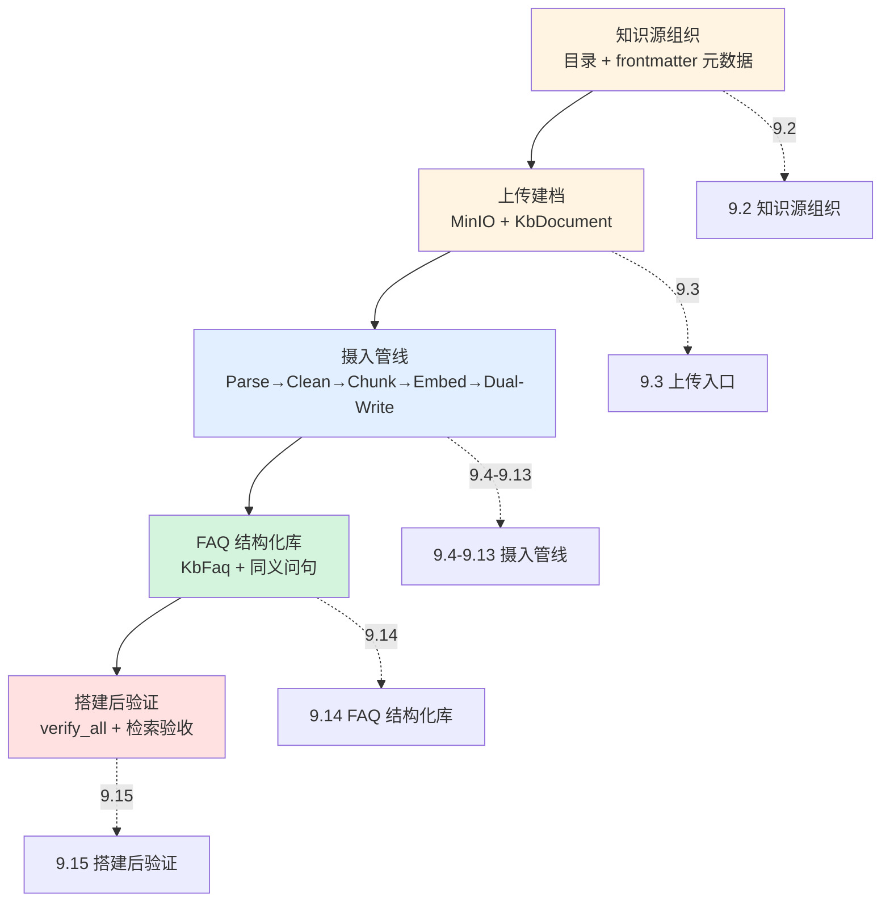
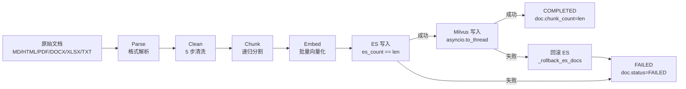
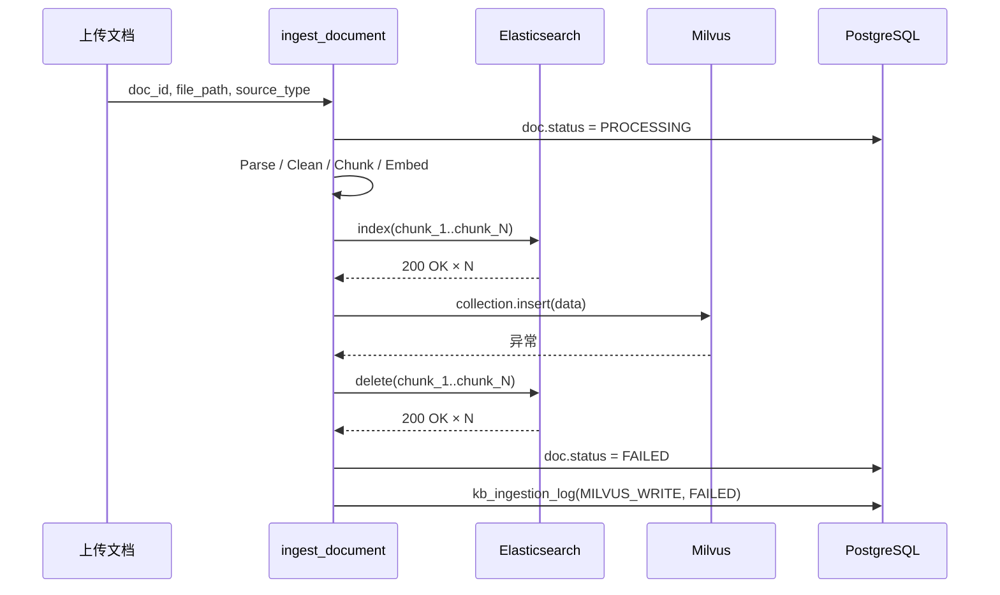

# 第 9 章: 知识库搭建: 摄入管线 + FAQ + 验证

> 本章从操作者的视角, 讲清把一份银行文档变成一个可检索知识库的完整路径: 文档怎么组织、怎么传进系统、中间经历了哪些处理、FAQ 怎么建、搭完之后怎么验证能检索. 重点回答: 知识源要不要按目录分? frontmatter 里的元数据有什么用? 5 阶段摄入为什么是这 5 个? FAQ 和文档检索有什么区别? 怎么确认知识库"真的能用"?

## 9.1 从零搭建全景 — 主路径图

搭建一个知识库不像"上传几个文件"那么简单. 一份《信用卡章程》PDF 要能被客户问"年费怎么免"时检索到, 中间要经过 5 个环节. 下面这张图是本章的总览, 每个环节对应后续一小节:



- **9.2 知识源组织**: 决定文档放哪个目录、元数据写什么, 是搭建的起点
- **9.3 上传入口**: 文件怎么进系统, 三个前置检查挡掉可预判的失败
- **9.4-9.13 摄入管线**: 核心环节, 把原始文档变成可检索的向量 + BM25 索引
- **9.14 FAQ 结构化库**: 高频问题直答, 与文档检索互补
- **9.15 搭建后验证**: 确认中间件连通、检索能召回, 才算搭完

## 9.2 知识源组织

搭建知识库的第一步, 是决定**文档怎么组织**——这决定了后面的分类、权限、检索过滤. Lumio 用"目录 + frontmatter 元数据"两个维度组织知识源, 由 `agent/scripts/seed_knowledge.py` 处理.

### 9.2.1 目录决定分类

`seed_knowledge.py:26-36` 定义了一级目录名到业务分类的映射:

```python
# agent/scripts/seed_knowledge.py:26
DIR_CATEGORY_MAP: dict[str, str] = {
    "faq": "FAQ",          "fee": "费率",
    "points": "积分",      "annual_fee": "年费",
    "regulations": "章程", "repayment": "还款",
    "security": "安全",    "activity": "活动",
    "other": "OTHER",
}
```

目录名是**英文 slug**, 分类值是**中文业务名**. 扫描时 (`scan_files` L68) 用 `rel_parts[0]` 取一级目录名, 再查映射得出分类. 例如 `test_data/fee/fee-annual-card-type.md` 会被归到"费率"。

`agent/test_data/` 的实际一级目录 (`activity` / `annual_fee` / `faq` / `fee` / `other` / `points` / `regulations` / `repayment` / `security`) 跟映射 key 一一对应, 新增分类时只需在映射表加一行, 无需改扫描逻辑。

### 9.2.2 frontmatter 决定元数据

每个 Markdown 文件顶部可写 YAML frontmatter, 提供比目录更细的元数据。`parse_frontmatter` (`:39`) 解析 `---` 包裹的头部:

```markdown
---
title: 白金卡年费减免政策
category: fee            # 覆盖目录映射的分类
doc_type: faq            # 文档类型
card_type: platinum      # 适用卡种
customer_tier: vip       # 适用客户层级
security_level: internal # 密级
version: "1.1"
effective_date: 2026-01-01
expiry_date: 2026-12-31
keywords: [年费, 减免, 白金卡]
---
```

**元数据的三来源优先级** (`scan_files` L90-96): **frontmatter 优先 > 目录映射兜底 > 默认值**。例如:

- `category`: frontmatter 有则用, 否则用目录映射的分类, 再否则 `OTHER`
- `doc_type`: 默认 `faq`
- `security_level`: 默认 `internal`
- `card_type`/`customer_tier`: 可留空, 空值表示"对全卡种/全员可见" (见 9.12)

**为什么用 frontmatter 而不是在目录上区分**: 分类是粗粒度 (文档属于费率), 而 `card_type`/`security_level`/`effective_date` 是每份文档的细粒度属性, 目录无法表达。frontmatter 让"一份文档可以有多个适用卡种"这类多维属性落在文档自身, 目录只承担最粗的分类。

### 9.2.3 用 seed 脚本试跑

`seed_knowledge.py` 的 `main` (`:261`) 支持 `--dry-run`, 只扫描不入库, 是搭建时预览的好工具:

```bash
poetry run python scripts/seed_knowledge.py --dry-run
poetry run python scripts/seed_knowledge.py --dir /path/to/docs
```

`--dry-run` 会打印扫描摘要 (`print_scan_summary` L154): 序号 / 文件名 / 分类 / 类型 / 标题, 让你在上传前确认目录和元数据对不对。正式运行时 (`:288-289`) 先把文件传 MinIO (`upload_to_minio` L163, object key 为 `{category}/{filename}`), 再按 content_hash 查重后写 `KbDocument` (`insert_to_database` L205) — 重复文件直接跳过, 不产生脏数据。

## 9.3 上传入口: 从 HTTP 文件到 5 阶段管线的"最后一公里"

摄入管线的上游是 `upload_document` 端点 (`bot/router.py:1443`), 这一段的职责不是"解析文档", 而是**在文件进管线之前把一切可预判的失败挡掉**。三个检查按成本从低到高排列:

1. **扩展名白名单** (`_ALLOWED_EXTENSIONS`): `.pdf/.docx/.html/.md/.txt/.xlsx` 六个后缀, 其余一律 400 (`DocumentFormatError` 2010)。白名单比黑名单安全——`.exe`/`.sh` 这类可执行文件连进入对象存储的机会都没有。
2. **文件大小上限 50MB**: 优先读 `Content-Length` header (不读 body 就能拒绝), header 缺失时才读完整内容后按 `len(content_bytes)` 判定。50MB 是经验值: 银行 PDF 章程通常 5-20MB, 批量上传峰值留 2-3 倍冗余; 再大就应走对象存储分片上传, 不应塞 HTTP body。
3. **SHA-256 内容哈希**: `content_hash` 写入 `kb_document`, 同一份文件重复上传时可按哈希识别去重, 也是将来做"内容变更检测" (内容变但文件名没变) 的锚点。

三个检查过后, 文件才进 MinIO (`{category}/{filename}` 二级 key), 再创建 `KbDocument` 记录 (status=`PENDING`), 最后调用 `ingest_document()` 触发 5 阶段管线并回写最终状态 (`COMPLETED` / `FAILED`)。**注意端点的返回不阻塞在摄入完成**: `ingest_document` 是 await 的, 但状态字段 (`doc.status`) 的最终值由摄入结果回填, 客户端可以通过 `GET /kb/documents/{doc_id}/status` 轮询——上传接口永远先返回, 长耗时在后台完成。

**为什么摄入异常不向上抛?** `upload_document` 里对 `ingest_document` 的调用包在 `try/except` 里, 异常时只把 `kb_doc.status` 置为 `FAILED`。这样"文件已收、摄入失败"不会让客户端拿到 500 重试上传——重试摄入比重传文件便宜得多 (MinIO 里已经有原件了)。

## 9.4 摄入管线 5 阶段总览

**先讲个业务场景**: 银行的法务部上传了一份《信用卡章程》PDF (200 页). 这份文档要能被客户问"年费怎么免"时检索到 — 但 200 页塞进系统可不像复制粘贴那么简单: PDF 要转文字, 页眉页脚要去掉, 长段落要切成小块, 每块要变成向量, 最后同时写进两个检索库. 任何一个环节出错 (PDF 解析失败/双写一半成功), 客户就可能问到**残缺的答案** — 这是合规事故.

文档摄入是 RAG 系统里最容易被低估的环节. 检索端 (`第 5 章`) 拿到的是已经向量化的 chunk, 看上去只取决于 Embedding 模型; 但 chunk 的边界是否合理、元数据是否完整、版本是否可追溯, 全部由摄入管线决定. Lumio 把摄入拆成 5 个明确的阶段, 每个阶段都写一条 `kb_ingestion_log` 流水:



为什么是 **Parse → Clean → Chunk → Embed → Dual-Write** 这五步? 核心约束是"先纯化, 再切分, 再向量化, 最后落库". Parse 阶段把二进制变成字符串, Clean 阶段去掉页眉页脚/控制字符等噪声, Chunk 阶段才能在干净的文本上找到语义边界; 如果反过来先切再清洗, 切出来的 chunk 边界很可能落在页眉上, 检索时把"第 3 页 / 共 20 页" 当成正文返回. Embed 必须在 Chunk 之后: 一次性把整篇文档塞给 Embedding 服务, 显存压力和超时风险都不可控. Dual-Write 最后做, 是因为只有到这一刻, 我们才拥有"可以同时被 ES (BM25) 和 Milvus (向量) 检索"的完整对象.

`ingest_document()` 是顶层编排器, 在 `agent/lumio/services/common/ingestion.py:522` 起. 它先查文档记录, 把 `doc.status` 置为 `PROCESSING`, 然后线性走完 5 个阶段. chunker 逻辑内联进 `ingestion.py`, 阶段间只通过字符串 / 字典传递, 减少了临时状态序列化开销.

## 9.5 Parse 阶段: 6 种文件格式

Parse 阶段的目标只有一个: 把任何格式变成纯文本. 6 种格式的解析器集中在 `ingestion.py:54-188`, 通过 `_PARSE_DISPATCH` 字典按 `KbSourceType` 派发:

| 格式 | 库 | 入口函数 | 特点 |
| --- | --- | --- | --- |
| Markdown | `markdown-it-py` | `parse_markdown` (`:54`) | 走 token 树, 只取 `text` 节点, 块级元素插 `\n` |
| HTML | `BeautifulSoup` + `lxml` | `parse_html` (`:77`) | 显式 `decompose` 掉 `script/style/nav/footer/header` |
| PDF | `pymupdf` (`fitz`) | `parse_pdf` (`:90`) | 逐页 `get_text()`, 简单但对扫描件无 OCR |
| DOCX | `python-docx` | `parse_docx` (`:105`) | 段落 + 表格分行, 表格用 ` \| ` 拼接 |
| XLSX | `openpyxl` | `parse_xlsx` (`:125`) | `read_only=True` 省内存, 行格式 `header: value \| ...` |
| TXT | 无 | `parse_text_content` (`:150`) | 仅 `strip()`, 直通 |

为什么 HTML 解析要主动 `decompose` nav/footer/header? 因为这些标签里几乎全是导航链接、版权信息、备案号, 检索时召回它们会污染 top-K 结果. 举个例子, 一份产品手册的"联系我们"区块如果被切成 chunk, 用户问"怎么退款" 时反而可能优先命中 footer 里的电话. 主动过滤是廉价的预防.

Markdown 的 token 树方案比正则替换更稳. 写法上 `parse_markdown` 不去管标题/列表语义, 只收集 `inline.text` 子节点, 然后在块级元素之间补 `\n` 维持段落感. 这种"语义忽略, 文本提取" 的策略在表格 / 代码块上有信息损失, 但配合后续 Chunk 阶段的中文句末优先断点已经够用.

PDF 是 6 种里唯一可能解析失败的 (扫描件), 目前 `parse_pdf` 抛异常会冒泡到顶层 `try/except`, 直接把 `doc.status` 标记为 `FAILED` (`:720`). 未来如果要支持扫描件, 应在 Parse 内部接 OCR 而不是把噪声推给下游.

## 9.6 Clean 阶段: 5 步清洗

`clean_text()` 在 `ingestion.py:211`, 5 步串行:

```python
# agent/lumio/services/common/ingestion.py:220
text = _RE_PAGE_HEADER_FOOTER.sub("", raw)      # 1. 去页眉页脚
text = _RE_CONTROL_CHARS.sub("", text)          # 2. 去控制字符
text = _RE_MULTI_SPACES.sub(" ", text)          # 3. 多空格合一
text = _RE_MULTI_NEWLINES.sub("\n\n", text)     # 4. 3+ 换行折叠为 2

# 5. 段落级 MD5 去重
```

5 步顺序不能换. 如果先合并空格再去除控制字符, 某些控制字符会冒充"占位空格" 把两个有意义的 token 粘在一起; 如果先折叠换行再去页眉, `第 3 页` 这类页眉被换行包夹, 正则匹配不到. 第 5 步的段落 MD5 去重专门处理 PDF 复制粘贴时的页眉残留: 即使前 4 步漏掉了 `Lumio 内部资料`, 同一份文档多个段落开头都是这 8 个字, 也只保留一份.

`page_header_footer` 正则 (`ingestion.py:196`) 同时匹配中英文:

```python
# agent/lumio/services/common/ingestion.py:196
_RE_PAGE_HEADER_FOOTER = re.compile(
    r"(第\s*\d+\s*页\s*/?\s*共\s*\d+\s*页|Page\s+\d+\s+of\s+\d+)",
    re.IGNORECASE,
)
```

`re.IGNORECASE` 让 `Page 3 of 20` 和 `PAGE 3 OF 20` 都能命中, 但代价是无法区分"正文里出现'第 3 页' 这种字面量" — 真实业务里这个概率极低, 当前可以接受.

## 9.7 Chunk 阶段: 递归字符分割

`chunk_text()` 在 `ingestion.py:297`, 默认 `chunk_size=1500`, `overlap=200`. 这里 1500 是中文字符数, 约等于 600-800 个英文 token, 对 `bge-large-zh-v1.5` 的 512 token 上限有充足余量 (一段中文 token 化后大约 1.8 倍字符数).

断点搜索在 `_find_break_point()` (`:251`), 3 个优先级:

1. **句末标点** `_SENTENCE_ENDINGS = "。！？；\n"` (`:44`)
2. **短语标点** `_PHRASE_ENDINGS = "，、：""）】》"` (`:46`)
3. **空格** (最后兜底)

搜索窗口是目标位置前后 ±200 字符 (`search_start = max(start, target - 200)`, `:262`). 为什么是 200? 它等于 overlap, 保证即使断点落在窗口最远端, 下一块也能从 `break_pos - 200` 继续, 不会和上一块完全无重叠.

为什么句末优先级最高? 因为中文的句号 / 问号 / 感叹号背后是完整的语义单元, 在这里断开 chunk 不会切断"主谓宾". 短语标点 (顿号 / 逗号) 通常连接并列项, 单独切断一个并列项会导致该 chunk 失去上下文. 空格是英文 / 数字的兜底断点, 命中率比前两个低很多.

## 9.8 Embed 阶段: 批大小 128 + 熔断器

`embed_chunks()` (`:344`) 把 chunks 按 `batch_size=128` 分批:

```python
# agent/lumio/services/common/ingestion.py:362
for i in range(0, len(chunks), batch_size):
    batch = chunks[i : i + batch_size]
    embeddings = await provider.embed(batch)
    all_embeddings.extend(embeddings)
```

128 这个数不是随便选的. TEI (`embedding.py:138`) 的 `bge-large-zh-v1.5` 模型 batch=128 时单次请求约 60-80ms, GPU 利用率能跑到 70%+. 继续增大到 256 时延翻倍但吞吐只提升 30%, 反而拖慢端到端. 128 也正好是 HuggingFace TEI 默认值, 跨环境一致.

`embedding.py` 里有两个实现: `OllamaEmbedding` (本地开发, 默认 `nomic-embed-text` 768 维) 和 `TEIEmbedding` (生产, `BAAI/bge-large-zh-v1.5` 1024 维). 两者实现 `EmbeddingProvider` 协议 (`embedding.py:26`), 由 `EmbeddingCircuitBreaker` (`:223`) 包一层做健康探测.

熔断器配置是 **3 失败开 / 2 成功关 / 30s 探测间隔**:

```python
# agent/lumio/services/common/embedding.py:230
self._probe_interval = 30.0
self._failure_threshold = 3
self._recovery_threshold = 2
```

为什么不"1 失败就开"? 因为单次健康探测可能因网络抖动失败, 1 次就熔断会让系统过于敏感. 3 次连续失败 (累计 90s 探测窗口) 几乎可以确认后端真出问题了. 关闭条件用 2 次成功而不是 1 次, 是为了避免"刚开又关" 的抖动. 30s 探测间隔是经验值, 嵌入服务出问题一般 30s 内仍处于恢复阶段, 没必要更密.

熔断器初始 `_is_open = True` (`:241`), 首次 `health_check()` 成功后才关闭. 这是冷启动安全: 进程刚起时不假定 TEI 一定可用, 一定要探一次.

## 9.9 Dual-Write 阶段: ES 先, Milvus 后

Dual-Write 是整个管线最容易出错的地方. Lumio 选择 **ES 先, Milvus 后**, 不是没有理由. ES 写入是单文档 `index()` 调用, 失败可以精确定位到 chunk_id; Milvus 是批量 `insert()`, 失败时只能回滚整批. 顺序反过来如果 Milvus 失败, 已经写入 ES 的 chunk 没法追溯是哪些 (因为还没回填 doc_group), 会出现"ES 有文档但用户搜不到" 的鬼影数据.

判定条件是 `es_count == len(chunk_records)` (`:653`):

```python
# agent/lumio/services/common/ingestion.py:652
es_count = await write_to_es(chunk_records, es_client)
es_ok = es_count == len(chunk_records)
```

ES 写满才算成功, 哪怕只丢 1 个 chunk 也要标 FAILED. 这是"全或无" 语义, 因为 ES 索引是检索的唯一入口, 缺一个就意味着少一条召回.

Milvus 写失败时调 `_rollback_es_docs` (`:472`) 逐个删除已写入的 ES 文档. 回滚失败也不抛出, 仅 `logger.debug`, 因为状态已经被主流程标为 FAILED, 后续重试会重新写 ES (用相同的 `chunk_id`, ES `index` 是 upsert 语义). 成功路径最后写 `KbChunk` 入库, 更新 `doc.status = COMPLETED` 和 `doc.chunk_count = len(chunks)`.



## 9.10 摄入日志: 7 阶段流水

`kb_ingestion_log` 表在 `shared/orm_models.py:412`, 配合 `KbIngestionStage` 枚举 (`:93`) 提供 7 个固定阶段:

`PARSE` → `CLEAN` → `CHUNK` → `EMBED` → `ES_WRITE` → `MILVUS_WRITE` → `KAFKA_PUBLISH`

注意 `KAFKA_PUBLISH` 在当前 `ingestion.py` 内联编排器里没有显式调用 — 它属于" 摄入完成后通知下游" 的发布阶段, 由上层服务 (例如 ingestion worker) 触发, 写日志时复用同一张表. 7 个阶段共用同一张流水表的好处是: 给定 `doc_id`, 一条 `SELECT stage, status, duration_ms, step_detail, created_at ORDER BY created_at` 就能复盘整个文档的生命周期.

每行写 (stage, status, duration_ms, step_detail), 其中 `step_detail` 是 JSON 字段, 容纳阶段特定的元数据. 例如 CHUNK 阶段写 `{"chunk_count": N}` (`:594`), EMBED 阶段写 `{"embedding_dim": 1024}` (`:606`), ES_WRITE 阶段写 `{"success_count": M, "total": N}` (`:660`). 这种"通用字段 + JSON 详情" 的设计避免了阶段专属列膨胀.

## 9.11 增量摄入与版本管理

企业知识库是持续演化的, 同一份产品手册会有 v1.0 / v1.1 / v2.0 多个版本. Lumio 的版本模型不靠"先删后写", 而是靠 PostgreSQL 的 **部分唯一索引**:

```sql
-- orm_models.py:282
Index(
    "doc_group",
    postgresql_where=text("is_current_version = true AND is_deleted = false"),
    unique=True,
)
```

含义: 同一 `doc_group` 下, 只能有 1 条记录同时满足 `is_current_version=true AND is_deleted=false`. 增量摄入时, 旧版本自动设 `is_current_version=false` (即被 supersede), 新版本占位为 `true`. 部分唯一索引让数据库本身保证一致性, 应用层不需要分布式锁.

ES 和 Milvus 在检索时会带上 `approval_status=PUBLISHED AND is_current_version=true` 的过滤 (`ingestion.py:409-411`), 旧版本 chunk 物理上还在索引里, 但永远不会被召回, 既保证可回滚又保证检索不返祖.

## 9.12 元数据如何影响检索: 过滤不是检索后做的

`DocumentMetadata` 是摄入时写入、检索时消费的"契约"。它携带 8 个字段, 其中 5 个是检索过滤键:

| 字段 | 检索语义 | 典型值 |
|------|----------|--------|
| `category` | 业务分类过滤 | `fee` / `promo` / `rule` |
| `card_type` | 卡种过滤 | `gold` / `visa` / 空=全卡种 |
| `customer_tier` | 客户等级过滤 | `vip` / 空=全员可见 |
| `security_level` | 密级过滤 | `internal` / `confidential` |
| `keywords` | 检索时加权/扩展 | 逗号分隔, 摄入时拆分 |

**设计要点: 过滤键在摄入时就要写对, 检索时只能消费**。如果文档上传时漏填 `card_type`, 检索端不会"猜"——空值按"对全卡种可见"处理, 而不是按"对谁都不可见"处理。这符合银行知识库的可见性直觉: 未标注的文档默认公开给所有坐席, 密级文档必须显式标注才受限。

`keywords` 的拆分逻辑 (`[k.strip() for k in keywords.split(",") if k.strip()]`) 有一个边界: 全角逗号 `，` 不会被拆分——上传文档的人用中文输入法很容易踩中, 表现为"关键词只有一个超长串"。这是刻意保持的简单行为, 因为自动做全角归一化会引入"关键词被意外合并"的另一个错误方向, 而检索端对空关键词有兜底 (退化到纯 BM25 全文匹配)。

## 9.13 摄入失败后怎么重试: PARTIAL 索引 + 幂等重建

摄入失败 (ES 或 Milvus 写入异常) 后, 重试不是"重新上传一遍", 而是**用相同的 `chunk_id` 重建索引**:

1. 失败时 `doc.status = FAILED`, 但 `kb_chunk` 行 (含 `chunk_id`) 已经落库;
2. 后台重试 worker 通过 3 个 PARTIAL 索引 (`embedding_status='PENDING'` / `es_indexed=false` / `milvus_indexed=false`) 扫出未完成的 chunk;
3. 重试时 ES 用 `index` (upsert 语义) 而非 `create`——同 `chunk_id` 幂等覆盖, 不会产生重复文档。

这个设计的巧妙之处在第 12 章的 `es_indexed` / `milvus_indexed` 状态字段: **PG 是真相之源, ES/Milvus 只是投影**。即使两个检索引擎的数据短暂不一致, worker 也能从 PG 的 PARTIAL 索引精确知道"哪些 chunk 缺哪个引擎", 不需要去对账两个外部系统。这也是为什么第 12.7 节的降级路由 (单路召回) 能成立——降级前先看 PG 状态, 而不是试错。

## 9.14 FAQ 结构化知识库

文档摄入适合处理长文档 (章程/手册), 但银行客服有大量**高频短问答** ("年费怎么免?""账单日是哪天?"), 这类问题用文档检索反而低效——要检索、分块、命中的是一条长文档的片段, 慢且可能答不准。Lumio 用 `KbFaq` 结构化表单独存这类问答对, 走独立的检索路径。

### 9.14.1 KbFaq 表结构

`KbFaq` 在 `shared/orm_models.py:729`, 每条记录是一个独立的 Q&A 检索单元, 不需要分块:

| 字段 | 含义 | 关键点 |
|------|------|--------|
| `question` | 标准问题 | `"白金卡年费多少?"` |
| `answer` | 标准答案 (Markdown) | 可直接展示给客户 |
| `variant_questions` | 同义问句列表 | `["年费能省吗", "年费怎么退"]` |
| `category` | 分类 | 年费/积分/账单/... |
| `card_types` | 适用卡种 | 空=通用 |
| `customer_tiers` | 适用客户层级 | 空=通用 |
| `keywords` | 检索关键词 | 检索加权 |
| `approval_status` | 审批状态 | DRAFT/IN_REVIEW/PUBLISHED/... |
| `version` / `doc_group` | 版本控制 | 同文档模型 |

**`variant_questions` 是 FAQ 的核心设计**。它把"客户可能问的多种说法"预存起来, 让精确匹配能覆盖口语变体——"年费怎么退"和"年费能省吗"是同一个答案, 不需要等语义检索去猜, 提前在创建时写死。

### 9.14.2 三级检索路径

`search_faq` (`faq_service.py:346`) 是 FAQ 检索总入口, 三级串行短路, 返回 `{"match_type": "exact"|"semantic"|"miss", "results": [...]}`:

1. **精确匹配 (Redis 缓存)** (`:367-384`): 用归一化后的 query (`_normalize_query` L32, NFKC+小写+压缩空格) 取 md5 作为 key, 查 `lumio:faq:exact:{md5}`。命中后做权限/卡种过滤, 通过则直接返回 `match_type="exact"`。这是最快路径, 一次 Redis GET, 无 LLM 无向量。
2. **语义匹配 (Milvus)** (`:386-429`): 精确 miss 后, `embed_query` 生成查询向量, 直接调 `milvus_collection.search` (COSINE, nprobe=16, top_k×2), 过滤 `chunk_type=="faq_qa" AND approval_status=="PUBLISHED" AND is_current_version==true`。注意 FAQ 语义检索**内联**在 faq_service 里, 不走通用文档检索的 `search_vector` (那是 5 章讲的路径)。
3. **降级 miss** (`:433-435`): 前两级都未命中, 返回 `match_type="miss"`, 由上层落到通用文档检索。

**FAQ embedding 的组织**: 发布时 (`_index_faq_to_search` L441) 把 `question` + 每个 `variant_questions` 各作为一条 `chunk_type="faq_qa"` 的独立 embedding 条目写入索引。这样"年费怎么退"这条 variant 有自己的向量, 语义检索能直接命中它, 而不需要先命中标准问题再映射。

### 9.14.3 发布、预热与去重

- **发布时写索引 + 预热缓存** (`transition_faq_approval` L238): FAQ 从 DRAFT 走到 PUBLISHED 时, 才调用 `_index_faq_to_search` (L285) 写索引, 并用 `_warm_exact_match_cache` (L288) 对 question + 所有 variant 分别 setex 预热精确缓存。未发布的 FAQ 不占索引、不进缓存。
- **下线时清缓存** (`_remove_faq_from_cache` L494): 删除 FAQ 时同步清掉精确缓存, 避免死数据命中。
- **语义去重** (`check_faq_duplicate` L303): 创建前用 Milvus 语义相似度检测, threshold 默认 0.92, 重复返回 409。防止"同一条知识以不同问法建两份"。
- **过期自动下线** (`expire_overdue_faqs` L538): 定时任务把超过 `expiry_date` 的 PUBLISHED FAQ 自动下线, 保证不再召回已失效的答案。

### 9.14.4 FAQ 与文档检索怎么选

| 维度 | 文档检索 (5 章) | FAQ (本节) |
|------|----------------|------------|
| 数据形态 | 长文档分块 | 结构化问答对 |
| 匹配方式 | BM25 + 向量 RRF 融合 | 精确缓存 → 向量 COSINE |
| 适用问法 | 开放式 / 长句 / 需要上下文 | 高频短问答 / 口语变体多 |
| 答得准 | 需检索片段拼装 | 标准答案直接返回 |
| 延迟 | 文档检索 + RRF | 最快可一次 Redis 命中 |

**实际分工**: 客户问"白金卡年费多少?" 这种高频标准问题, FAQ 一次 Redis 命中直接给标准答案; 问"我上次刷了 5800 块还没出账单, 这笔什么时候记账?" 这种带具体上下文的, 走文档检索。Flash 的 `match_type` 字段让上层能观测到"这次是 FAQ 答的还是文档答的", 用于调优两套库的比例。

## 9.15 搭建后验证

知识库搭完, 不能假设"能跑就完了"——要确认两件事: **中间件都连通** + **检索真能召回**。

### 9.15.1 `verify_all.py` — 中间件连通性

`agent/scripts/verify_all.py` 一键验证 9 项中间件 (`main` L177-222), 通过 `make verify` 触发:

| 检查函数 | 行号 | 验证什么 |
|---------|------|---------|
| `check_postgresql` | L18 | PostgreSQL 16 (asyncpg SELECT 1) |
| `check_redis` | L46 | Redis 7.2 (ping + server version) |
| `check_elasticsearch` | L59 | Elasticsearch 8.19 (es.info 版本) |
| `check_milvus` | L71 | Milvus 2.4 (connect + server version) |
| `check_minio` | L83 | MinIO (列 buckets) |
| `check_kafka` | L100 | Kafka (消费 topics 数量) |
| `check_ollama` | L123 | Ollama (GET /api/tags 列模型) |
| `check_nacos` | L142 | Nacos (MCP 关闭时跳过, 默认视为通过) |
| `check_higress` | L158 | Higress 网关 (同上) |

每条 check 返回 `(ok, 详情)`, 输出用 ✅/❌ 标记, 只要有失败就 `sys.exit(1)` (`:216`), 适合做 CI gate。Nacos/Higress 两项由 `_mcp_enabled()` (L137) 决定是否校验——MCP 工具关闭时默认跳过, 保证 `make verify` 在默认环境全绿。

### 9.15.2 检索验收 — 知识库"真的能用"吗

中间件连通只证明"服务活着", 不证明"知识库能答对"。搭建后的验收应包括:

1. **跑一遍 seed**: `poetry run python scripts/seed_knowledge.py --dry-run` 确认扫描结果正确, 再正式入库。
2. **FAQ 检索验收**: 用 `POST /kb/faq/search` (`faq_router.py:246`) 逐个测核心 FAQ, 确认 `match_type` 是 `exact` 或 `semantic`, 而不是 `miss`。精确命中说明缓存预热成功, 语义命中说明向量索引正常。
3. **文档召回验收**: 对一个已知文档里的问题跑检索, 确认能召回对应 chunk。召回率低时排查 Chunk 边界 (9.7) / 元数据过滤 (9.12) / Embedding 模型 (9.8)。
4. **版本验收**: 更新一份文档触发新版本, 确认旧版本不再被召回 (9.11)。

## 9.16 测试覆盖

`agent/tests/test_ingestion.py` 覆盖三个核心场景类:

- **TestCleanText** (`:18`): 页眉页脚清除 / 多空格合并 / 控制字符清理
- **TestChunkText** (`:58`): 短文本直通 / 长文本分块 / 中文句末边界优先
- **TestParse** (`:95`): Markdown token 树 / TXT 直通

其中 `test_chunk_respects_chinese_sentence_boundary` (`:81`) 是最关键的一条: 它构造一段长文本断言 chunk 边界落在 `。` 而非中段, 直接锁定了第 9.7 节的优先级约定. Milvus 写入和 ES 回滚走集成测试 (需要真集群), 不在单测范围.

## 9.17 小结

搭建一个知识库, 从操作视角看是 5 个环节的串联: **知识源组织** (目录 + frontmatter 决定分类和过滤) → **上传建档** (白名单/大小/哈希三检查) → **摄入管线** (Parse 屏蔽 6 种格式, Clean 5 步清洗, Chunk 中文句末断点, Embed 128 批 + 熔断, Dual-Write ES 先 Milvus 后 + 回滚保证原子性) → **FAQ 结构化库** (精确缓存 → 语义 COSINE 三级检索) → **验证** (verify_all 连通性 + 检索验收).

贯穿始终的两个设计原则: **PG 是真相之源, ES/Milvus 只是投影** (重试靠 PARTIAL 索引对账, 不靠外部系统对账); **过滤在摄入时就要写对, 检索时只能消费** (元数据契约). 7 阶段 `kb_ingestion_log` 是出问题时的第一现场, 部分唯一索引让版本管理不依赖应用层逻辑.

> **延伸阅读**:
> - [第 5 章 RAG 检索全链路](../05-rag-pipeline.md) — 文档检索端细节
> - [第 12 章 数据层](12-data-layer.md) — ES/Milvus 索引设计 + 降级路由
> - [附录 A 术语表](../appendix/A-glossary.md#a6-rag-检索术语) — RAG 术语速查