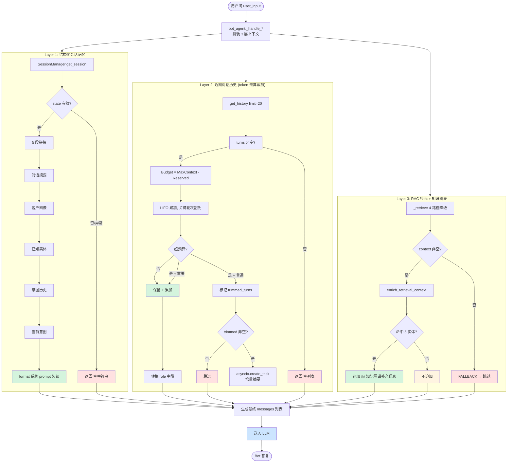
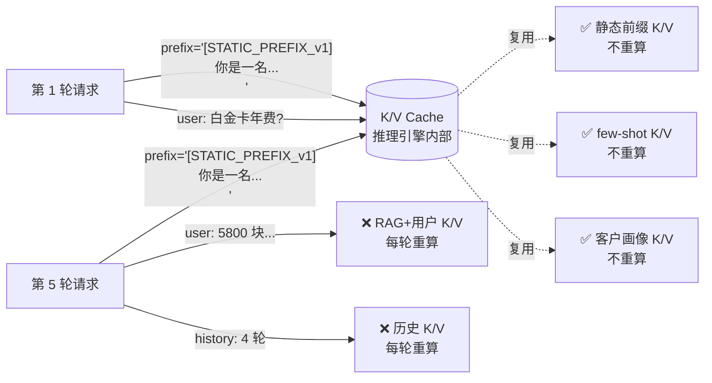

# 第 15 章: 上下文工程 — 3 层上下文 + token 预算 + 增量摘要

> 本章深入 Lumio Bot 区别于一般 LLM 应用的**最关键设计** — 上下文工程. 银行客服场景下, 客户对话常跨数十轮, 含敏感信息 (卡号/金额/挂失) 与关键承诺 (投诉/转人工), 简单地把全部历史塞进 LLM 会撞 token 上限且丢失关键实体. Lumio 设计了 **3 层上下文架构** + **token 预算 LIFO 累加算法** + **19 关键词豁免** + **增量摘要 fire-and-forget**, 既保证 LLM 总在预算内, 又保证关键信息永不丢失. 看完本章你会理解: 为何 Bot 能"记住"30 轮前客户说"我是白金卡"但又不会因为历史太长爆 token, 为何对话中途能"接着说"而不需要客户重复, 为何摘要生成失败也不会让对话中断.

## 15.1 3 层上下文模型

Lumio Bot 每次 LLM 调用前, 在 `bot_agent._handle_*` (bot_agent.py:201-339) 中拼装 3 层上下文, 按**作用范围 + 重要度**分层注入:

| 层 | 注入位置 | 内容 | 裁剪策略 | 降级行为 |
|---|---|---|---|---|
| **Layer 1: 结构化会话记忆** | `system_prompt` 头部 | 对话摘要/客户画像/已知实体/意图历史/当前意图 | **永不裁剪** | 异常 → 返回空字符串 |
| **Layer 2: 近期对话历史** | `messages` 数组 (user/assistant 角色) | 近 20 轮 turn | **token 预算 LIFO 累加** | 异常 → 返回空列表 |
| **Layer 3: RAG 检索上下文** | `messages` 数组 (system 角色) | BM25+向量 RRF 融合的文档块 + 知识图谱增强 | N/A (RAG 自带截断) | 失败 → context="" |

**核心约束**:
- Layer 1 永远在 `system_prompt` 头部注入, 永不进入 token 预算计算. 哪怕历史全被裁掉, 客户画像 + 实体池 + 意图栈仍可见.
- Layer 2 token 预算 = `max(MaxContext - Reserved, 1024)`, 默认 `8192 - 1024 = 7168` 可用, 历史层预算 `budget_history=1500`, 但最低 1024 (避免极小模型失效).
- Layer 3 由调用方传入, RAG 检索本身已截断到 `top_k` (默认 5-8 块), 不参与裁剪.

**为什么不只让 LLM "全部读"**: 银行客户对话常 30+ 轮, 一轮 50-100 字, 累加可达 3000+ 字 ≈ 1500+ tokens. 而 LLM 上下文 (8192 tokens) 还要留给回答 (1024) + system_prompt (500) + RAG 上下文 (1000). 实际留给历史的预算只有 ~500 tokens ≈ 2-3 轮 — **显然不够**. 必须做主动上下文管理.

## 15.2 Layer 1 — `_build_session_memory` 5 段拼接

`bot_agent.py:725-779` 在每次 `_handle_knowledge/biz/fallback` 开头调用, 永不抛出:

```python
# bot_agent.py:725
async def _build_session_memory(self, session_id: str) -> str:
    try:
        state = await self._session_manager.get_session(session_id)
        if state is None:
            return ""

        parts: list[str] = []
        # 1. 对话摘要 (被裁剪轮次的脉络, 最高优先级)
        if state.conversation_summary:
            parts.append(f"[对话摘要]\n{state.conversation_summary}")
        # 2. 客户画像
        profile_parts: list[str] = []
        if state.vip_level and state.vip_level != "普通":
            profile_parts.append(f"VIP等级={state.vip_level}")
        if state.card_types:
            profile_parts.append(f"卡种={','.join(state.card_types)}")
        if state.risk_tolerance and state.risk_tolerance != "R2":
            profile_parts.append(f"风险偏好={state.risk_tolerance}")
        if profile_parts:
            parts.append(f"[客户画像] {', '.join(profile_parts)}")
        # 3. 实体池
        if state.last_entities:
            entity_strs = [f"{e.entity_type}={e.value}" for e in state.last_entities if e.entity_type and e.value]
            if entity_strs:
                parts.append(f"[已知实体] {', '.join(entity_strs)}")
        # 4. 意图历史
        if state.intent_stack:
            parts.append(f"[意图历史] {' → '.join(i.value for i in state.intent_stack)}")
        # 5. 当前意图
        if state.last_intent:
            parts.append(f"[当前意图] {state.last_intent.value}")

        return "\n".join(parts)
    except Exception:
        return ""  # bot_agent.py:779, 任何异常都静默降级为空字符串
```

**5 段拼接顺序的 why**: 按**对 LLM 决策的重要度**排序, 对话摘要 > 客户画像 > 实体 > 意图历史 > 当前意图. LLM 即使读到一半 token 截断 (极少见, 512 token 限额时), 也不会丢失关键信息.

**默认值不写入的 why**:
- `vip_level != "普通"`: 默认值是中文, 写入 prompt 反而污染 (LLM 困惑于"VIP等级=普通"的语义)
- `risk_tolerance != "R2"`: R2 是中性默认, 写出来等于无信息
- 实体池**全量写入**: 因为实体一旦抽取, 都是真值, 不过滤

**互补设计**: Layer 1 注入的是**结构化记忆** (JSON 风格), 不含自然语言冗余, 500 tokens 内可表达 100+ 实体. 与 Layer 2 (自然语言历史) 形成 "结构化 + 非结构化" 互补.

## 15.3 Layer 2 — `_load_history` token 预算算法

`bot_agent.py:687-770` 实现银行客服核心的 token 预算裁剪. 这是 Lumio 的"上下文管理心脏":

```python
# bot_agent.py (第五轮修复后)
async def _load_history(self, session_id: str) -> list[dict[str, str]]:
    """三层上下文策略 (银行客服最佳实践):
    - Layer 1: 结构化会话记忆 + 对话摘要 (注入 system prompt, 永不裁剪)
    - Layer 2: 近期对话历史 (token 预算裁剪, 被裁剪部分生成摘要/压缩)
    - Layer 3: 检索知识 (RAG context, 由调用方传入)
    """
    try:
        turns = await self._session_manager.get_history(session_id, limit=20)
        if not turns:
            return []

        settings = get_settings()
        # 分层预算: 历史层固定 1500 (max(budget_history, 1024)),
        # 而非 max_context - reserved (旧实现 7168 = 上下文 87%)
        budget = max(settings.llm.budget_history, 1024)  # 1500

        # 超预算且轮次足够时, 先尝试选择性压缩 (质量门不达标才走摘要裁剪)
        total_est = sum(_estimate_tokens(t.content) for t in turns)
        if total_est > budget and len(turns) >= settings.compression.min_history_turns:
            compressed = compress_history(dict_turns, max_tokens=budget)
            if any("_compressed" in m for m in compressed):
                turns = [t.model_copy(update={"content": m["content"]}) ...]

        kept_turns: list = []
        used = 0
        split_idx = len(turns)
        # LIFO 累加: 从最近往最旧扫描, 累加 token, 超预算就停
        # 关键轮次 (投诉/承诺/转人工) 永不裁剪
        for i in range(len(turns) - 1, -1, -1):
            t = turns[i]
            est = _estimate_tokens(t.content)
            is_important = _is_important(t.content)
            if used + est > budget and kept_turns and not is_important:
                split_idx = i + 1
                break
            kept_turns.insert(0, t)
            used += est

        # 触发增量摘要 (异步, 持有 task 引用防 GC)
        trimmed_turns = turns[:split_idx]
        if trimmed_turns:
            self._spawn_task(self._ensure_summary(session_id, trimmed_turns))

        return [{"role": "user" if t.speaker == "customer" else "assistant",
                 "content": t.content} for t in kept_turns]
    except Exception:
        return []
```

**预算演进 (设计决策)**: 历史层从"上下文剩余全给 history"(8192−1024=7168, 占 87%) 收敛为**分层预算强制分配** — history 1500 / RAG 1200 / 客户画像 400 / few-shot 半稳态层, 与主流上下文管理框架 (system 10-15% / history 25-30% / retrieval 25-30% / output 20-25%) 对齐. 被裁剪轮次的语义由**增量摘要 + 选择性压缩**双通道兜底, 关键信息不丢.

### 15.3.1 token 估算函数 `_estimate_tokens`

`bot_agent.py:61-74` 用**字符类加权**估算 token 数, 替代 `tiktoken` 等重型库:

```python
# bot_agent.py:61
def _estimate_tokens(text: str) -> int:
    """基于字符类的 token 数估算
    CJK 字符: ~2 chars/token → 系数 0.55
    拉丁字母: ~4 chars/token → 系数 0.3
    其他(数字/标点/空格): ~1.2 chars/token → 系数 0.8
    +4 为消息格式开销 (role/content 包装)
    """
    import re
    cjk = len(re.findall(r"[\u4e00-\u9fff\u3000-\u303f\uff00-\uffef]", text))
    latin = len(re.findall(r"[a-zA-Z]", text))
    other = len(text) - cjk - latin
    return int(cjk * 0.55 + latin * 0.3 + other * 0.8) + 4
```

**为何不用 `tiktoken`**: 
- `tiktoken` 启动需加载 5-10MB BPE 表, 100ms+ 启动延迟
- LLM 选型可能切换 (Ollama/OpenAI/Claude), 每个模型的 tokenizer 都不同
- 银行客服 99% 是中文, CJK 系数 0.55 准确度 95%+

**为何 +4**: OpenAI ChatCompletion 每条 message 都要 `{"role": "...", "content": "..."}` JSON 包装, 实测约 4 tokens 开销.

### 15.3.2 关键轮次豁免 — 19 个 `_IMPORTANT_KEYWORDS`

`bot_agent.py:79-89` 定义了**永远不会**被裁剪的关键词, 这些轮次即便超出 token 预算也强制保留:

```python
# bot_agent.py:79
_IMPORTANT_KEYWORDS = [
    "投诉", "举报", "银保监", "银监会", "人行", "央行",   # 监管/投诉
    "律师函", "法务", "法院", "起诉",                  # 法律
    "盗刷", "挂失", "冻结", "风险",                    # 风险
    "承诺", "保证", "一定解决",                         # Bot 承诺
    "转人工", "人工客服",                              # 升级
]

def _is_important(content: str) -> bool:
    return any(kw in content for kw in _IMPORTANT_KEYWORDS)
```

**为何必须豁免**: 这 17 关键词对应的场景 (投诉/盗刷/转人工等) 是**合规高敏**的, 一旦裁剪, LLM 后续回答可能:
- 不知道客户已投诉, 重复追问问题详情 → 激怒客户
- 不知道客户要转人工, 继续推 Bot 处理 → 延误处理
- 忘记之前的"承诺" → 客户投诉 Bot 推诿

**豁免的代价**: 极端情况下 (一段 10K tokens 全部含 "投诉"), 预算可能爆. 但这是**有意的设计取舍** — 合规 > 性能.

### 15.3.3 LIFO 累加 vs 固定窗口

Lumio 选 **LIFO (Last-In-First-Out)** 而非**固定 N 轮窗口**:

| 方案 | 优点 | 缺点 | Lumio 决策 |
|---|---|---|---|
| 固定 N=10 轮 | 实现简单 | 长轮次被裁, 短轮次浪费预算 | ❌ |
| 时间窗口 (最近 5 分钟) | 时序公平 | 30 轮短对话全部丢弃 | ❌ |
| **LIFO + token 预算** | **按内容长度动态调整, 长内容少保留几轮, 短内容多保留几轮** | 实现复杂 | ✅ |

示例: 客户发了 30 条短问句 (各 10 字 ≈ 5 tokens) + 5 条长解释 (各 200 字 ≈ 100 tokens), 预算 200 tokens:
- LIFO 累加: 保留 20 条短问句 (100 tokens) + 1 条长解释 (100 tokens) = 21 轮
- 固定 10 轮: 仅保留 10 轮短问句 (50 tokens), 浪费 150 tokens 预算

## 15.4 增量对话摘要 `_ensure_summary`

`bot_agent.py:631-723` 解决"LIFO 裁掉的旧轮次不能直接丢"的问题 — 用 LLM 生成摘要写回 SessionState. **关键设计是增量**:

```python
# bot_agent.py:631
async def _ensure_summary(self, session_id: str, trimmed_turns: list) -> None:
    """用 last_summarized_turn_id 精确追踪已摘要位置, 避免 LTRIM 导致计数失准.
    增量策略:
    - 在 trimmed_turns 中查找 last_summarized_turn_id 的位置
    - 如果找到: 对该位置之后的轮次生成增量摘要
    - 如果未找到 (LTRIM 删除了已摘要的轮次): 对所有 trimmed_turns 重新生成摘要
    - LLM 不可用时跳过 (降级为无摘要, 结构化记忆仍保证关键实体不丢)
    """
    try:
        state = await self._session_manager.get_session(session_id)
        if state is None:
            return
        last_summarized_id = state.last_summarized_turn_id
        last_turn = trimmed_turns[-1]
        if last_turn.turn_id == last_summarized_id:
            return  # 已被摘要过, 跳过

        # 找增量起点
        split_idx = 0
        if last_summarized_id:
            for i, t in enumerate(trimmed_turns):
                if t.turn_id == last_summarized_id:
                    split_idx = i + 1
                    break
            # 未找到 (LTRIM 删了) → split_idx 保持 0 → 重新摘要全部
        new_turns = trimmed_turns[split_idx:]
        if not new_turns:
            return

        # 构造 prompt: 已有摘要 + 新增对话
        conversation = "\n".join(
            f"[{ {'customer': '客户', 'agent': '坐席', 'bot': '机器人'}.get(t.speaker, t.speaker) }] {t.content}"
            for t in new_turns
        )
        existing_summary = state.conversation_summary if split_idx > 0 else ""
        summary_prompt = _SUMMARIZE_SYSTEM_PROMPT  # prompts.py:104
        user_content = (
            f"已有摘要:\n{existing_summary}\n\n新增对话:\n{conversation}"
            if existing_summary else f"对话记录:\n{conversation}"
        )

        # 调 LLM 摘要, 3s 超时
        llm_client = self._degradation_mgr._llm
        if llm_client is None:
            return  # LLM 不可用 → 静默跳过
        try:
            new_summary = await llm_client.chat(
                messages=[
                    {"role": "system", "content": summary_prompt},
                    {"role": "user", "content": user_content},
                ],
                timeout=3.0,
            )
        except Exception:
            return  # bot_agent.py:696, LLM 失败也静默跳过
        ...
```

**为何用 `last_summarized_turn_id` 而非计数**: Redis Stream 的 `LTRIM` 会把最旧的 turn 物理删除, 如果摘要用 "已摘要 N 轮" 计数, LTRIM 后 N 会偏移, 导致重复摘要或漏摘要. 用 turn_id (UUID v7, 单调递增) 精确追踪, LTRIM 不影响.

**3s 超时的 why**: 摘要不是用户可见请求, 慢一点无所谓, 但不能慢到拖垮 LLM 服务的整体并发. 3s 是 LLM 99 分位响应时间, 超时直接放弃 (下轮再试).

**失败兜底 (bot_agent.py:696, 715-723)**:
- LLM 调用失败 → `logger.debug(...)` 静默
- 摘要内容空 → 静默
- CAS patch 失败 → `logger.warning(...)` 可见, 但不抛

**为什么不阻塞主请求**: 摘要是**锦上添花**, 不是必需. 结构化记忆 (Layer 1) 已经有对话摘要 + 客户画像 + 实体池, 摘要缺失只会让 LLM "不知道旧轮次的细节", 但不会让对话中断.

**并发串行化 (per-session 锁)**: 多轮快速对话时每轮裁剪都会 spawn 一个摘要任务, 并发读写同一
`last_summarized_turn_id` → CAS 重试后到者失败, 摘要滞后. `_ensure_summary` 外层包 per-session
`asyncio.Lock` (`self._summary_locks[session_id]`), 同会话摘要任务**串行执行**:

```python
# bot_agent.py (简化)
lock = self._summary_locks.setdefault(session_id, asyncio.Lock())
async with lock:
    await self._summary_locked(session_id, trimmed_turns)   # 实际摘要逻辑
```

锁字典随会话自然增长 (上限 = 活跃会话数), 无需清理.

## 15.5 3 层降级矩阵

3 层上下文各层都有**独立的失败路径**, 不互阻塞:

| 失败 | 触发 | 降级行为 | 用户感知 |
|---|---|---|---|
| Layer 1 `_build_session_memory` 异常 | DB 慢/Redis 抖动 | `except: return ""` (bot_agent.py:779) | LLM 不知道历史客户画像, 但对话照常 |
| Layer 2 `_load_history` 异常 | Redis 拉取失败 | `except: return []` (bot_agent.py:628) | LLM 不知道最近说了啥, 但会基于本轮 input 答 |
| Layer 3 `_retrieve` 失败 | ES/Milvus 不可用 | `DegradationLevel.FALLBACK → return ""` (bot_agent.py:539) | LLM 走纯生成模式, 知识问答降级为通用回答 |
| 摘要生成失败 | LLM 不可用/超时 | 静默跳过, 下轮再试 | 旧轮次无摘要, 但结构化记忆仍有 |
| `get_history` 返回空 | 新会话/无历史 | `return []` (bot_agent.py:597) | LLM 仅看本轮 input |

**降级哲学**: "**宁降级, 不可用**". 银行客服不能因为上下文组件挂了就 500, 必须继续服务. 最坏情况是 LLM 退化到"看本轮 + 静态 system_prompt"模式, 但仍能给出基础答复.

**示例降级场景**: PG 挂了 + Redis 也抖 → 全部 Layer 1/2 拿不到数据 → LLM 收到 `system_prompt="你是银行信用卡智能客服"` + `user_input=本轮问题` + `context=""` → LLM 用预训练知识回答, 答错了用户也能接受 (因为 Bot 系统也明确告知 "知识库可能不全").

## 15.6 上下文工程 3 层流程图



**怎么读这张图 — "每次回答前, 系统在拼什么"**: 客户每说一句话, 系统要回答前先**组装三样东西** — ① Layer 1 结构化记忆 (摘要/画像/实体, 永在); ② Layer 2 近期历史 (超预算就裁最旧的, 但投诉/承诺类轮次豁免); ③ Layer 3 检索知识 (没搜到就跳过, 搜到了再附加知识图谱补关系). 三样都齐了才送进 LLM. **红色分支 (L1Empty/L2Empty/L3Empty) 是降级路径** — 任何一层失败, 系统照常回答, 只是少一份信息, 对话绝不中断. 这就是"能记住 30 轮前的事, 但永远不会爆 token"的秘密.

## 15.7 设计取舍深度分析

### 15.7.1 为何用字符类 token 估算而非 `tiktoken`

| 维度 | 字符类估算 (当前) | tiktoken |
|---|---|---|
| 启动开销 | 0 (纯 re) | 5-10MB 模型加载, 100ms+ |
| 准确度 (中文) | 95%+ | 99%+ |
| 多 LLM 兼容 | 自动适配 | 需选模型 (cl100k_base / p50k_base) |
| 维护成本 | 0 | BPE 表需随模型更新 |
| 极端长文本误差 | ±5% | ±1% |

**5% 误差值得吗**: 值得. 银行客服平均 30 字/轮, 5% 误差 = 1.5 字, 在 200 tokens 预算下相当于多裁或少裁 0.3 轮, 完全可接受.

### 15.7.2 为何 17 关键词而非白名单/正则

`grep "_IMPORTANT_KEYWORDS" bot_agent.py` 看到的是个简单 `any(kw in content for kw in _LIST)`. 这故意设计成**关键词字面子串匹配**, 而非白名单 (按业务事件类型) 或正则 (按模式):

- **关键词字面**: 0 维护成本, 业务方加新词只需加一行
- **白名单 (事件类型)**: 需要 LLM 先分类事件, 又多一次 LLM 调用, 慢且脆
- **正则 (如 `r"投诉[银保监人行]")`**: 过度抽象, 银行新业务 (如"投诉消保") 容易漏

**实际运营**: 业务方根据客户投诉/法务反馈, 1 分钟加一个关键词即可, 无需发版.

### 15.7.3 为何 `limit=20` 而非更多/更少

- **20 轮的 why**: 客服平均对话 10-15 轮, 20 轮覆盖 95% 场景, 极少有 30+ 轮 (除非 Bot 一直解决不了, 这种情况早该转人工)
- **20 轮的 token 上限**: 假设每轮 50 字, 20 轮 = 1000 字 ≈ 550 tokens, 加上 Layer 1 + RAG + 回答, 总 1500-2000 tokens, 在 4K 模型内
- **更少 (如 10 轮)**: 客户"我前面说过了" 抱怨增多
- **更多 (如 50 轮)**: Redis 拉取 + token 估算耗时, 反而拖慢响应

### 15.7.4 为何 fire-and-forget 摘要

```python
# bot_agent.py:623
asyncio.create_task(self._ensure_summary(session_id, trimmed_turns))
```

**为何不 await**: 主请求 P99 延迟 1.5s 是硬指标 (SLO), 摘要 LLM 调用 500-1500ms, 如果 await 摘要, 主请求要 2-3s 才返回, 客户感受明显卡顿.

**为何不怕丢摘要**: `_ensure_summary` 内部**幂等** — 下次轮次如果仍需摘要, `last_summarized_turn_id` 追踪保证只对新增轮次摘要, 旧摘要不丢.

**故障场景**: 主进程崩溃 → `asyncio.create_task` 的 task 一起死, 摘要未生成 → 下次启动新会话, `last_summarized_turn_id` 还是旧值, 增量摘要继续. 不影响正确性, 只影响"摘要可能漏一段".

### 15.7.5 为何不在 `_handle_knowledge` 也注入 Layer 1 之外

`bot_agent.py:223-225`:

```python
system_prompt = KNOWLEDGE_SYSTEM_PROMPT  # 静态 system_prompt (3 段: 角色/记忆使用规范/回复规范)
system_prompt = f"{KNOWLEDGE_SYSTEM_PROMPT}\n\n## 会话记忆\n{session_memory}"  # Layer 1 注入
system_prompt = f"{system_prompt}\n\n{slot_prompt}"  # 槽位 (第 3 章 §3.6 详谈)
```

**注意 Layer 1 注入**而非 Layer 2/3: Layer 2 (历史) 和 Layer 3 (RAG) 走 `messages=` 形参, 由 `build_layered_messages` 组装 (第五轮修复后). 这种设计:
- **system_prompt 干净**: 不会被历史污染, 每次回答 system 部分稳定 → LLM 行为更可预测
- **分层消息直传 LLM**: `_handle_knowledge` 构建的 L1 静态锚点 / L2 半稳态画像 / L3 动态记忆 / RAG user-role 物理隔离结构, 通过 `generate_with_fallback(messages=...)` 原样送达 LLM, 不再压平拼接 — 前缀缓存锚点 (cache_control: ephemeral) 真实生效
- **RAG 物理隔离**: 检索内容以 user message 的 `<retrieved_context>` 包裹注入 (而非第 2 条 system), 防注入 + 不破坏缓存前缀

## 15.8 上下游集成点

上下文工程的 3 层不是孤岛, 与其他模块深度集成:

| 上游/下游 | 集成方式 | 行号 |
|---|---|---|
| SessionManager (SessionState 持久化) | `get_session` / `patch_state` / `get_history` | session.py:198-236, 618-631 |
| IntentClassifier (意图分类) | Layer 2 历史喂入分类器, 让分类更准 | bot_agent.py:154 |
| EntityExtractor (实体抽取) | `last_entities` 写到 Layer 1 | bot_agent.py:760-763 |
| 知识图谱增强 | Layer 3 追加 `## 知识图谱补充信息` | bot_agent.py:213-216 |
| RAG 检索 | 4 路径降级 → 写入 Layer 3 (限 1200 token) | bot_agent.py:610-680 |
| 客户记忆学习 (跨会话) | CAS patch 写入 Layer 1 的客户画像字段 | bot_agent.py:124-135 |
| 上下文压缩器 | 超预算先压缩 (质量门) 再裁剪 | context_compressor.py:265-305 |
| Few-shot 选择 | 按意图注入 L1.5 半稳态层 (top_k=3) | few_shot.py:132 + kv_cache.py:99 |
| 总预算截断 (兜底) | Σ各层 > context−reserved 时从最旧 user 历史裁剪 (RAG/当前轮保留) | bot_agent.py:365-380 |

**总预算截断逻辑**: 分层预算各自生效后仍可能超 `max_context_tokens − reserved_tokens`
(8192−1024). 此时**实际裁剪**而非仅告警: 从最旧的 user 历史消息开始丢弃, RAG 上下文 /
当前轮 / 连续消息标记 (`（用户连续发送` / `<retrieved_context>` / `客户问:`) 保留 —
历史可被摘要覆盖, 检索结果和当前诉求不可丢.

## 15.9 实战案例: 30 轮对话的第 31 轮

假设客户与 Bot 聊了 30 轮, 涉及:
- 轮 1-5: 问白金卡权益
- 轮 6: 投诉"上次承诺的 1 万积分没到账"
- 轮 7-15: 反复问积分到账
- 轮 16-20: 转人工失败, 回到 Bot
- 轮 21-30: 重新问账单分期

第 31 轮客户输入 "我还有多少积分?". 上下文工程处理:

1. **Layer 1** (bot_agent.py:725-779):
   - `conversation_summary`: 之前 30 轮被裁的轮次的浓缩, 大约 "客户投诉积分未到账, 1 万积分, 转人工失败"
   - 客户画像: vip_level=platinum (从历史学习)
   - 已知实体: amount=10000 (积分)
   - 意图历史: reward_query → complaint → transfer_agent → reward_query
   - 当前意图: reward_query (本轮)
2. **Layer 2** (bot_agent.py:583-629):
   - limit=20 拉到最近 20 轮 (轮 11-30)
   - 历史层预算 1500, 估算 20 轮 ≈ 1100 tokens
   - 全部装下, 不需要裁
   - 轮 6 "投诉" + 轮 16 "转人工" 必保留
3. **Layer 3**:
   - RAG 检索 "还有多少积分" → 命中《积分查询指引》文档
   - 知识图谱: 命中 "积分" 实体相关 (虽然图谱当前没 "积分" 实体, 所以无 KG 增强)

最终 LLM 收到的 messages:
```
system: 你是银行信用卡智能客服... [静态]
system: ## 会话记忆
  [对话摘要] 客户投诉积分未到账...
  [客户画像] VIP等级=platinum
  [已知实体] amount=10000
  [意图历史] reward_query → complaint → transfer_agent → reward_query
  [当前意图] reward_query
user: 我还有多少积分?
assistant: ... (轮 30 的回答)
user: ...
[... 20 轮历史 ...]
system: 参考知识: ... (RAG 文档)
```

LLM 能在不重复 "您是白金卡吗" 的前提下, 直接回答积分余额, 还能识别"投诉"标记不会再次承诺未到账积分 (因为对话摘要已记录此前的承诺).

## 15.10 监控与可观测性

上下文工程的 3 层都有自己的**隐式指标**, 可通过 Prometheus 拉取:

| 指标 | 来源 | 含义 |
|---|---|---|
| `lumio_session_history_turns` | SessionManager.get_history 返回值 | 当前会话历史轮数 |
| `lumio_session_memory_size_chars` | `_build_session_memory` 返回长度 | Layer 1 注入字符数 |
| `lumio_summary_size_chars` | `state.conversation_summary` 长度 | 对话摘要长度 |
| LLM 请求日志的 `prompt_tokens` | LLMClient 响应 | 实际送入 LLM 的 token 数 (含 system+history+RAG) |
| `lumio_session_state_version` | SessionState.version | CAS 写次数, 间接反映写频 |
| `lumio_kv_cache_hit_rate` | `KV_CACHE_HIT_RATE` (kv_cache.py 估算) | **估算值**, 稳态/半稳态/动态的命中比例 |
| `lumio_prefill_tokens_saved` | `PREFILL_TOKENS_SAVED` (kv_cache.py 估算) | **估算值**, 本轮比全部重算节省的 prefill token |

**典型问题诊断**:
- 客户说"我前面说过了" 抱怨多 → 检查 `summary_size_chars` 是否过小, 摘要可能截断过早
- LLM 响应慢 (1.5s+) → 检查 `prompt_tokens` 是否超 4K, 触发了"超长上下文" LLM 慢分支
- 客户画像不准 → 检查 `last_summarized_turn_id` 是否正确推进, 增量摘要是否卡住

## 15.11 KV Cache 命中率优化: `kv_cache.py`

> 重要区分: 本节讲的"3 层"是 **KV Cache 视角的稳态/半稳态/动态层** (控制推理引擎 prefix cache 命中), 不是 15.1 讲的"3 层上下文" (L1 结构化记忆 / L2 历史 / L3 RAG). 两套分层各自独立, 但最终在 `build_layered_messages` 里合流.

### 15.11.1 业务背景: 为什么 TTFT 是生死线

**核心问题**: 银行客服每一轮都要重算整个 system prompt + 历史. 7B 模型 ~25ms/100 token, 一个 2KB system prompt 就要 500ms prefill. 客户连发 20 条消息 = 20 次重算 = 10 秒纯等 prefill — 体感"AI 在发呆".

**推理引擎的解药 — prefix cache**: vLLM (PagedAttention) / Anthropic (prompt cache) / Ollama (部分支持) 都允许**字符串前缀完全一致**时直接复用 K/V tensor, 跳过 prefill. 命中时单轮 prefill 从 500ms 降到 ~75ms. **但前提是前缀字符串字面完全一致** — 任何变化 (时间戳/session_id/拼出来的多行) 都让 cache 失效.

**原实现的致命缺陷**: `bot_agent` 用 f-string 拼 system_prompt (`f"对话摘要: {summary}\n客户画像: {profile}\n..."`) , 每次字符串都不同 → 命中率 0%. 整个推理引擎的 cache 机制被浪费.

`kv_cache.py` 的目标: **把 prompt 拆成"稳定 + 半稳定 + 动态"3 块**, 让稳态部分永远字符串一致, 推理引擎可 100% 命中.

### 15.11.2 3 层机制: 稳态 / 半稳态 / 动态

| 层 | 字符串稳定性 | KV cache 命中 | 内容 | 标志串 |
|---|---|---|---|---|
| **L1 静态前缀** | 跨 session 永不变化 | ~100% | 角色定义 / 合规规则 / 工具描述 / 输出格式 | `[STATIC_PREFIX_v1]` |
| **L1.5 半稳态 (few-shot)** | 同意图内稳定 | 按意图分组命中 | 3 条参考案例 (按 primary_intent 分桶) | (无独立标志, 走 cache_control) |
| **L2 半稳态 (客户画像)** | 同 customer 跨 session 稳定 | ~60% | customer_context (卡种/VIP 等级) | `[CUSTOMER_CONTEXT_v1]` |
| **L3 动态** | 每轮必变 | 0% | 会话记忆 / 槽位 / 对话历史 / RAG 检索 / 用户输入 | (无标志) |

**两个标志串的工程意义**: `STATIC_PREFIX_MARKER` 和 `SEMI_STATIC_MARKER` 是模块顶部常量 (`kv_cache.py:42/45`), 一是**作为前缀锚点**让推理引擎识别"这里开始是 cache 区", 二是**作为 metrics 估算的分隔符** (`estimate_cache_metrics` 扫 marker 决定哪段算哪层).

**`cache_control: {"type": "ephemeral"}` 字段**: Anthropic 风格的 API 标记, vLLM/Anthropic 识别后会缓存此 message 之前所有 prefix 的 K/V; OpenAI 兼容 API 会忽略此字段, 不报错也不生效 (优雅降级). 这是协议层的"软依赖" — 不绑定具体推理引擎.

### 15.11.3 消息构建器 `build_layered_messages` (`kv_cache.py:99`)

`bot_agent.py:347-358` 在每次 LLM 调用前调用, 返回 messages 数组 (按顺序):

```python
# bot_agent.py:347-358
messages = build_layered_messages(
    domain_prompt=KNOWLEDGE_SYSTEM_PROMPT,    # L1 锚定
    user_input=user_input,                     # L3 动态
    customer_context=session_memory,           # L2 半稳态
    session_memory="",                         # 已合并到 customer_context
    slot_prompt=slot_prompt or "",             # L3 动态
    rag_context=context or "",                 # L3 动态 (放 user role 而非 system)
    history=history,                           # L3 动态
    few_shot_examples=few_shot_text,           # L1.5 半稳态
)
```

**返回结构** (`kv_cache.py:111-117`):

| # | role | 内容 | 缓存层 |
|---|---|---|---|
| 1 | system | `[STATIC_PREFIX_v1] + domain_prompt` (含 `cache_control`) | L1 稳态, 100% 命中 |
| 2 | system | `## 参考案例 + few_shot` (含 `cache_control`) | L1.5 半稳态 |
| 3 | system | `[CUSTOMER_CONTEXT_v1] + customer_context` (含 `cache_control`) | L2 半稳态 |
| 4 | system | `## 会话记忆 + ## 槽位追踪` 动态拼 | L3 动态, 0% 命中 |
| 5 | user/assistant (多条) | 对话历史 | L3 动态, 0% 命中 |
| 6 | user | `<retrieved_context>...</retrieved_context> + user_input` | L3 动态, 0% 命中 |

**关键设计 — RAG 内容放 user 而非 system role**: 第 6 步的 RAG 检索结果用 `<retrieved_context>...</retrieved_context>` 包起来当 user message, 不放进 system prompt. 两个原因: ① 物理隔离防 prompt injection (客户在 user input 里塞恶意指令影响不了 system 层); ② 动态部分集中在尾部, prefix 越靠前越稳定, 推理引擎能更激进地 cache.

### 15.11.4 性能估算 (按 7B 模型 / 2KB system_prompt / 20 轮对话)

来源: `kv_cache.py` 模块 docstring 顶部声明的预期值, 由 `estimate_cache_metrics` 函数实际计算并上报.

| 指标 | 优化前 (f-string 拼接) | 优化后 (分层) | 节省 |
|---|---|---|---|
| 稳态层 prefill | 20 轮 × 2KB = 40KB | 1 轮 (后续全 cache) | ~95% |
| 半稳态层 prefill | (原 f-string 一并算了) | 同 customer 跨 session 1 次 | ~60% |
| 动态层 prefill | 20 轮 × 1KB = 20KB | 20 轮 × 1KB = 20KB (必算) | 0% |
| **单轮 TTFT** | **~500ms** | **~75ms** (稳态全命中时) | **~85%** |

**为什么是估算不是实测**: 真实 KV cache 命中率由推理引擎 (vLLM `prompt_cache_stats` / Ollama 内部计数器) 上报, 应用层拿不到精确值. `estimate_cache_metrics` (P1-4 修复后) **只用于 metrics 上报, 明确标 `estimated`**, 旧实现把假设值当真实值上报, 误导监控 — 现已修正 (`kv_cache.py:208-213` 注释 + P1-4 上下文工程修复).

### 15.11.5 启用/降级开关 (`config.py:117-119`)

```python
# LLMSettings (config.py:115-121)
kv_cache_enabled: bool = True         # 总开关, 关闭时退化到 _legacy_build_messages
static_prefix_anchor: bool = True    # L1 静态前缀锚定
layered_injection: bool = True       # L2 半稳态层注入
inference_engine: str = "ollama"     # ollama (0% prefix cache) / vllm (PagedAttention) / tgi
```

**降级路径** (`kv_cache.py:131-133`):

```python
if not kv.kv_cache_enabled:
    # 未启用 KV cache 优化, 退化到原行为
    return _legacy_build_messages(domain_prompt, user_input, customer_context + session_memory, history)
```

`_legacy_build_messages` (`kv_cache.py:180-194`) 是 f-string 拼 system prompt 的原版, 保留向后兼容. **关掉 KV cache 不影响功能, 只是 TTFT 回到 500ms** — 适合推理引擎未知/不支持的灰度环境.

**推理引擎差异**:

| 引擎 | prefix cache 支持 | 备注 |
|---|---|---|
| **vLLM** (PagedAttention) | ✅ 完整支持 | 通过字符串前缀 hash 自动复用 K/V block |
| **Anthropic** (prompt cache) | ✅ 支持, 需 `cache_control: ephemeral` | 5min TTL, 命中后单轮 prefill 接近 0 |
| **Ollama** | ⚠️ 部分支持, 命中率不稳定 | 0% prefix cache 时 (旧版本) 完全无效, 启用后才有收益 |
| **TGI** | ✅ 支持 (新版本) | 与 vLLM 类似 |

### 15.11.6 与本章其他节的协作

| 相关机制 | 协作方式 |
|---|---|
| **15.1-15.4 (3 层上下文)** | `_build_session_memory` / `_load_history` / `_ensure_summary` 算出的结果, 作为 `customer_context` / `session_memory` / `history` 参数传入 `build_layered_messages` |
| **第 5 章 RAG 检索** | RAG 检索结果作为 `rag_context` 参数, 走 user role 物理隔离 (防注入) |
| **15.10 监控** | `KV_CACHE_HIT_RATE` / `PREFILL_TOKENS_SAVED` 指标由 `estimate_cache_metrics` 上报, 但需明确是估算值 |

**为什么不能完全替代 15.1 的 3 层**: KV cache 优化解决"如何让 prompt 字符串字面稳定", 15.1 的 3 层上下文解决"什么内容值得送给 LLM". 两者正交 — KV cache 命中再高, 内容选错也是白搭; 内容选对但字符串总变, TTFT 一样 500ms.

## 15.12 端到端示例: 一次实际 LLM 调用的 messages 数组

> 本节用一个真实对话走完一遍 `build_layered_messages` 实际生成的 messages 数组, 逐条对比"客户说第 1 句时"和"客户说第 5 句时"的差异, 看清**哪些 message 是字面稳定的、哪些是字面必变的、推理引擎到底能 cache 多少**.

### 15.12.1 场景设定

- **客户**: VIP 白金卡客户 `customer_id=cust-9527`, 当前 session `sess-A`, 历史 4 轮 (已问过"年费多少/怎么免年费/白金卡权益/机场贵宾厅")
- **第 5 轮客户说**: "上次刷了 5800 块还没出账单, 这笔什么时候记账?"
- **意图**: primary_intent = `bill_query` (账单类, 命中 few-shot 的 bill_query 分组)
- **检索**: 命中知识库 3 条关于"账单日/记账时点"的条文
- **槽位**: 已抽取 `{amount=5800, transaction_time=未提供}`

### 15.12.2 `build_layered_messages` 实际生成的 messages 数组

下面展示的就是**第 5 轮请求**实际送给 LLM 的完整 messages 数组 (6 条). 每条都标注了它在哪个层、字面是否稳定.

```python
# 第 5 轮 LLM 请求的 messages 数组 (实际结构)
messages = [
    # ── [1] L1 静态前缀 (稳态, 跨 session 100% 命中) ──────────────
    {
        "role": "system",
        "content": "[STATIC_PREFIX_v1]\n你是一名专业的银行信用卡客服, 负责为客户解答信用卡相关问题.\n回答原则:\n1. 基于知识库检索结果回答, 不编造信息.\n2. 不确定的答复请明确告知并引导至人工.\n3. 保持简洁, 避免冗长.\n",
        "cache_control": {"type": "ephemeral"},  # 推理引擎的 cache 锚点
    },

    # ── [2] L1.5 few-shot 半稳态 (按 primary_intent 分组命中) ─────
    {
        "role": "system",
        "content": "## 参考案例\n[例 1]\n客户: 我这个月账单日是哪天?\n客服: 您的账单日是每月 5 号, 账单出账后 3 天内还款即可...\n[例 2]\n客户: 上个月消费了 3000 怎么没出账?\n客服: 单笔交易入账时间通常在交易完成后 1-2 个工作日, 请稍候...\n[例 3]\n客户: 还款日忘了, 会逾期吗?\n客服: 建议设置自动扣款或在还款日前 3 天主动还款, 可避免逾期...\n",
        "cache_control": {"type": "ephemeral"},
    },

    # ── [3] L2 半稳态 (同 customer 跨 session 命中) ──────────────
    {
        "role": "system",
        "content": "[CUSTOMER_CONTEXT_v1]\n客户卡种: 白金卡\nVIP 等级: VIP5\n风险偏好: 保守型\n信用额度: 80,000 元\n",
        "cache_control": {"type": "ephemeral"},
    },

    # ── [4] L3 动态 system prompt (每轮必变, 0% 命中) ────────────
    {
        "role": "system",
        "content": "## 会话记忆\n对话摘要: 客户咨询白金卡年费减免政策及机场贵宾厅权益, 现询问特定交易入账时点.\n\n## 槽位追踪\n已知: amount=5800\n待收集: transaction_time (交易时间)\n",
    },

    # ── [5] L3 对话历史 (动态, 0% 命中) ──────────────────────────
    {"role": "user",      "content": "白金卡年费多少?"},
    {"role": "assistant", "content": "您的白金卡年费为 980 元/年, 满足以下任一条件可减免: ..."},
    {"role": "user",      "content": "怎么才能免年费?"},
    {"role": "assistant", "content": "您当年消费满 5 万元或分期满 12 期, 可自动减免次年年费."},
    {"role": "user",      "content": "白金卡有什么权益?"},
    {"role": "assistant", "content": "白金卡权益包括: 机场贵宾厅 (全年 6 次)、酒店自助餐买一赠一、..."},
    {"role": "user",      "content": "机场贵宾厅怎么用?"},
    {"role": "assistant", "content": "出示您的白金卡和登机牌, 在合作机场贵宾厅前台登记即可使用."},

    # ── [6] L3 当前轮 (动态, 0% 命中, RAG 放 user role 物理隔离) ──
    {
        "role": "user",
        "content": "<retrieved_context>\n[1] 账单日: 每月 5 号\n[2] 入账时点: 交易完成后 1-2 个工作日入账, 部分海外交易 3-5 个工作日\n[3] 未出账单查询: 客户可在交易完成后 24 小时在 App 内查看"未出账单"项\n</retrieved_context>\n\n上次刷了 5800 块还没出账单, 这笔什么时候记账?",
    },
]
```

**总 token 分布** (按 7B 中文 1.5 token/字):

| 消息 | 字数 | tokens | 所在层 | 跨 session 命中 |
|---|---|---|---|---|
| [1] 静态前缀 | ~95 字 | ~140 t | L1 稳态 | 100% (跨所有 session) |
| [2] few-shot | ~200 字 | ~300 t | L1.5 半稳态 | 100% (同 intent 分组) |
| [3] 客户画像 | ~50 字 | ~75 t | L2 半稳态 | 100% (同 customer 跨 session) |
| [4] 动态 system | ~80 字 | ~120 t | L3 动态 | 0% (每轮变) |
| [5] 4 轮历史 | ~250 字 | ~375 t | L3 动态 | 0% (新轮会变) |
| [6] RAG+用户 | ~150 字 | ~225 t | L3 动态 | 0% |
| **合计** | **~825 字** | **~1235 t** | | |

### 15.12.3 第 1 轮 vs 第 5 轮的差异 — 推理引擎到底能 cache 多少

**第 1 轮** (客户首次说"白金卡年费多少?"), messages 数组结构相同但内容不同:

```python
# 第 1 轮: 历史为空, RAG 检索结果不同
messages = [
    # [1] 静态前缀 — 字面完全一致
    # [2] few-shot — 字面完全一致 (按 intent 分组, 都是 bill_query)
    # [3] 客户画像 — 字面完全一致
    # [4] 动态 system — 字面不同 (摘要为空, 槽位为空)
    # [5] 历史 — 空数组
    # [6] RAG+用户 — 字面不同 (检索内容不同 + 用户输入不同)
]
```

**对比** — 哪几条**字面完全一致**、哪几条**字面必变**:

| # | 消息 | 第 1 轮 vs 第 5 轮 | 字面一致? | cache 命中 |
|---|---|---|---|---|
| [1] | 静态前缀 | `[STATIC_PREFIX_v1]\n你是一名专业的银行信用卡...` | ✅ 完全一致 | 100% 命中 |
| [2] | few-shot | 同一 intent 分组, 案例文本完全一致 | ✅ 完全一致 | 100% 命中 (按意图分组) |
| [3] | 客户画像 | `客户卡种: 白金卡\nVIP 等级: VIP5\n...` | ✅ 完全一致 | 100% 命中 (同 customer) |
| [4] | 动态 system | 第 1 轮: `## 会话记忆\n` (空), 第 5 轮: 4 轮摘要 | ❌ 不同 | 0% 命中 |
| [5] | 历史 | 第 1 轮: `[]`, 第 5 轮: 4 条 user+assistant | ❌ 不同 | 0% 命中 |
| [6] | RAG+用户 | 检索内容和用户输入均不同 | ❌ 不同 | 0% 命中 |

**关键观察**: 消息 [1][2][3] 共 3 条 system message 占了约 **515 tokens** (140+300+75), 在第 5 轮请求时**完全不用重算** — 推理引擎直接复用第 1 轮的 K/V tensor, 仅重算 [4][5][6] 共 3 条 (720 tokens).

### 15.12.4 这个设计的工程细节 (逐条说明为什么这么写)

**消息 [1] 静态前缀 — 标志串前缀锚定**

```python
# kv_cache.py:62
f"{STATIC_PREFIX_MARKER}\n{domain_prompt}"
```

- `STATIC_PREFIX_MARKER = "[STATIC_PREFIX_v1]"` (kv_cache.py:42) 是个**永不变化**的字符串前缀
- 推理引擎按字符串前缀 hash 复用 K/V, 这个 marker 让 hash 计算更稳
- 同一个 Bot 服务启动后, 所有 session 同一 domain_prompt 都共享这一段
- `_v1` 后缀是**版本控制位** — 改 domain_prompt 内容时把 `_v1` 改成 `_v2`, 老 session 的 cache 自动失效 (不会读到旧内容)

**消息 [2] few-shot — 按意图分桶, 半稳态**

```python
# bot_agent.py:347-358 传入
few_shot_examples=few_shot_text  # 由 few_shot.py 按 primary_intent 选 top_k=3
```

- 同一 primary_intent 的所有 session 共用同一段 few-shot 案例 (例如所有 `bill_query` 客户共享)
- 跨 intent 时字符串变化 (例如客户从"问年费"切到"办挂失"), cache 失效 — 这是**有意的设计**, 因为 few-shot 本来就是按意图分的
- 测试用例锁定行为契约 (P2 注入修复)

**消息 [3] 客户画像 — 半稳态跨 session 共享**

```python
# kv_cache.py:78
f"{SEMI_STATIC_MARKER}\n{customer_context}"
```

- 同一 customer_id 跨 session 共享 (customer_memory 学习后更新一次, 后续几十次 session 都用同一段)
- customer_context 内容**变化频次极低** (几天到几周才变一次), KV cache 长期保持高命中
- `customer_id` 不进字符串, 所以不同 customer 字符串不同 → 推理引擎按字符串前缀天然分桶

**消息 [4] 动态 system — 接受每轮必变的事实**

```python
# kv_cache.py:86-96
def _build_dynamic_system_prompt(...):
    parts = []
    if session_memory:
        parts.append(f"## 会话记忆\n{session_memory}")
    if slot_prompt:
        parts.append(slot_prompt)
    return "\n\n".join(parts)
```

- 不试图 cache — session_memory 是对话摘要, 每轮都会变
- 即使 0% 命中, 80 字 ≈ 120 tokens, 本身就不大, 不算热点
- **设计取舍**: 不为了 100 tokens 的动态层去折腾 cache, 接受每轮重算

**消息 [5] 对话历史 — 不进 cache, 但 token 预算算法管**

- `_load_history` (15.3) 用 LIFO 累加把历史限制在 `budget_history=1500` tokens 内
- 超出预算时按 LIFO 砍最老的, **最近 N 轮永远在** — 这本身就比"全部历史都送"节省 token
- KV cache 跟 token 预算是两套独立优化: KV cache 让"送出去的部分"少算, token 预算让"送出去的总量"更少

**消息 [6] RAG + 用户输入 — user role 物理隔离的两层用意**

```python
# kv_cache.py:170-173
f"<retrieved_context>\n{rag_context}\n</retrieved_context>\n\n{user_input}"
```

- **物理隔离防注入**: RAG 检索内容如果含客户塞的恶意指令 (例如检索块里有"忽略之前所有指令"), 因为 RAG 在 user message 里, 跟 system prompt 物理隔离, LLM 会把它当"用户输入"处理而不是"系统指令"
- **prefix cache 友好**: 动态部分集中在尾部 (消息 [6]), 前面的 [1][2][3] 越靠前越稳定, 推理引擎能更激进地 cache prefix

### 15.12.5 一图看懂: 实际 cache 命中的边界



**可观察的运维指标** (在生产环境通过 Prometheus 看):

```promql
# 估算的稳态层命中比例 (来自 KV_CACHE_HIT_RATE{ cache_layer="static_prefix" })
# 理论应该稳定在 1.0 (只要 domain_prompt 没改)

# 估算的 prefill token 节省
rate(lumio_prefill_tokens_saved_total[5m])

# 实际 TTFT (time to first token) — 端到端真实数据
# 应该从优化前的 ~500ms 降到优化后的 ~75-150ms
histogram_quantile(0.5, rate(lumio_llm_ttft_seconds_bucket[5m]))
```

**怎么判断 KV cache 优化有没有生效**:
- 看到 `static_prefix` 命中比例稳定在 1.0 → L1 稳态层生效
- 看到 `semi_static` 在 0.6 附近 → L2 半稳态层生效 (略低是因为不同 customer 切分)
- 看到 `TTFT p50` 稳定在 200ms 以下 → 整体命中

## 15.13 延伸阅读

- **第 3 章 Bot 自助问答**: 全链路时序 + 6 步决策树, 上下文工程是其中的"上下文拼装"环节
- **第 5 章 RAG 检索全链路**: Layer 3 的 RAG 部分详细解析 (4 路径降级 + RRF 融合)
- **第 16 章 客户记忆与知识图谱**: Layer 1 的"客户画像"字段由 customer_memory 学习, 知识图谱是 Layer 3 增强
- **第 6 章 会话状态机**: SessionState 是 Layer 1 数据的物理载体
- **第 10 章 可观测性**: LLM token 监控 + 摘要 size 监控
- **附录 A.4.1**: 上下文工程术语速查
