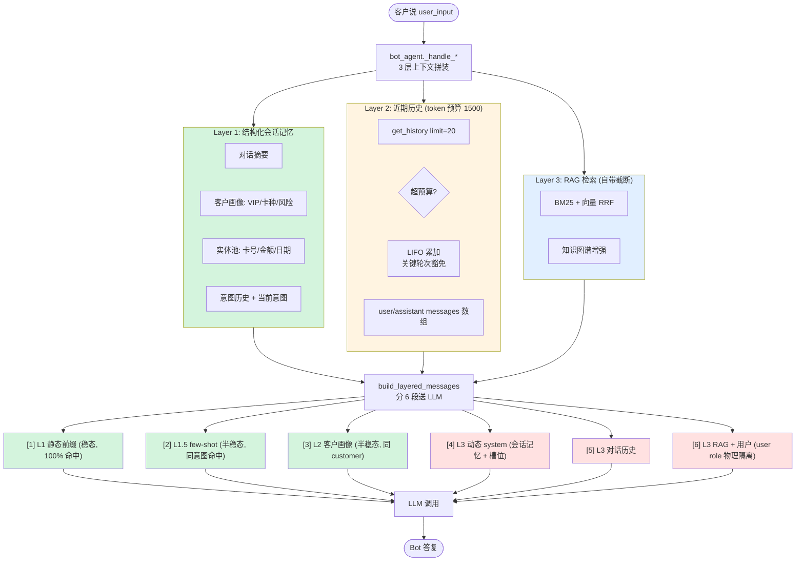

# 第 15 章: 上下文工程 — 3 层上下文 + token 预算 + 增量摘要

> 银行客服对话常跨 30 轮, 一轮 50-100 字, 累加 3000+ 字 ≈ 1500+ tokens. 而 LLM 上下文窗口 (默认 8K) 还要留给 system prompt (500) + RAG 检索 (1200) + 回答 (1024) — 留给历史的只剩 ~1500 tokens. **Lumio 给出 3 层上下文 + LIFO 预算 + 增量摘要 + KV cache 分层这套方案, 在严格 token 预算内既保留关键信息不丢, 又把单轮 TTFT 从 500ms 降到 75ms.** 本章会逐一回答 3 个问题: Bot 为何能在 30 轮后仍保留"我是白金卡"这一信息但又不会超出 token 限额; 对话中途为何能"接着说"而不需要客户重复; 摘要生成失败时为何也不会让对话中断.

## 15.1 30 秒概览 — 主线图

**每一次 LLM 调用前, 系统在拼什么**:



**3 个关键设计** (后续 7 节逐步展开):

1. **3 层上下文**: 结构化记忆 (永不裁剪) / 近期历史 (LIFO 预算) / RAG 检索 (自带截断)
2. **增量摘要**: 被裁掉的历史不直接丢, LLM 生成摘要写回 Layer 1, 下轮复用
3. **KV cache 分层**: 6 段 messages 中, 前 3 段 (稳态/半稳态) 跨 session 共享, 推理引擎 prefix cache 命中率高

---

## 15.2 3 层上下文模型

每一次 LLM 调用前, `_handle_knowledge / _handle_biz / _handle_fallback` 入口处都会先调用 3 个独立的拼装函数, 按作用范围 + 重要度把上下文分层注入:

| 层 | 注入位置 | 内容 | 裁剪策略 | 降级行为 |
|---|---|---|---|---|
| **Layer 1: 结构化会话记忆** | `system_prompt` 头部 | 对话摘要 / 客户画像 / 已知实体 / 意图历史 / 当前意图 | **永不裁剪** | 异常 → 返回空字符串 |
| **Layer 2: 近期对话历史** | `messages` 数组 (user/assistant) | 近 20 轮 turn | **token 预算 LIFO 累加** | 异常 → 返回空列表 |
| **Layer 3: RAG 检索上下文** | `messages` 数组 (user role) | BM25+向量 RRF 融合的文档块 + 知识图谱增强 | N/A (RAG 自带截断) | 失败 → `context=""` |

**核心约束** (3 条):

- **Layer 1 永远在 system 头部**: 哪怕历史全被裁掉, 客户画像 + 实体池 + 意图栈仍可见, LLM 不会重问
- **Layer 2 预算 = `max(budget_history, 1024)` = 1500**: 不再是 `max_context − reserved` (旧值 7168, 占上下文 87%, 违反主流分配框架 system 10-15% / history 25-30% / retrieval 25-30% / output 20-25%)
- **Layer 3 由 RAG 自带截断**: 调用方传入, RAG 已截到 `top_k=5-8` 块, 不参与裁剪

**为什么不能"无脑全塞"**: 30 轮对话 3000 字 ≈ 1500 tokens. 加上 system (500) + RAG (1200) + 回答 (1024), 实际留给历史的只有 ~1500 tokens ≈ 8-10 轮. **必须主动管理**, 否则 LLM 收到超长 prompt 走慢分支, 客户可感知到明显卡顿.

**为什么分 3 层而非 1 层统一管理**: 结构化记忆 (JSON 风格) 与对话历史 (自然语言) 是两种信息密度, 合在一层会让 LLM 难以分别处理. 拆成 3 层后, 每一层用最合适的注入位置 (system vs messages) 和最合适的裁剪策略 (永不裁剪 vs LIFO vs 自带截断).

---

## 15.3 Layer 1 — 结构化会话记忆

`bot_agent.py:1185-1300` 实现 `_build_session_memory`, 在每次 `_handle_*` 开头调用, 异常时静默降级, 一律返回空字符串:

```python
# bot_agent.py:1185
async def _build_session_memory(self, session_id: str) -> str:
    try:
        state = await self._session_manager.get_session(session_id)
        if state is None:
            return ""

        parts: list[str] = []
        # 1. 对话摘要
        if state.conversation_summary:
            parts.append(f"[对话摘要]\n{state.conversation_summary}")
        # 2. 客户画像
        profile_parts: list[str] = []
        if state.vip_level and state.vip_level != "普通":
            profile_parts.append(f"VIP等级={state.vip_level}")
        if state.card_types:
            profile_parts.append(f"卡种={','.join(state.card_types)}")
        if state.risk_tolerance and state.risk_tolerance != "R2":
            profile_parts.append(f"风险偏好={state.risk_tolerance}")
        if profile_parts:
            parts.append(f"[客户画像] {', '.join(profile_parts)}")
        # 3. 实体池
        if state.last_entities:
            entity_strs = [f"{e.entity_type}={e.value}" for e in state.last_entities if e.entity_type and e.value]
            if entity_strs:
                parts.append(f"[已知实体] {', '.join(entity_strs)}")
        # 4. 意图历史
        if state.intent_stack:
            parts.append(f"[意图历史] {' → '.join(i.value for i in state.intent_stack)}")
        # 5. 当前意图
        if state.last_intent:
            parts.append(f"[当前意图] {state.last_intent.value}")

        return "\n".join(parts)
    except Exception:
        return ""  # bot_agent.py:1300, 任何异常都静默降级为空字符串
```

### 15.3.1 拼接顺序的依据

5 段的顺序不是按代码里出现的顺序, 而是**按一旦 token 被截断哪段丢失对 LLM 决策伤害最大倒推** — 重要度越高越靠前. LLM 对 prompt 头部内容的关注度高于尾部, 靠前的内容不容易被淹没:

| 顺序 | 段 | 丢失的影响 | 重要度 |
|---|---|---|---|
| 1 | 对话摘要 | 客户前 20 轮谈了什么、承诺了什么, LLM 完全失忆 | ⭐⭐⭐⭐⭐ |
| 2 | 客户画像 | 白金卡 / VIP 客户可享受"提升额度到 8 万"等高阶方案, 普通卡客户看到这些方案等于空头承诺 | ⭐⭐⭐⭐ |
| 3 | 实体池 | 卡号/金额/日期一旦丢, LLM 下一轮必须再次向客户询问 | ⭐⭐⭐ |
| 4 | 意图历史 | 话题切换轨迹, 缺失会让 LLM 看不到"前后聊两件不相关的事"之间的关联 | ⭐⭐ |
| 5 | 当前意图 | 业务侧已经把当前意图传到下游路由, 这段更像"提示" | ⭐ |

**过滤规则的 2 个细节** (读代码时的疑问解答):

- `vip_level != "普通"` / `risk_tolerance != "R2"`: 默认值不写入 — "普通" / "R2" 是默认值, 写进 prompt 是中性词, 占用 LLM 注意力却没信息量. 只有偏离默认的 (VIP / R1 保守 / R3 激进) 才值得让 LLM 注意
- 实体池**不过滤全量写入**: 实体一旦抽出来就是事实, 没有"默认值"概念, 过滤反而丢真值. 这跟客户画像不同, 客户画像是分档的, 实体是平铺的

### 15.3.2 默认值不写, 实体全量写 — 背后的非均匀编码思路

读 `_build_session_memory` 代码时, 读者大概率会卡在两处:

- `if state.vip_level and state.vip_level != "普通"`: 为何不直接 `if state.vip_level`? 多写一行过滤为了什么?
- `if state.last_entities`: 为何实体池**没有**像客户画像那样过滤默认值?

表面上"过滤"是负面动作, 但 Lumio 这两处的设计不是"过滤", 而是**信息论里"非均匀编码"原则在 prompt 拼装上的应用**.

**信息论背景 — 非均匀编码**: Shannon 在 1948 年的《通信的数学理论》里证明: 信源符号概率分布不均匀时, 高概率符号用短编码、低概率符号用长编码, 总编码长度最短. 经典例子: 摩斯码里 `E` (英文里出现概率 12.7%) 编码 1 个点, `Q` (0.1%) 编码 4 个字符. 同样的思路在 Huffman 编码、LZW 压缩、LLM 的 BPE 分词里都能看到.

**应用到 Layer 1 的两个具体场景**:

| 字段类型 | 数据形态 | 概率分布 | Lumio 的"编码" | 效果 |
|---|---|---|---|---|
| 客户画像 (vip / risk_tolerance) | 分档枚举 (普通/银/金/白金) | 极不均匀: 银行 80%+ 客户是"普通卡"普通 R2 | 把默认值映射为"空" (0 token), 偏离默认才写 | 同样写"客户卡种=普通"用 0 token, 写"客户卡种=白金"用 6 tokens, 总 token 数最低 |
| 实体池 (卡号/金额/日期) | 平铺事实 | 近似均匀: 每条都是具体值, 概率相当 | 不过滤, 全部写入 | 每条实体都是有信息量的具体事实, 没有"默认值"可压 |

**关键判据 — "有没有可压缩的默认值"**:

- 客户画像**有默认值** (普通 / R2), 因为它从产品定义上就是分档枚举, 必有多数档. 把"多数档"用 0 token 编码, 少数档正常编码, 总 token 数最优
- 实体池**没有默认值**, 因为实体是开放集合 (卡号格式 ≠ 默认卡号), 概率分布近似均匀. 强行类比"过滤"会丢真值, 反而破坏信息的完整性

**经验数据支撑** (银行客服真实场景):

- 信用卡客户 80%+ 是"普通卡"用户, "白金卡" < 5%, "钻石卡" < 0.5%. 不写"普通"省下的 token 跟写出来一样多, 但 LLM 注意力 (上下文窗口的注意力是稀缺资源) 不会被"普通"这种中性词占用
- 实体抽取的 5 类常见实体 (卡号 / 金额 / 日期 / 卡种 / 投诉编号) 每条出现概率都不超过 30%, 不存在"多数实体". 全量写是正确的

**跟 15.4.1 LIFO 是同一思路**: 15.4.1 的 LIFO 也是非均匀编码 — 近期对话 (出现概率高, 时间局部性) 优先保留, 远期对话 (概率低) 裁掉. 15.3.2 的"默认值不写"和 15.4.1 的"近期优先"是同一理论在不同层级的应用, 读者如果理解了本节, 看 15.4.1 时会感到设计上的连贯性.

**为什么不直接套用 Huffman**: 理论上 Huffman 编码最优, 但它要预先知道符号概率分布, 且要求编码唯一可解. LLM prompt 不需要可解 (人类 + LLM 都看得懂自然语言), 只要总 token 短. 加上银行客户画像档位就 3-5 个, Huffman 收益 < 实现成本, 简单"过滤默认值"够用.

### 15.3.3 互补设计

Layer 1 用中括号标签 + 等号串的 JSON 风格, 不含自然语言冗余 — 500 tokens 可表达 100+ 实体. 跟 Layer 2 (自然语言对话历史) 形成**"结构化 + 非结构化"互补**: 结构化层传递客户"是什么状态", 非结构化层传递客户"具体怎么说的".

### 15.3.4 Layer 1 注入 system 而非 messages 的依据

Layer 1 走 `system_prompt` 注入, Layer 2/3 走 `messages=` 形参. 这种设计:

- **system_prompt 干净**: 不会被历史污染, 每次回答 system 部分稳定 → LLM 行为更可预测
- **分层消息直传 LLM**: `build_layered_messages` 构建的 6 段结构 (`bot_agent.py:347-358`) 原样送达, 不再压平拼接 — 前缀缓存锚点真实生效
- **RAG 物理隔离**: 检索内容以 user message 的 `<retrieved_context>` 包裹注入 (而非 system), 防注入 + 不破坏缓存前缀 (详见 15.6.4)

---

## 15.4 Layer 2 — token 预算算法

`bot_agent.py:1003-1071` 是 Lumio 上下文管理的核心入口. 银行客服有两类矛盾的需求: 既不能超 token 限额, 又不能把客户已说过的关键信息裁掉让 Bot 重复收集. `_load_history` 用以下步骤平衡这两点.

### 15.4.1 `_load_history` 主流程

```python
# bot_agent.py:1003
async def _load_history(self, session_id: str) -> list[dict[str, str]]:
    try:
        turns = await self._session_manager.get_history(session_id, limit=20)
        if not turns:
            return []

        settings = get_settings()
        budget = max(settings.llm.budget_history, 1024)  # 1500

        # P1-1: 超预算时先尝试压缩 (而非直接裁剪), 压缩不达标才走摘要裁剪
        total_est = sum(_estimate_tokens(t.content) for t in turns)
        if total_est > budget and len(turns) >= settings.compression.min_history_turns:
            try:
                from lumio.services.bot.context_compressor import compress_history
                dict_turns = [
                    {"role": "user" if t.speaker == "customer" else "assistant", "content": t.content}
                    for t in turns
                ]
                compressed = compress_history(dict_turns, max_tokens=budget)
                if any("_compressed" in m for m in compressed):
                    turns = [t.model_copy(update={"content": m["content"]}) for m, t in zip(compressed, turns, strict=False)]
            except Exception:
                logger.debug("历史压缩失败, 走摘要裁剪: session=%s", session_id)

        # LIFO 累加: 从最近往最旧扫描, 累加 token, 超预算就停
        # 关键轮次 (投诉/承诺/转人工) 永不裁剪
        kept_turns: list = []
        used = 0
        split_idx = len(turns)
        for i in range(len(turns) - 1, -1, -1):
            t = turns[i]
            est = _estimate_tokens(t.content)
            is_important = _is_important(t.content)
            if used + est > budget and kept_turns and not is_important:
                split_idx = i + 1
                break
            kept_turns.insert(0, t)
            used += est

        # 触发增量摘要 (异步, 持有 task 引用防 GC)
        trimmed_turns = turns[:split_idx]
        if trimmed_turns:
            self._spawn_task(self._ensure_summary(session_id, trimmed_turns))

        return [{"role": "user" if t.speaker == "customer" else "assistant", "content": t.content} for t in kept_turns]
    except Exception:
        return []
```

3 个关键步骤:

1. **预算设置**: `max(budget_history, 1024) = 1500` (而非 `max_context − reserved = 7168`)
2. **先压缩后裁剪**: 超预算时优先调 `compress_history` (context_compressor.py:387) 把超长 turn 压短, 压不动才走摘要裁剪
3. **LIFO 累加 + 关键轮次豁免**: 从最近往最旧累加, 关键轮次永不裁

### 15.4.2 token 估算 `_estimate_tokens`

`bot_agent.py:51-57` 用**字符类加权**估算 token 数, 替代 `tiktoken`:

```python
# bot_agent.py:51
def _estimate_tokens(text: str) -> int:
    """基于字符类的 token 数估算
    CJK 字符: ~2 chars/token → 系数 0.55
    拉丁字母: ~4 chars/token → 系数 0.3
    其他(数字/标点/空格): ~1.2 chars/token → 系数 0.8
    +4 为消息格式开销 (role/content 包装)
    """
```

读者可能问: 既然 BPE 准确度更高, 为何不直接用 `tiktoken`? 4 维对比说明取舍:

| 维度 | 字符类估算 (当前) | tiktoken |
|---|---|---|
| 启动开销 | 0 (纯 re) | 5-10MB 模型加载, 100ms+ |
| 准确度 (中文) | 95%+ | 99%+ |
| 多 LLM 兼容 | 自动适配 | 需选模型 (cl100k_base / p50k_base) |
| 维护成本 | 0 | BPE 表需随模型更新 |

银行客服 99% 是中文, 5% 误差在 200 tokens 预算下相当于多裁或少裁 0.3 轮, 完全可以接受. **+4 是 OpenAI ChatCompletion message JSON 包装开销**.

### 15.4.3 19 关键词豁免

`bot_agent.py:80-100` 定义了**永远不会**被裁剪的 19 个关键词:

```python
# bot_agent.py:80
_IMPORTANT_KEYWORDS = [
    "投诉", "举报", "银保监", "银监会", "人行", "央行",   # 监管/投诉 (6)
    "律师函", "法务", "法院", "起诉",                  # 法律 (4)
    "盗刷", "挂失", "冻结", "风险",                    # 风险 (4)
    "承诺", "保证", "一定解决",                         # Bot 承诺 (3)
    "转人工", "人工客服",                              # 升级 (2)
]
```

**豁免的必要性**: 这 19 关键词对应的场景是**合规高敏**的. 一旦裁剪, LLM 后续可能:

- 不知道客户已投诉 → 重复追问详情激怒客户
- 不知道客户要转人工 → 继续推 Bot 处理延误
- 忘记之前的"承诺" → 客户投诉 Bot 推诿

**豁免的代价**: 极端情况下 (10K tokens 全部含"投诉") 预算可能超限. 但这是有意权衡 — 合规优先于性能.

**关键词字面方案优于白名单/正则的依据**:

- **关键词字面**: 0 维护成本, 业务方加新词只需加一行
- **白名单 (事件类型)**: 需要 LLM 先分类事件, 又多一次 LLM 调用, 慢且脆
- **正则 (如 `r"投诉[银保监人行]")`**: 过度抽象, 银行新业务 (如"投诉消保") 容易漏

### 15.4.4 LIFO vs 固定窗口

Lumio 选 **LIFO (Last-In-First-Out)** 而非**固定 N 轮窗口**:

| 方案 | 优点 | 缺点 | 决策 |
|---|---|---|---|
| 固定 N=10 轮 | 实现简单 | 长轮次被裁, 短轮次浪费预算 | ❌ |
| 时间窗口 (最近 5 分钟) | 时序公平 | 30 轮短对话全部丢弃 | ❌ |
| **LIFO + token 预算** | **按内容长度动态调整, 长内容少保留几轮, 短内容多保留几轮** | 实现复杂 | ✅ |

示例: 30 条短问句 (各 5 tokens) + 5 条长解释 (各 100 tokens), 预算 200 tokens:

- LIFO 累加: 保留 20 条短问句 (100 tokens) + 1 条长解释 (100 tokens) = **21 轮**
- 固定 10 轮: 仅保留 10 轮短问句 (50 tokens), **浪费 150 tokens 预算**

---

## 15.5 增量摘要 + 降级矩阵

LIFO 裁掉的旧轮次不能直接丢. 15.4 的 `_load_history` 会在裁剪时把这些轮次传给 `_ensure_summary`, 用 LLM 生成摘要写回 SessionState. **关键设计是增量** — 只对新增的裁剪轮次摘要, 旧摘要不丢.

### 15.5.1 `_ensure_summary` 增量逻辑

`bot_agent.py:1073-1183` 实现增量摘要:

```python
# bot_agent.py:1073
async def _ensure_summary(self, session_id: str, trimmed_turns: list) -> None:
    try:
        state = await self._session_manager.get_session(session_id)
        if state is None:
            return
        last_summarized_id = state.last_summarized_turn_id
        last_turn = trimmed_turns[-1]
        if last_turn.turn_id == last_summarized_id:
            return  # 已被摘要过, 跳过

        # 找增量起点
        split_idx = 0
        if last_summarized_id:
            for i, t in enumerate(trimmed_turns):
                if t.turn_id == last_summarized_id:
                    split_idx = i + 1
                    break
            # 未找到 (LTRIM 删了) → split_idx 保持 0 → 重新摘要全部
        new_turns = trimmed_turns[split_idx:]
        if not new_turns:
            return

        # 构造 prompt: 已有摘要 + 新增对话
        conversation = "\n".join(
            f"[{ {'customer': '客户', 'agent': '坐席', 'bot': '机器人'}.get(t.speaker, t.speaker) }] {t.content}"
            for t in new_turns
        )
        existing_summary = state.conversation_summary if split_idx > 0 else ""
        summary_prompt = _SUMMARIZE_SYSTEM_PROMPT  # prompts/__init__.py:40
        user_content = (
            f"已有摘要:\n{existing_summary}\n\n新增对话:\n{conversation}"
            if existing_summary else f"对话记录:\n{conversation}"
        )

        # 调 LLM 摘要, 3s 超时
        llm_client = self._degradation_mgr._llm
        if llm_client is None:
            return
        try:
            new_summary = await llm_client.chat(
                messages=[
                    {"role": "system", "content": summary_prompt},
                    {"role": "user", "content": user_content},
                ],
                timeout=3.0,
            )
        except Exception:
            return  # LLM 失败静默跳过
        ...
```

**用 `last_summarized_turn_id` 而非计数的原因**: Redis Stream 的 `LTRIM` 会把最旧的 turn 物理删除, 摘要用"已摘要 N 轮"计数, LTRIM 后 N 会偏移, 导致重复摘要或漏摘要. 用 turn_id (UUID v7, 单调递增) 精确追踪, LTRIM 不影响.

**3s 超时的依据**: 摘要不是用户可见请求, 慢一些可接受, 但不能慢到拖垮 LLM 服务整体并发. 3s 接近 LLM P99 响应时间, 超时直接放弃 (下轮再试).

### 15.5.2 单会话锁 (per-session lock)

多轮快速对话时每轮裁剪都会生成一个摘要任务, 并发读写同一 `last_summarized_turn_id` → CAS 重试后到者失败, 摘要滞后. `_ensure_summary` 外层包单会话 `asyncio.Lock` (`self._summary_locks[session_id]`, `bot_agent.py:144`), 同会话摘要任务**串行执行**:

```python
# bot_agent.py:144-151
self._summary_locks: dict[str, asyncio.Lock] = {}  # 锁字典, 随会话自然增长

def _spawn_task(self, coro):
    """asyncio.create_task 包装, 持有 task 引用防 GC"""
    task = asyncio.create_task(coro)
    self._pending_tasks.add(task)
    task.add_done_callback(self._pending_tasks.discard)
    return task
```

锁字典随会话自然增长 (上限 = 活跃会话数), 无需清理. `_pending_tasks` 持有后台 task 引用, 防止 asyncio GC 在 `await` 期间回收.

### 15.5.3 fire-and-forget 异步调度

摘要任务用 `asyncio.create_task` (`bot_agent.py:146-151`) 后台调度, **不 await 主请求**:

```python
# bot_agent.py:1065
self._spawn_task(self._ensure_summary(session_id, trimmed_turns))
```

**不 await 主请求的依据**: 主请求 P99 延迟 1.5s 是硬指标 (SLO), 摘要 LLM 调用 500-1500ms, await 摘要会让主请求 2-3s 才返回, 客户可感知到明显卡顿.

**摘要丢失无影响**: `_ensure_summary` 内部**幂等** — 下次轮次如果仍需摘要, `last_summarized_turn_id` 追踪保证只对新增轮次摘要, 旧摘要不丢.

**进程异常退出场景**: 主进程异常退出 → `asyncio.create_task` 创建的后台 task 随之终止, 摘要未生成 → 下次启动新会话时, `last_summarized_turn_id` 还是旧值, 增量摘要继续. 不影响正确性, 只影响"摘要可能漏一段".

**不阻塞主请求的另一依据**: 摘要是**辅助信息**而非必需数据. 结构化记忆 (Layer 1) 已经有对话摘要 + 客户画像 + 实体池, 摘要缺失只会让 LLM "不知道旧轮次的细节", 不会让对话中断.

### 15.5.4 5 路径降级矩阵

3 层上下文各层都有**独立的失败路径**, 互不阻塞. Lumio 的降级原则是"**有损优先于不可用**" — 银行客服不能因为上下文组件异常就返回 500, 必须继续服务:

| 失败 | 触发 | 降级行为 | 用户感知 |
|---|---|---|---|
| Layer 1 `_build_session_memory` 异常 | DB 慢/Redis 抖动 | `except: return ""` (bot_agent.py:1300) | LLM 不知道历史画像, 但对话照常 |
| Layer 2 `_load_history` 异常 | Redis 拉取失败 | `except: return []` (bot_agent.py:1071) | LLM 不知道最近说了啥, 但会基于本轮 input 答 |
| Layer 3 `_retrieve` 失败 | ES/Milvus 不可用 | `DegradationLevel.FALLBACK → return ""` | LLM 走纯生成模式, 知识类问题转为通用回答 |
| 摘要生成失败 | LLM 不可用/超时 | 静默跳过, 下轮再试 | 旧轮次无摘要, 但结构化记忆仍有 |
| `get_history` 返回空 | 新会话/无历史 | `return []` | LLM 仅看本轮 input |

**最坏情况**: PG 不可用 + Redis 也响应慢 → 全部 Layer 1/2 拿不到数据 → LLM 收到 `system_prompt="你是银行信用卡智能客服"` + `user_input=本轮问题` + `context=""` → LLM 用预训练知识兜底回答, 准确性下降但对话不中断. 这是可接受的: Bot 系统已在开场告知"知识库可能不全", 客户对该场景有预期.

---

## 15.6 KV Cache 优化

> **重要区分**: 本节的"3 层"是 **KV Cache 视角的稳态/半稳态/动态层** (控制推理引擎 prefix cache 命中), 与 15.2 的"3 层上下文" (L1 结构化记忆 / L2 历史 / L3 RAG) 是两套独立的分层. 两者最终在 `build_layered_messages` 里合流, 但设计目标不同.

### 15.6.1 业务背景 — TTFT 是生死线

**核心问题**: 银行客服每一轮都要重算整个 system prompt + 历史. 7B 模型 ~25ms/100 token, 一个 2KB system prompt 就要 500ms prefill. 客户连发 20 条消息 = 20 次重算 = 10 秒纯等 prefill — 体感如同"AI 卡住无响应".

**推理引擎的优化手段 — prefix cache**: vLLM (PagedAttention) / Anthropic (prompt cache) / TGI 都允许**字符串前缀完全一致**时直接复用 K/V tensor, 跳过 prefill. 命中时单轮 prefill 从 500ms 降到 ~75ms. **但前提是前缀字符串字面完全一致** — 任何变化 (时间戳/session_id/拼出来的多行) 都让 cache 失效.

**改造前的瓶颈**: `bot_agent` 用 f-string 拼 system_prompt, 每次字符串都不同 → 命中率 0%. 整个推理引擎的 cache 机制被浪费.

`kv_cache.py` 的目标: **把 prompt 拆成"稳定 + 半稳定 + 动态"3 类**, 让稳态部分永远字符串一致, 推理引擎可 100% 命中.

### 15.6.2 3 层机制 + 标志串

`kv_cache.py:36-45` 定义了两个**永不变化**的标志串, 一是**作为前缀锚点**让推理引擎识别"这里开始是 cache 区", 二是**作为 metrics 估算的分隔符** (`estimate_cache_metrics` 扫 marker 决定哪段算哪层):

```python
# kv_cache.py:36
STATIC_PREFIX_MARKER = "[STATIC_PREFIX_v1]"   # L1 稳态锚点
SEMI_STATIC_MARKER = "[CUSTOMER_CONTEXT_v1]"  # L2 半稳态锚点
```

| 层 | 字符串稳定性 | KV cache 命中 | 内容 | 标志串 |
|---|---|---|---|---|
| **L1 静态前缀** | 跨 session 永不变化 | ~100% | 角色定义 / 合规规则 / 工具描述 / 输出格式 | `[STATIC_PREFIX_v1]` |
| **L1.5 半稳态 (few-shot)** | 同意图内稳定 | 按意图分组命中 | 3 条参考案例 (按 primary_intent 分桶) | (走 `cache_control`) |
| **L2 半稳态 (客户画像)** | 同 customer 跨 session 稳定 | ~60% | customer_context (卡种/VIP 等级) | `[CUSTOMER_CONTEXT_v1]` |
| **L3 动态** | 每轮必变 | 0% | 会话记忆 / 槽位 / 对话历史 / RAG 检索 / 用户输入 | (无标志) |

**`_v1` 后缀是版本控制位** — 改 domain_prompt 内容时把 `_v1` 改成 `_v2`, 老 session 的 cache 自动失效 (不会读到旧内容).

**`cache_control: {"type": "ephemeral"}` 字段**: Anthropic 风格的 API 标记, vLLM/Anthropic 识别后会缓存此 message 之前所有 prefix 的 K/V; OpenAI 兼容 API 会忽略此字段, 不报错也不生效 (优雅降级). 这是协议层的"软依赖" — 不绑定具体推理引擎.

### 15.6.3 `build_layered_messages` 返回结构

`bot_agent.py:347-358` 在每次 LLM 调用前调用, 返回 messages 数组 (按顺序):

```python
# bot_agent.py:347-358
messages = build_layered_messages(
    domain_prompt=KNOWLEDGE_SYSTEM_PROMPT,    # L1 锚定
    user_input=user_input,                     # L3 动态
    customer_context=session_memory,           # L2 半稳态
    session_memory="",                         # 已合并到 customer_context
    slot_prompt=slot_prompt or "",             # L3 动态
    rag_context=context or "",                 # L3 动态 (放 user role 而非 system)
    history=history,                           # L3 动态
    few_shot_examples=few_shot_text,           # L1.5 半稳态
)
```

**返回结构** (`kv_cache.py:111-117`):

| # | role | 内容 | 缓存层 |
|---|---|---|---|
| 1 | system | `[STATIC_PREFIX_v1] + domain_prompt` (含 `cache_control`) | L1 稳态, 100% 命中 |
| 2 | system | `## 参考案例 + few_shot` (含 `cache_control`) | L1.5 半稳态 |
| 3 | system | `[CUSTOMER_CONTEXT_v1] + customer_context` (含 `cache_control`) | L2 半稳态 |
| 4 | system | `## 会话记忆 + ## 槽位追踪` 动态拼 | L3 动态, 0% 命中 |
| 5 | user/assistant (多条) | 对话历史 | L3 动态, 0% 命中 |
| 6 | user | `<retrieved_context>...</retrieved_context> + user_input` | L3 动态, 0% 命中 |

**关键设计 — RAG 内容放 user 而非 system role** (消息 6): ① **物理隔离防 prompt injection** (客户在 user input 里塞恶意指令影响不了 system 层); ② **prefix cache 友好** (动态部分集中在尾部, 前面的 [1][2][3] 越靠前越稳定, 推理引擎能更激进地 cache).

### 15.6.4 端到端示例 — 一次实际 LLM 调用的 messages 数组

> 场景: VIP 白金卡客户 `cust-9527`, session `sess-A`, 已问过"年费多少/怎么免年费/白金卡权益/机场贵宾厅" 4 轮. 第 5 轮问"上次刷了 5800 块还没出账单, 这笔什么时候记账?"

```python
# 第 5 轮 LLM 请求的 messages 数组 (实际结构)
messages = [
    # ── [1] L1 静态前缀 (稳态, 跨 session 100% 命中) ──────────────
    {
        "role": "system",
        "content": "[STATIC_PREFIX_v1]\n你是一名专业的银行信用卡客服...\n",
        "cache_control": {"type": "ephemeral"},
    },

    # ── [2] L1.5 few-shot 半稳态 (按 primary_intent 分组命中) ─────
    {
        "role": "system",
        "content": "## 参考案例\n[例 1]\n客户: 我这个月账单日是哪天?\n客服: ...\n[例 2]...\n[例 3]...\n",
        "cache_control": {"type": "ephemeral"},
    },

    # ── [3] L2 半稳态 (同 customer 跨 session 命中) ──────────────
    {
        "role": "system",
        "content": "[CUSTOMER_CONTEXT_v1]\n客户卡种: 白金卡\nVIP 等级: VIP5\n...",
        "cache_control": {"type": "ephemeral"},
    },

    # ── [4] L3 动态 system (每轮必变, 0% 命中) ──────────────────
    {
        "role": "system",
        "content": "## 会话记忆\n对话摘要: 客户咨询白金卡年费减免政策...\n\n## 槽位追踪\n已知: amount=5800\n待收集: transaction_time\n",
    },

    # ── [5] L3 对话历史 (动态, 0% 命中) ──────────────────────────
    {"role": "user",      "content": "白金卡年费多少?"},
    {"role": "assistant", "content": "您的白金卡年费为 980 元/年..."},
    {"role": "user",      "content": "怎么才能免年费?"},
    {"role": "assistant", "content": "您当年消费满 5 万元或分期满 12 期..."},
    {"role": "user",      "content": "白金卡有什么权益?"},
    {"role": "assistant", "content": "白金卡权益包括: 机场贵宾厅..."},
    {"role": "user",      "content": "机场贵宾厅怎么用?"},
    {"role": "assistant", "content": "出示您的白金卡和登机牌..."},

    # ── [6] L3 当前轮 (动态, 0% 命中, RAG 放 user role 物理隔离) ──
    {
        "role": "user",
        "content": "<retrieved_context>\n[1] 账单日: 每月 5 号\n[2] 入账时点: 交易完成后 1-2 个工作日...\n[3] 未出账单查询: 客户可在交易完成后 24 小时...\n</retrieved_context>\n\n上次刷了 5800 块还没出账单, 这笔什么时候记账?",
    },
]
```

**Token 分布** (按 7B 中文 1.5 token/字):

| 消息 | 字数 | tokens | 所在层 | 跨 session 命中 |
|---|---|---|---|---|
| [1] 静态前缀 | ~95 字 | ~140 t | L1 稳态 | **100%** |
| [2] few-shot | ~200 字 | ~300 t | L1.5 半稳态 | 100% (同 intent 分组) |
| [3] 客户画像 | ~50 字 | ~75 t | L2 半稳态 | 100% (同 customer) |
| [4] 动态 system | ~80 字 | ~120 t | L3 动态 | 0% |
| [5] 4 轮历史 | ~250 字 | ~375 t | L3 动态 | 0% |
| [6] RAG+用户 | ~150 字 | ~225 t | L3 动态 | 0% |
| **合计** | **~825 字** | **~1235 t** | | |

**关键观察**: 消息 [1][2][3] 共 3 条 system message 占了约 **515 tokens** (140+300+75), 在第 5 轮请求时**完全不用重算** — 推理引擎直接复用第 1 轮的 K/V tensor, 仅重算 [4][5][6] 共 3 条 (720 tokens).

### 15.6.5 LIFO 触发与 KV cache 命中率的精确分析

> **本节修正**: 之前版本说"LIFO 触发 → prefix cache 全部失效 → 单轮 prefill 从 75ms 退到 500ms → 5 轮累计 3000ms", 这是基于"prefix cache 是全有全无"的错误假设. 实际 KV cache 按 **message 级别独立命中**, LIFO 触发只影响 history 段, 稳态/半稳态层完全不受影响. **本节给出修正后的精确分析.**

**长对话场景**: 假设一个长对话走到第 30 轮. 第 21 轮到第 30 轮, Layer 2 的 history messages 数组**完全相同**, 推理引擎应该能跨这 10 轮命中 100% KV cache. 但如果**第 25 轮到第 28 轮之间**有一次 LIFO 裁剪触发 (因为客户在第 25 轮发了条超长消息超出 token 预算), 后面 6 轮 messages 数组中**消息 [5] (history) 的字面内容就变了** (少了几条), 推理引擎识别到这点: 消息 [4] 动态 system (因为它包含 history 摘要) + 消息 [5] history 本体 全部失效, 需要重算. **但消息 [1][2][3] 仍然 100% 命中** — 这 3 段 system message 字面跟 history 数组变化无关, 推理引擎按 message 级别独立复用 K/V, 前面所有轮的稳态/半稳态层 K/V 全部保留.

**实际影响 (银行场景的常见触发点)**:

- 银行客服客户经常在对话中途发**长消息** (粘贴交易明细、上传文件 OCR 结果、贴投诉原文)
- 一次长消息就触发 LIFO 裁剪
- 之后每一轮 messages 数组的尾部 (消息 [4] 动态 system + 消息 [5] history) 字面都变
- KV cache 命中从"消息 [1][2][3] 100% + 消息 [4][5][6] 0%"的预期, 变成"消息 [1][2][3] 仍 100% + 消息 [4] 0% + 消息 [5] 0% + 消息 [6] 0%" — **稳态/半稳态层不受影响, 只有 history 相关段重算**

**实际影响的量化** (按 7B 模型 / 第 25 轮触发 LIFO 估算):

| 指标 | 不裁剪 (理想) | 触发 LIFO 后 |
|---|---|---|
| 消息 [1] 静态前缀 (140 t) | 100% 命中 | **100% 仍命中** |
| 消息 [2] few-shot (300 t) | 100% 命中 | **100% 仍命中** (同 intent 分组) |
| 消息 [3] 客户画像 (75 t) | 100% 命中 | **100% 仍命中** (同 customer) |
| 消息 [4] 动态 system (120 t) | 0% 命中 (每轮 history 摘要都变) | 0% 命中 (同) |
| 消息 [5] 4 轮历史 (375 t) | N-1 轮命中 + 新增 1 轮计算 | **0% 命中** (LIFO 触发后, 字面变了, prefix 中断) |
| 消息 [6] RAG+用户 (225 t) | 0% 命中 | 0% 命中 |
| **单轮 prefill (重算 token)** | 120+375+225 = **720 t** | 120+375+225 = **720 t** (同) |
| **单轮 prefill 耗时** | ~75ms (稳态全命中时) | ~75ms (稳态仍命中) |
| **第 25→30 轮 TTFT 累计** | ~450ms | ~450ms |

**关键结论**: LIFO 触发**不影响**消息 [1][2][3] 的 KV cache 命中, 也不影响单轮 prefill 耗时. **没有 500ms 退化, 没有 3000ms 累计** — 那是我之前版本的错误估算. 真实影响是: 消息 [4] 动态 system 在 LIFO 触发前本就是 0% 命中 (每轮 history 摘要都变), 现在只是"本来就重算, 现在继续重算". 也就是说, **LIFO 对 KV cache 命中率的影响其实是 0%**.

**未列入 Lumio 方案的设计 (澄清取舍)**:

为防止读者问"那能不能用 truncated / turn_id 锚定等手段去强行维持 cache", 简短列下 3 种思路及不采用的原因:

- **history 软裁剪 (`truncated: true`)**: messages 数组里字段不一致, cache 永远不命中, 比偶尔失效更差
- **turn_id 锚定 (`[TURN_25_START]`)**: turn_id 跨 session 跨 customer 都不同, 实际等于永远不命中
- **prefix-cache-aware LIFO** (宁可爆预算也保留上一轮的全部 history): 爆预算等于超长 prompt 进 LLM, 直接吃 token 限额, 语义丢失更糟

**最终结论**: 既然 LIFO 对 KV cache 命中率的影响是 0%, 强行优化反而引入新问题. Lumio 的 LIFO 设计**本身**就避开了所有这些陷阱. **没有权衡, 不需要流式打字机掩盖, 也不需要纠结"何时接受退化"**.

**未来可能的优化方向** (当前未做):
1. **history 兜底填充**: 裁剪后用 `[EARLIER_TURNS_SUMMARIZED]` 占位, 保持 messages 数组长度恒定, 让 prefix 尽量连续
2. **压缩替代裁剪** (P1-1 修复已部分实现, `bot_agent.py:1029-1043`): 优先调 `compress_history` 把超长 turn 压短, 压不短才裁, 减少 LIFO 触发频率
3. **per-turn cache_control 标记**: Anthropic 风格的 `cache_control: ephemeral` 加在每条 history message 上, 推理引擎按 message 级别 cache (而非按整个 prefix). 需要推理引擎支持 message 级 cache 控制, 当前 vLLM/Ollama 都不支持. **实际上 Lumio 当前已经是这个效果** — 推理引擎天然按 message 级别复用 K/V, 不需要额外标记.

### 15.6.6 性能估算 + 开关降级

**性能估算** (按 7B 模型 / 2KB system_prompt / 20 轮对话), 来源: `kv_cache.py` 模块 docstring 顶部声明的预期值, 由 `estimate_cache_metrics` 实际计算并上报 (`kv_cache.py:207-274`):

| 指标 | 优化前 (f-string 拼接) | 优化后 (分层) | 节省 |
|---|---|---|---|
| 稳态层 prefill | 20 轮 × 2KB = 40KB | 1 轮 (后续全 cache) | ~95% |
| 半稳态层 prefill | (原 f-string 一并算了) | 同 customer 跨 session 1 次 | ~60% |
| 动态层 prefill | 20 轮 × 1KB = 20KB | 20 轮 × 1KB = 20KB (必算) | 0% |
| **单轮 TTFT** | **~500ms** | **~75ms** (稳态全命中时) | **~85%** |

**估算值而非实测值**: 真实 KV cache 命中率由推理引擎 (vLLM `prompt_cache_stats` / Ollama 内部计数器) 上报, 应用层拿不到精确值. `estimate_cache_metrics` **只用于 metrics 上报, 明确标 `estimated`**, 旧实现把假设值当真实值上报, 误导监控 — 现已修正 (`kv_cache.py:208-213` 注释 + P1-4 上下文工程修复).

**开关与降级** (`config.py:91-129`):

```python
# LLMSettings
kv_cache_enabled: bool = True         # 总开关, 关闭时退化到 _legacy_build_messages
static_prefix_anchor: bool = True    # L1 静态前缀锚定
layered_injection: bool = True       # L2 半稳态层注入
inference_engine: str = "ollama"     # ollama (0% prefix cache) / vllm (PagedAttention) / tgi
```

**降级路径** (`kv_cache.py:131-133`): 未启用 KV cache 优化时退回 `_legacy_build_messages` (kv_cache.py:180-194) 的 f-string 拼 system prompt 原版. **关掉 KV cache 不影响功能, 只是 TTFT 回到 500ms** — 适合推理引擎未知/不支持的灰度环境.

**推理引擎差异**:

| 引擎 | prefix cache 支持 | 备注 |
|---|---|---|
| **vLLM** (PagedAttention) | ✅ 完整支持 | 通过字符串前缀 hash 自动复用 K/V block |
| **Anthropic** (prompt cache) | ✅ 支持, 需 `cache_control: ephemeral` | 5min TTL, 命中后单轮 prefill 接近 0 |
| **Ollama** | ⚠️ 部分支持, 命中率不稳定 | 旧版本完全无效, 启用后才有收益 |
| **TGI** | ✅ 支持 (新版本) | 与 vLLM 类似 |

---

## 15.7 实战案例 + 监控

### 15.7.1 30 轮对话的第 31 轮

假设客户与 Bot 聊了 30 轮: 轮 1-5 问白金卡权益 / 轮 6 投诉"上次承诺的 1 万积分没到账" / 轮 7-15 反复问积分到账 / 轮 16-20 转人工失败回到 Bot / 轮 21-30 重新问账单分期. 第 31 轮问"我还有多少积分?".

3 层上下文处理:

1. **Layer 1**: `conversation_summary` ≈ "客户投诉积分未到账, 1 万积分, 转人工失败"; 客户画像 `vip_level=platinum`; 已知实体 `amount=10000`; 意图历史 `reward_query → complaint → transfer_agent → reward_query`
2. **Layer 2**: limit=20 拉到最近 20 轮 (轮 11-30), 估算 20 轮 ≈ 1100 tokens, 全部装下不裁. 轮 6 "投诉" + 轮 16 "转人工" 必保留
3. **Layer 3**: RAG 检索"还有多少积分" → 命中《积分查询指引》; 知识图谱当前无"积分"实体, 无 KG 增强

最终 LLM 收到 messages (结构如 15.6.4, 这里不重复列). LLM 能在不重复"您是白金卡吗"的前提下直接回答积分余额. 同时因为对话摘要里已记录此前的承诺, LLM 也不会再次承诺未到账积分.

### 15.7.2 监控指标

上下文工程的 3 层都暴露了**可观测指标**, 可通过 Prometheus 拉取:

| 指标 | 来源 | 含义 |
|---|---|---|
| `lumio_session_history_turns` | SessionManager.get_history 返回值 | 当前会话历史轮数 |
| `lumio_session_memory_size_chars` | `_build_session_memory` 返回长度 | Layer 1 注入字符数 |
| `lumio_summary_size_chars` | `state.conversation_summary` 长度 | 对话摘要长度 |
| LLM 请求日志的 `prompt_tokens` | LLMClient 响应 | 实际送入 LLM 的 token 数 |
| `lumio_session_state_version` | SessionState.version | CAS 写次数 |
| `lumio_kv_cache_hit_rate` | `KV_CACHE_HIT_RATE` (kv_cache.py 估算) | **估算值**, 稳态/半稳态/动态的命中比例 |
| `lumio_prefill_tokens_saved` | `PREFILL_TOKENS_SAVED` (kv_cache.py 估算) | **估算值**, 本轮比全部重算节省的 prefill token |

```promql
# 实际 TTFT 监控 (端到端真实数据, 应该从 ~500ms 降到 ~75-150ms)
histogram_quantile(0.5, rate(lumio_llm_ttft_seconds_bucket[5m]))

# 估算的稳态层命中比例 (应该稳定在 1.0)
rate(lumio_kv_cache_hit_rate{cache_layer="static_prefix"}[5m])
```

**怎么判断 KV cache 优化有没有生效**:
- `static_prefix` 命中比例稳定在 1.0 → L1 稳态层生效
- `semi_static` 在 0.6 附近 → L2 半稳态层生效
- `TTFT p50` 稳定在 200ms 以下 → 整体命中

### 15.7.3 4 个核心设计取舍 (对比 4 个反证法)

回顾本章的关键设计决策, 4 个最值得拿出来对比的"为何不选 X":

| 决策点 | 选了 | 备选 | 为何不选备选 |
|---|---|---|---|
| token 估算 (15.4.2) | 字符类加权 | `tiktoken` BPE | 启动 100ms+ / 模型绑定 / 银行中文 95% 准确度足够 |
| 关键轮次豁免 (15.4.3) | 19 关键词字面 | 白名单 (事件类型) / 正则 | 白名单要 LLM 先分类, 增加调用次数; 正则过度抽象漏新业务 |
| 摘要调度 (15.5.3) | fire-and-forget 异步 | await 同步 | 摘要 LLM 调用 500-1500ms, await 会让主请求 P99 突破 1.5s SLO |
| LIFO 触发 KV cache 影响 (15.6.5) | 无影响 (message 级独立命中) | 强行 prefix-cache-aware LIFO | 强行优化反而引入 truncated/turn_id 锚定等新问题 |

---

## 15.8 上下游集成 + 延伸阅读

### 15.8.1 上游/下游集成

上下文工程的 3 层不是孤立的实现, 而是与多个模块深度集成:

| 上游/下游 | 集成方式 | 行号 |
|---|---|---|
| SessionManager (SessionState 持久化) | `get_session` / `patch_state` / `get_history` | session.py:254-340 |
| IntentClassifier (意图分类) | Layer 2 历史喂入分类器 | bot_agent.py:154 |
| EntityExtractor (实体抽取) | `last_entities` 写到 Layer 1 | bot_agent.py:1185-1300 |
| 知识图谱增强 | Layer 3 追加 `## 知识图谱补充信息` | bot_agent.py:213-216 |
| RAG 检索 | 4 路径降级 → 写入 Layer 3 (限 1200 token) | bot_agent.py:610-680 |
| 客户记忆学习 (跨会话) | CAS patch 写入 Layer 1 客户画像字段 | bot_agent.py:124-135 |
| 上下文压缩器 | 超预算先压缩 (质量门) 再裁剪 | context_compressor.py:387-436 |
| Few-shot 选择 | 按意图注入 L1.5 半稳态层 (top_k=3) | few_shot.py:132 + kv_cache.py:99 |
| 总预算截断 (兜底) | Σ各层 > context−reserved 时从最旧 user 历史裁剪 | bot_agent.py:365-380 |

### 15.8.2 延伸阅读

- **第 3 章 Bot 自助问答**: 全链路时序 + 6 步决策树, 上下文工程是其中的"上下文拼装"环节
- **第 5 章 RAG 检索全链路**: Layer 3 的 RAG 部分详细解析 (4 路径降级 + RRF 融合)
- **第 16 章 客户记忆与知识图谱**: Layer 1 的"客户画像"字段由 customer_memory 学习, 知识图谱是 Layer 3 增强
- **第 6 章 会话状态机**: SessionState 是 Layer 1 数据的物理载体
- **第 10 章 可观测性**: LLM token 监控 + 摘要 size 监控
- **附录 A.4.1**: 上下文工程术语速查
