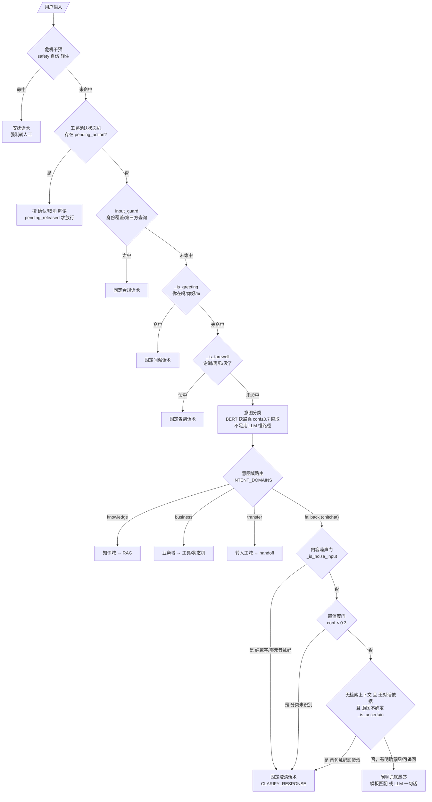

# 意图分类 · 按银行信用卡客服业务 SOP 拆解设计规范（300+ 细粒度）

> 版本：draft-0.2（阶段 A 验收稿，尚未落地）
> 变更：draft-0.1 的 9 域 × ~40 类扩展为 **14 域 × 304 子意图**，并补充配套分层分类架构
> 状态：**待验收（SOP 主表 / 兼容映射 / 影响面 / 架构演进）后进入阶段 B**
> 关联代码：`agent/lumio/shared/models.py:46`（IntentLabel）、`agent/lumio/services/common/classifier.py`、`agent/data/intent_classification/seed_dataset.json`

---

## 0. 背景与目标

现状：扁平 10 类封闭单标签（`faq / bill_query / transaction_query / limit_query / installment_inquiry / reward_query / card_loss / complaint / transfer_agent / chitchat`），按 `decision_path`（`knowledge / business / fallback`）路由。

目标：按银行信用卡客服业务 SOP，把意图拆成**可支撑 300+ 细粒度子意图**的两阶段结构：

- **一级业务域（14 个）**＝SOP 的顶层业务阶段，对接决策路径，保持路由稳定。
- **二级子意图（304 个）**＝每个域内可按「对象 × 动作」组合出的具体业务动作，供工具编排 / 槽位状态机 / 紧急转人工 / RAG 做差异化分支。

### 0.1 关键架构演进：300+ 封闭集必须分层，不能单模型硬扛

为什么：一个小 BERT(24M) 或一次 LLM 分类，撑不起 304 个封闭单标签的可靠判别（类别间区分度不足、每类 ≥12 条种子即 3600+ 标注、单模型 top-1 精度随类别数骤降）。因此把 300+ 落地在**三级分类架构**上：

| 层级 | 做什么 | 承担者 | 产出去向 |
|---|---|---|---|
| **L0 域粗分** | 输入先判 14 个一级业务域 | 规则 + 小 BERT（域级，~14 类）或 LLM 一次 | 落到某业务域 |
| **L1 域内子意图** | 域内再判具体子意图（每域 8~25 类） | 域级专用小 BERT / 规则 + 域级 LLM | 具体子意图 |
| **L2 槽位/动作** | 子意图拐带命中的工具、槽位、转人工、RAG | 既有 slot_tracker / tool_selection / transfer | 下游执行 |

- 两级都判大 BERT —— 域级与子意图级各是一个 2×24 等小模型，类别数 8~25 完全可行。
- 规则层（`_RULES`）负责高频意图快路径；`决策路径`（`decision_path`）在 L0 就定了一部分（knowledge/business/risk/…）。
- `closed_loop.json` 的 `CLS_BERT_ENABLED` 仍控制快路径是否启用；精度不足的新域可先只走规则 + LLM。

这段是「300+ 意图」真正能落地的前提，阶段 B 的模型部分照此实现，而不是训一个 304 类单模型。

---

## 1. SOP 分解主表（14 域 × ~304 意图）

> 阅读约定：
> - **decision_path（runtime）**＝运行时代码 `INTENT_DOMAINS` 接入路径：`knowledge`=RAG、`business`=业务/工具、`transfer`=转人工、`fallback`=模板/兜底、`risk`=风险合规、`complain`=投诉。台账总数 304。
> - **BERT**＝是否进入子意图级微调快路径；默认除注明外均「是」。风险/办理类多数靠规则+LLM，标注见各域。
> - **下游**：`工具`=MCP 编排、`状态机`=槽位+确认状态机、`转人工`=紧急直排、`RAG`=知识检索、`模板`=模板回复。
> - 每行「代表触发」为落地种子阶段的示例语料，非穷举。
> - 合规底线：凡「**紧急转人工/URGENT**」意图（标 ⚠️），主表决不允许走工具或 RAG 兜底；判定用 `in {集合}`（见 §3.2）。

### 1.1 账户与账单域（account，25 类）

| # | 子意图 | 中文名 | 代表触发 | 路径 | 下游 |
|---|---|---|---|---|---|
| 1 | account_bill_total_query | 本期账单总额查询 | 这月一共欠多少 | business | 工具 |
| 2 | account_bill_detail_query | 本期账单明细查询 | 本期每笔明细 | business | 工具 |
| 3 | account_bill_last_period_query | 上期账单查询 | 上个月账单 | business | 工具 |
| 4 | account_bill_history_query | 历史账单查询 | 半年前账单 | business | 工具 |
| 5 | account_bill_unbilled_query | 未出账单查询 | 还没出的账单 | business | 工具 |
| 6 | account_bill_forex_query | 外币账单查询 | 美元账单 | business | 工具 |
| 7 | account_e_bill_enable | 电子账单开通 | 开通电子账单 | business | 工具/状态机 |
| 8 | account_e_bill_change_mail | 电子账单变更邮箱 | 换邮箱收账单 | business | 工具 |
| 9 | account_e_bill_unsubscribe | 电子账单退订 | 不要电子账单了 | business | 工具 |
| 10 | account_paper_bill_reissue | 纸质账单补寄 | 补寄纸质账单 | business | 工具 |
| 11 | account_stmt_reconcile_query | 对账核对 | 帮我核对下账 | business | 工具 |
| 12 | account_stmt_discrepancy | 对账差错反馈 | 账上这笔记错了 | complain | 转人工 |
| 13 | account_bill_export | 账单导出下载 | 导出账单 PDF | business | 工具 |
| 14 | account_bill_merge_repay | 账单合并还款设置 | 两张卡一起还 | business | 工具 |
| 15 | account_bill_split_repay | 账单拆分还款设置 | 拆成几笔还 | business | 工具 |
| 16 | account_bill_alert_set | 账单提醒设置 | 出账提醒我 | business | 工具 |
| 17 | account_bill_email_update | 账单邮箱更新 | 改账单邮箱 | business | 工具 |
| 18 | account_bill_mobile_notify | 账单短信/App 提醒 | 账单发到手机 | business | 工具 |
| 19 | account_balance_snapshot | 当前欠款总余额 | 现在总共欠多少 | business | 工具 |
| 20 | account_credit_used_amount | 已用额度/占用查询 | 额度用了多少 | business | 工具 |
| 21 | account_available_balance | 可用余额/额度 | 还能刷多少 | business | 工具 |
| 22 | account_min_repay_calc | 最低还款额试算 | 最低还多少 | business | 工具 |
| 23 | account_full_repay_calc | 全额还款模拟试算 | 全还要多少钱 | business | 工具 |
| 24 | account_due_state | 账单结清状态 | 这单结清没 | business | 工具 |
| 25 | account_forex_rate_view | 账单汇率查看 | 账单按什么汇率 | business | 工具 |

### 1.2 交易与消费域（transaction，24 类）

| # | 子意图 | 中文名 | 代表触发 | 路径 | 下游 |
|---|---|---|---|---|---|
| 26 | txn_flow_query | 交易流水查询 | 最近消费流水 | business | 工具 |
| 27 | txn_single_query | 单笔交易查询 | 那笔 108 扣款 | business | 工具 |
| 28 | txn_time_query | 按时间查交易 | 昨天的消费 | business | 工具 |
| 29 | txn_merchant_query | 按商户查交易 | 星巴克那笔 | business | 工具 |
| 30 | txn_amount_query | 按金额查交易 | 三千多的那笔 | business | 工具 |
| 31 | txn_status_query | 交易入账/状态 | 这笔入账没 | business | 工具 |
| 32 | txn_pending_query | 待入账交易 | 冻结的那笔 | business | 工具 |
| 33 | txn_forex_query | 境外/外币交易 | 国外刷卡记录 | business | 工具 |
| 34 | txn_cash_advance_query | 预借现金/取现交易 | 取现扣了啥 | business | 工具 |
| 35 | txn_recurring_query | 周期/自动扣款交易 | 自动扣了啥 | business | 工具 |
| 36 | txn_auto_debit_set | 自动扣款签约 | 开通自动扣款 | business | 工具 |
| 37 | txn_auto_debit_cancel | 自动扣款解约 | 关掉自动扣款 | business | 工具 |
| 38 | txn_auto_debit_change | 自动扣款变更 | 改扣款卡 | business | 工具 |
| 39 | txn_refund_query | 退款交易查询 | 退款到没 | business | 工具 |
| 40 | txn_refund_status | 退款进度 | 退款到哪步 | business | 工具 |
| 41 | txn_dispute_submit | 交易争议提交 | 这比不是我刷的 | risk | 转人工 ⚠️ |
| 42 | txn_dispute_status | 争议处理进度 | 争议结果咋样 | business | 工具 |
| 43 | txn_dispute_result | 争议结果反馈 | 争议判定结果 | business | 工具 |
| 44 | txn_receipt_get | 交易凭证获取 | 给我签购单 | business | 工具 |
| 45 | txn_currency_select | 交易币种设置 | 换结算币种 | business | 工具 |
| 46 | txn_overseas_lock | 境外锁卡/解锁 | 境外的卡锁了 | business | 工具 |
| 47 | txn_channel_query | 消费渠道查询 | 线上还是线下 | business | 工具 |
| 48 | txn_category_query | 消费分类统计 | 这月花在餐饮多少 | business | 工具 |
| 49 | txn_export | 消费明细导出 | 导出交易清单 | business | 工具 |

### 1.3 还款与还款日域（repay，24 类）

| # | 子意图 | 中文名 | 代表触发 | 路径 | 下游 |
|---|---|---|---|---|---|
| 50 | repay_due_date_query | 本期还款日查询 | 哪天还款 | business | 工具 |
| 51 | repay_due_amount_query | 本期应还金额 | 这期要还多少 | business | 工具 |
| 52 | repay_min_amount_query | 最低还款金额 | 最低还多少 | business | 工具 |
| 53 | repay_done_query | 还款到账查询 | 我还进去了没 | business | 工具 |
| 54 | repay_history_query | 历史还款记录 | 前几次还款 | business | 工具 |
| 55 | repay_method_query | 还款方式咨询 | 怎么还款 | knowledge | RAG |
| 56 | repay_bank_transfer | 跨行还款方式 | 他行转来还 | knowledge | RAG |
| 57 | repay_internal_transfer | 本行卡内还款 | 用本行卡还 | business | 工具 |
| 58 | repay_installment_transfer | 转分期还款 | 转到分期还 | business | 工具 |
| 59 | repay_auto_enable | 自动还款开通 | 开通自动还款 | business | 工具 |
| 60 | repay_auto_edit | 自动还款调整 | 改自动还款卡 | business | 工具 |
| 61 | repay_auto_disable | 自动还款关闭 | 关闭自动还款 | business | 工具 |
| 62 | repay_early_full | 提前全额还款 | 提前全还了 | business | 工具 |
| 63 | repay_early_partial | 提前部分还款 | 先还一部分 | business | 工具 |
| 64 | repay_grace_period | 宽限期咨询 | 有没有宽限期 | knowledge | RAG |
| 65 | repay_overdue_relief | 逾期减免申请 | 滞纳金能免吗 | complain | 转人工 |
| 66 | repay_overdue_plan | 逾期协商计划 | 逾期能分期还吗 | risk | 转人工 |
| 67 | repay_overdue_status | 逾期状态查询 | 我逾期了吗 | business | 工具 |
| 68 | repay_overdue_penalty | 逾期违约金查询 | 逾期罚多少 | business | RAG |
| 69 | repay_force_retrieve | 还款凭证获取 | 还了要回单 | business | 工具 |
| 70 | repay_bill_settle | 账单结清操作 | 把这单结清 | business | 工具 |
| 71 | repay_appointment | 预约/延后还款 | 能晚几天还吗 | risk | 转人工 |
| 72 | repay_currency | 还款币种设置 | 用美元还是人民还 | business | 工具 |
| 73 | repay_deduction_order | 扣款顺序设置 | 先扣哪张卡 | business | 工具 |

### 1.4 额度与授信域（limit，22 类）

| # | 子意图 | 中文名 | 代表触发 | 路径 | 下游 |
|---|---|---|---|---|---|
| 74 | limit_current_query | 当前固定额度查询 | 我卡额度多少 | business | 工具 |
| 75 | limit_available_query | 可用额度查询 | 还可刷多少 | business | 工具 |
| 76 | limit_used_query | 已用额度查询 | 用了多少额度 | business | 工具 |
| 77 | limit_temp_query | 临时额度使用 | 临额用多少 | business | 工具 |
| 78 | limit_apply_permanent | 固定额度提升申请 | 想提高额度 | business | 状态机 |
| 79 | limit_apply_temp | 临时额度申请 | 申请临时额度 | business | 状态机 |
| 80 | limit_apply_reduce | 主动降额申请 | 帮我降额度 | business | 状态机 |
| 81 | limit_check_auto | 自动调额规则咨询 | 什么时候自动提额 | knowledge | RAG |
| 82 | limit_adjust_history | 额度调整历史 | 之前提过多少次 | business | 工具 |
| 83 | limit_validity | 额度有效期 | 临额到哪天 | business | 工具 |
| 84 | limit_release_temp | 临额到期恢复 | 临额到期了吗 | business | 工具 |
| 85 | limit_tying | 额度占用追回 | 退款占的额度啥时回 | business | 工具 |
| 86 | limit_pool | 共用额度池咨询 | 家庭共享额度 | knowledge | RAG |
| 87 | limit_cash | 预借现金额度 | 能取现多少 | business | 工具 |
| 88 | limit_overseas | 境外/外币额度 | 境外能刷多少 | business | 工具 |
| 89 | limit_denied_apply | 提额被拒原因 | 为啥提额被拒 | knowledge | RAG |
| 90 | limit_apply_status | 提额申请进度 | 提额到哪步 | business | 工具 |
| 91 | limit_apply_cancel | 提额申请撤销 | 不办了提额 | business | 状态机 |
| 92 | limit_implicit_temp | 节假日临额咨询 | 过节能不能提临额 | knowledge | RAG |
| 93 | limit_retention | 额度留存/恢复确认 | 额度降了怎么恢复 | risk | 转人工 |
| 94 | limit_usage_alert | 额度使用提醒 | 快刷爆提醒我 | business | 工具 |
| 95 | limit_linked_card | 附属卡额度关联 | 附属卡额度咋算 | knowledge | RAG |

### 1.5 分期业务域（installment，22 类）

| # | 子意图 | 中文名 | 代表触发 | 路径 | 下游 |
|---|---|---|---|---|---|
| 96 | inst_bill_apply | 账单分期申请 | 账单帮我分期 | business | 状态机 |
| 97 | inst_consume_apply | 消费分期申请 | 那笔消费分期 | business | 状态机 |
| 98 | inst_consume_single | 单笔消费转分期 | 这笔单独分期 | business | 状态机 |
| 99 | inst_fee_query | 分期手续费率查询 | 分 12 期费率 | knowledge | RAG |
| 100 | inst_period_query | 分期期数选择咨询 | 能分多少期 | knowledge | RAG |
| 101 | inst_status_query | 分期进度查询 | 分期生效没 | business | 工具 |
| 102 | inst_early_full | 提前全额结清 | 一次性结清分期 | business | 状态机 |
| 103 | inst_early_partial | 提前部分还款 | 先还一部分分期 | business | 状态机 |
| 104 | inst_change_period | 分期期数变更 | 改成分 6 期 | business | 状态机 |
| 105 | inst_change_day | 分期还款设定变更 | 改分期还款日 | business | 状态机 |
| 106 | inst_cancel | 分期取消/撤销 | 不分期了 | business | 状态机 |
| 107 | inst_refund_rule | 分期退款规则 | 退货运费谁来 | knowledge | RAG |
| 108 | inst_forex | 外币分期咨询 | 美元账单能分期吗 | knowledge | RAG |
| 109 | inst_award | 分期优惠咨询 | 分期有什么活动 | knowledge | RAG |
| 110 | inst_divided_format | 分期结果试算 | 分几期还多少 | business | 工具 |
| 111 | inst_payoff_project | 还款计划试算 | 帮我算还款计划 | business | 工具 |
| 112 | inst_min_period | 最短期数 | 最少分几个月 | knowledge | RAG |
| 113 | inst_max_period | 最长期数 | 最多分几个月 | knowledge | RAG |
| 114 | inst_fee_calc | 分期手续费计算 | 每期手续费多少 | business | 工具 |
| 115 | inst_contract | 分期协议说明 | 分期协议内容 | knowledge | RAG |
| 116 | inst_change_payment | 分期金额调整 | 改分期金额 | business | 状态机 |
| 117 | inst_overdue_treat | 分期逾期处理 | 分期逾期了咋办 | risk | 转人工 |

### 1.6 积分与权益域（points，22 类）

| # | 子意图 | 中文名 | 代表触发 | 路径 | 下游 |
|---|---|---|---|---|---|
| 118 | points_balance_query | 积分余额查询 | 我积分多少 | business | 工具 |
| 119 | points_redeem_gift | 积分兑换礼品 | 兑个水杯 | business | 状态机 |
| 120 | points_redeem_cash | 积分抵现 | 积分抵现金 | business | 状态机 |
| 121 | points_redeem_miles | 积分兑里程 | 换成航空里程 | business | 状态机 |
| 122 | points_redeem_app | 兑换 App 权益 | 换个视频会员 | business | 状态机 |
| 123 | points_expiry_query | 积分有效期/过期 | 积分多久过期 | knowledge | RAG |
| 124 | points_expiry_alarm | 积分过期提醒 | 快过期提醒我 | business | 工具 |
| 125 | points_transfer | 积分转让/共享 | 积分能转吗 | business | 状态机 |
| 126 | points_shop_query | 积分商城咨询 | 商城有什么 | knowledge | RAG |
| 127 | points_order_status | 兑换订单状态 | 兑换到哪步 | business | 工具 |
| 128 | points_refund | 兑换订单退款 | 兑换能退吗 | business | 工具 |
| 129 | points_double | 多倍积分规则 | 生日几倍积分 | knowledge | RAG |
| 130 | points_extreme | 极速积分计划 | 怎么攒分快 | knowledge | RAG |
| 131 | benefit_query | 卡权益查询 | 我有啥权益 | business | 工具 |
| 132 | benefit_claim | 权益申领 | 领接送机 | business | 状态机 |
| 133 | benefit_status | 权益到账/使用 | 接送机到账没 | business | 工具 |
| 134 | benefit_expiry | 权益有效期 | 权益啥时过期 | knowledge | RAG |
| 135 | benefit_reassign | 权益转让/赠送 | 权益能送人吗 | business | 状态机 |
| 136 | benefit_upgrade | 权益升级咨询 | 怎么升级权益 | knowledge | RAG |
| 137 | campaign_query | 商家优惠查询 | 这月星巴克活动 | knowledge | RAG |
| 138 | campaign_signup | 活动报名 | 报名这个活动 | business | 状态机 |
| 139 | campaign_rule | 活动规则咨询 | 活动要求是啥 | knowledge | RAG |

### 1.7 卡片与生命周期域（card，22 类）

| # | 子意图 | 中文名 | 代表触发 | 路径 | 下游 |
|---|---|---|---|---|---|
| 140 | card_loss_report | 挂失申请 | 卡丢了挂失 | risk | 转人工 ⚠️ |
| 141 | card_loss_cancel | 取消挂失 | 找到卡解除挂失 | business | 状态机 |
| 142 | card_reissue | 补卡 | 补办一张 | business | 状态机 |
| 143 | card_new_apply | 新卡申请 | 帮我办张新卡 | business | 状态机 |
| 144 | card_new_progress | 申请进度 | 我卡批没 | business | 工具 |
| 145 | card_new_cancel | 申请撤销 | 不办了 | business | 状态机 |
| 146 | card_activate | 卡片激活 | 新卡怎么激活 | business | 工具/流程 |
| 147 | card_activate_missed | 激活失败咨询 | 激活不了 | business | 工具/转人工 |
| 148 | card_expire_renew | 到期换卡 | 卡到期寄新卡吗 | business | 状态机 |
| 149 | card_cancel | 销户/注销 | 把卡注销 | business | 状态机（强确认） |
| 150 | card_cancel_restore | 撤销销户 | 别销了 | business | 状态机 |
| 151 | card_status | 卡片状态查询 | 卡现在啥状态 | business | 工具 |
| 152 | card_freeze | 卡片冻结 | 冻结我卡 | risk | 转人工/工具 |
| 153 | card_unfreeze | 卡片解冻 | 解冻我卡 | business | 状态机 |
| 154 | card_pin_set | 密码设置 | 设个密码 | business | 状态机 |
| 155 | card_pin_change | 密码修改 | 改密码 | business | 状态机 |
| 156 | card_pin_forgot | 忘记密码/锁卡 | 忘记密码卡被锁 | risk | 转人工 |
| 157 | card_cvv | 安全码/有效期咨询 | 卡背面三位码 | knowledge | RAG |
| 158 | card_attach_card | 附属卡申请 | 办张附属卡 | business | 状态机 |
| 159 | card_type_switch | 卡种升级/转换 | 升级成白金 | business | 状态机 |
| 160 | card_supplement | 卡面/卡型咨询 | 这卡什么材质 | knowledge | RAG |
| 161 | card_gift | 开卡礼咨询 | 开卡礼是啥 | knowledge | RAG |

### 1.8 支付与渠道域（payment，22 类）

| # | 子意图 | 中文名 | 代表触发 | 路径 | 下游 |
|---|---|---|---|---|---|
| 162 | pay_method_query | 支付方式查询 | 支持哪些支付 | knowledge | RAG |
| 163 | pay_qrcode | 二维码支付设置 | 开通付款码 | business | 工具 |
| 164 | pay_wallet | 绑定第三方钱包 | 绑到微信 | business | 状态机 |
| 165 | pay_wallet_unbind | 解绑钱包 | 解绑支付宝 | business | 状态机 |
| 166 | pay_applepay | Apple Pay 绑定 | 绑苹果支付 | business | 状态机 |
| 167 | pay_contactless | 闪付/小额免密 | 开通小额免密 | business | 状态机 |
| 168 | pay_large_verify | 大额验证/限额 | 大额要验证码 | business | 状态机 |
| 169 | pay_online | 网上支付开通 | 开通线上支付 | business | 状态机 |
| 170 | pay_online_close | 网上支付关闭 | 关闭网上支付 | business | 状态机 |
| 171 | pay_mobile_pay | 手机银行联动 | App 咋还款 | knowledge | RAG |
| 172 | pay_password_online | 无卡支付密码 | 线上密码设置 | business | 状态机 |
| 173 | pay_alipay_qrcode | 支付宝付款码 | 用付款码刷 | business | 状态机 |
| 174 | pay_installment_url | 分期通道支付 | 分期付款方式 | knowledge | RAG |
| 175 | pay_currency_swtich | 结算币种/汇率 | 结算币种切换 | business | 状态机 |
| 176 | pay_kiosk | 自助终端 | 去 ATM 还 | knowledge | RAG |
| 177 | pay_agency | 委托扣款设置 | 开通代扣 | business | 状态机 |
| 178 | pay_agency_query | 代扣协议查询 | 我的代扣协议 | business | 工具 |
| 179 | pay_agency_cancel | 代扣解约 | 取消代扣 | business | 状态机 |
| 180 | pay_pause | 卡暂停使用 | 暂停用这张卡 | business | 状态机 |
| 181 | pay_resume | 恢复使用 | 恢复刷卡 | business | 状态机 |
| 182 | pay_magnetic | 磁条/芯片通道 | 芯片刷不了 | business | 工具 |
| 183 | pay_receipt_ticket | 支付凭证打印 | 打张凭证 | business | 工具/转人工 |

### 1.9 费用与费率域（fee，22 类）

| # | 子意图 | 中文名 | 代表触发 | 路径 | 下游 |
|---|---|---|---|---|---|
| 184 | fee_annual_query | 年费收取标准 | 年费怎么收 | knowledge | RAG |
| 185 | fee_annual_exempt | 年费减免政策 | 怎么免年费 | knowledge | RAG |
| 186 | fee_interest_query | 循环利息 | 循环利息咋算 | knowledge | RAG |
| 187 | fee_penalty_query | 违约金/滞纳金 | 违约金怎么算 | knowledge | RAG |
| 188 | fee_overlimit | 超限费咨询 | 超了额度咋收 | knowledge | RAG |
| 189 | fee_late | 逾期费用咨询 | 逾期收多少 | knowledge | RAG |
| 190 | fee_service | 服务费咨询 | 服务费是什么 | knowledge | RAG |
| 191 | fee_forex | 外币兑换手续费 | 消费换汇手续费 | knowledge | RAG |
| 192 | fee_cash | 取现手续费 | 取现手续费 | knowledge | RAG |
| 193 | fee_installment | 分期手续费 | 分期手续费率 | knowledge | RAG |
| 194 | fee_transfer | 转账/还款手续费 | 跨行转账费 | knowledge | RAG |
| 195 | fee_card_issuance | 卡片工本费 | 办卡工本费 | knowledge | RAG |
| 196 | fee_reissue | 补卡工本费 | 补卡收费吗 | knowledge | RAG |
| 197 | fee_overseas | 境外刷卡费 | 境外刷卡费 | knowledge | RAG |
| 198 | fee_dynamic | 货币转换费 | DCC 费用 | knowledge | RAG |
| 199 | fee_round | 计息/计费规则 | 利息从哪天算 | knowledge | RAG |
| 200 | fee_waive_apply | 手续费减免申请 | 手续费能免吗 | complain | 转人工 |
| 201 | fee_calced_query | 已产生费用明细 | 我这单收了几项费 | business | 工具 |
| 202 | fee_settle_inquiry | 结算周期咨询 | 费用多久结算 | knowledge | RAG |
| 203 | fee_ratio | 费率标准速查 | 各费率多少 | knowledge | RAG |
| 204 | fee_disclose | 费率披露政策 | 费率在哪公示 | knowledge | RAG |
| 205 | fee_appeal | 费用异议申诉 | 这笔费不合理 | complain | 转人工 ⚠️ |

### 1.10 风险管理域（risk，22 类）

| # | 子意图 | 中文名 | 代表触发 | 路径 | 下游 |
|---|---|---|---|---|---|
| 206 | risk_fraud_report | 盗刷举报 | 卡不是我刷的 | risk | 转人工 ⚠️ |
| 207 | risk_fraud_verify | 反欺诈核实 | 核实这是不是我的 | risk | 转人工 ⚠️ |
| 208 | risk_cash_advance_warn | 套现风险提示 | 套现会被查吗 | risk | 转人工 |
| 209 | risk_money_laundry | 反洗钱核查 | 为啥让我填用途 | risk | 转人工 |
| 210 | risk_suspicious_txn | 可疑交易确认 | 这笔是我的吗 | risk | 转人工 |
| 211 | risk_account_freeze | 账户冻结风险咨询 | 卡被冻了 | risk | 转人工 |
| 212 | risk_overseas_lock | 境外锁卡风险 | 境外卡没法刷 | risk | 转人工 |
| 213 | risk_contact_warn | 诈骗识别提醒 | 有人冒充客服 | risk | 转人工 |
| 214 | risk_fraud_hotline | 反诈专线指引 | 反诈电话多少 | knowledge | RAG |
| 215 | risk_card_swallow | 吞卡/吞钞 | ATM 吞卡了 | risk | 转人工 |
| 216 | risk_atm_anomaly | ATM 取款异常 | ATM 扣了没吐钱 | risk | 转人工 |
| 217 | risk_pos_anomaly | POS 刷卡异常 | 刷卡不成功 | business | 工具/转人工 |
| 218 | risk_online_fraud | 线上盗刷咨询 | 网上我可没消费 | risk | 转人工 |
| 219 | risk_know_your_customer | KYC 更新/补资料 | 让我补身份资料 | knowledge | RAG |
| 220 | risk_verify_sms | 短信验证码风险 | 验证码被盗了 | risk | 转人工 |
| 221 | risk_freeze_temporary | 临时冻结/解冻 | 暂时冻结一下 | risk | 转人工 |
| 222 | risk_pin_attack | 密码泄露评估 | 密码可能泄露 | risk | 转人工 |
| 223 | risk_overseas_travel | 出境用卡评估 | 出国用卡要注意啥 | knowledge | RAG |
| 224 | risk_connect_wallet | 第三方绑定安全 | 绑卡的 App 安全吗 | knowledge | RAG |
| 225 | risk_suspend_for_safety | 安全暂停卡指导 | 感觉不安全暂停卡 | risk | 转人工 |
| 226 | risk_chargeback_advise | 拒付/争议指导 | 我不认这笔钱 | risk | 转人工 |
| 227 | risk_fraud_next | 盗刷后处理流程 | 被盗刷后怎么办 | risk | 转人工 |

### 1.11 争议与投诉域（dispute，22 类）

| # | 子意图 | 中文名 | 代表触发 | 路径 | 下游 |
|---|---|---|---|---|---|
| 228 | dispute_submit | 投诉提交 | 我要投诉 | complain | 转人工 ⚠️ |
| 229 | dispute_reason_fee | 投诉费用 | 乱收我费 | complain | 转人工 ⚠️ |
| 230 | dispute_reason_service | 投诉服务态度 | 客服态度差 | complain | 转人工 ⚠️ |
| 231 | dispute_reason_product | 投诉产品 | 这卡权益缩水 | complain | 转人工 ⚠️ |
| 232 | dispute_reason_charge | 投诉乱扣费 | 没同意就扣 | complain | 转人工 ⚠️ |
| 233 | dispute_status | 投诉进度查询 | 我的投诉咋样 | business | 工具 |
| 234 | dispute_result | 投诉结果反馈 | 投诉结果呢 | business | 工具 |
| 235 | dispute_appeal | 对结果申诉 | 我不服这个结果 | complain | 转人工 |
| 236 | dispute_chargeback | 拒付争议申请 | 拒付这笔 | role transfer | 转人工 ⚠️ |
| 237 | dispute_chargeback_status | 拒付进度 | 拒付到哪步 | business | 工具 |
| 238 | dispute_regulate | 监管投诉渠道 | 银保监投诉 | knowledge | RAG/转人工 |
| 239 | dispute_hotline | 投诉热线 | 投诉电话 | knowledge | RAG |
| 240 | dispute_complain_urge | 催办投诉 | 快点处理 | complain | 转人工 |
| 241 | dispute_withdraw | 撤销投诉 | 不投诉了 | business | 状态机 |
| 242 | dispute_followup | 投诉补充材料 | 补交证据 | business | 状态机 |
| 243 | dispute_agent_hand | 转接处理专员 | 让专人处理 | transfer | 转人工 |
| 244 | dispute_escalate | 升级投诉 | 找你们领导 | complain | 转人工 ⚠️ |
| 245 | dispute_compensation | 赔偿/补偿申请 | 要赔偿 | complain | 转人工 |
| 246 | dispute_evidence | 举证材料提交 | 提交证据 | business | 状态机 |
| 247 | dispute_anonymous | 匿名投诉 | 不想留名投诉 | complain | 转人工 |
| 248 | dispute_log | 投诉记录查询 | 查投诉记录 | business | 工具 |
| 249 | dispute_close | 投诉结案确认 | 确认处理完成 | business | 状态机 |

### 1.12 转人工与人工服务域（handoff，24 类）

| # | 子意图 | 中文名 | 代表触发 | 路径 | 下游 |
|---|---|---|---|---|---|
| 250 | handoff_human | 转人工客服 | 转人工 | transfer | 转人工 |
| 251 | handoff_sales | 转销售/理财专线 | 找理财顾问 | transfer | 转人工 |
| 252 | handoff_chargeback | 转争议专员 | 转拒付专员 | transfer | 转人工 |
| 253 | handoff_loss | 转挂失专线 | 转挂失人员 | transfer | 转人工 |
| 254 | handoff_cancel | 转销户专线 | 转销户人员 | transfer | 转人工 |
| 255 | handoff_fraud | 转反诈专线 | 转反诈人员 | transfer | 转人工 |
| 256 | handoff_dispute | 转投诉坐席 | 转投诉坐席 | transfer | 转人工 |
| 257 | handoff_overseas | 转境外服务 | 转境外专线 | transfer | 转人工 |
| 258 | handoff_priority | VIP/优先人工 | 我是金卡优先 | transfer | 转人工 |
| 259 | handoff_queue | 排队状态查询 | 前面多少人 | business | 工具 |
| 260 | handoff_time | 人工服务时段 | 什么时候有人工 | knowledge | RAG |
| 261 | handoff_end | 结束人工 | 挂断吧 | fallback | 模板 |
| 262 | handoff_restart | 重连人工 | 刚才断线重连 | transfer | 转人工 |
| 263 | handoff_schedule | 预约人工回电 | 约个时间回电 | transfer | 转人工(状态机) |
| 264 | handoff_expected | 等待时长咨询 | 还要等多久 | knowledge | RAG |
| 265 | handoff_number | 人工专线号码 | 人工电话是多少 | knowledge | RAG |
| 266 | handoff_pwd | 人工核身(密码) | 输密码验证 | knowledge | RAG |
| 267 | handoff_identity | 人工身份确认 | 确认是不是本人 | knowledge | RAG |
| 268 | handoff_sms_auth | 人工短信验证 | 收不到验证码 | business | 工具 |
| 269 | handoff_transfer_other | 转其他业务 | 转到办卡部门 | transfer | 转人工 |
| 270 | handoff_credit_line | 转额度专线 | 转额度处理 | transfer | 转人工 |
| 271 | handoff_installment | 转分期专线 | 转分期专员 | transfer | 转人工 |
| 272 | handoff_again | 再次转人工 | 能不能转真人 | transfer | 转人工 |
| 273 | handoff_wait_block | 等待转人工中 | 在转人工了吗 | business | 工具 |

### 1.13 知识问答与政策域（faq，22 类）

| # | 子意图 | 中文名 | 代表触发 | 路径 | 下游 |
|---|---|---|---|---|---|
| 274 | faq_product | 一般产品功能 | 这卡能境外取现吗 | knowledge | RAG |
| 275 | faq_annual | 年费政策 | 年费怎么免 | knowledge | RAG |
| 276 | faq_interest | 利息计息政策 | 利息怎么算 | knowledge | RAG |
| 277 | faq_period | 免息期政策 | 免息期多久 | knowledge | RAG |
| 278 | faq_overseas | 境外用卡政策 | 出国刷卡注意啥 | knowledge | RAG |
| 279 | faq_currency | 汇率政策 | 汇率按哪天 | knowledge | RAG |
| 280 | faq_activation | 激活流程 | 怎么激活 | knowledge | RAG |
| 281 | faq_repay_process | 还款流程 | 怎么还款 | knowledge | RAG |
| 282 | faq_application | 办卡流程/资料 | 办卡要啥材料 | knowledge | RAG |
| 283 | faq_credit_report | 征信/信用记录 | 逾期上征信吗 | knowledge | RAG |
| 284 | faq_contract | 协议条款 | 协议在哪儿看 | knowledge | RAG |
| 285 | faq_notice | 公告/政策变更 | 有政策调整吗 | knowledge | RAG |
| 286 | faq_compliance | 监管合规政策 | 合规要求是啥 | knowledge | RAG |
| 287 | faq_fee_policy | 收费标准汇总 | 都收哪些费 | knowledge | RAG |
| 288 | faq_benefit_policy | 权益政策 | 权益怎么用 | knowledge | RAG |
| 289 | faq_security | 安全用卡建议 | 怎么用卡安全 | knowledge | RAG |
| 290 | faq_dispute_policy | 争议处理政策 | 争议有啥流程 | knowledge | RAG |
| 291 | faq_data | 个人隐私 | 我信息怎么用 | knowledge | RAG |
| 292 | faq_channel | 渠道/App 功能 | App 咋用 | knowledge | RAG |
| 293 | faq_activity | 活动通用规则 | 活动怎么参加 | knowledge | RAG |
| 294 | faq_any | 开放式通用问答 | 随便问个问题 | knowledge | RAG |
| 295 | faq_account_policy | 账户管理政策 | 名下卡怎么管 | knowledge | RAG |

### 1.14 非业务域（nonbusiness，9 类）

| # | 子意图 | 中文名 | 代表触发 | 路径 | 下游 |
|---|---|---|---|---|---|
| 296 | nb_chitchat | 闲聊/问候 | 在吗、你好 | fallback | 模板 |
| 297 | nb_gratitude | 感谢/道别 | 谢谢、再见 | fallback | 模板 |
| 298 | nb_greeting | 打招呼 | hi、早 | fallback | 模板 |
| 299 | nb_smalltalk | 无关闲聊 | 聊点别的 | fallback | 模板 |
| 300 | nb_noise | 乱码/无效输入 | yrnn、hjfw!asd | fallback | 门禁拦截（不入分类） |
| 301 | nb_off_topic | 离题话题 | 今天天气 | fallback | 模板 |
| 302 | nb_confirmation | 确认/简短回应 | 嗯、好的 | fallback | 模板 |
| 303 | nb_emoji | 纯表情输入 | 😊🚀 | fallback | 门禁拦截 |
| 304 | nb_help | 帮助引导 | 你能帮我干啥 | knowledge | RAG |

**主表合计：304 个子意图（14 域）。**

---

## 2. 下游动作契约

每个二级子意图接入唯一主链路，避免路由模棱两可：

| 链路 | 接入位置 | 适用子意图 |
|---|---|---|
| MCP 工具编排 | `tool_selection.TOOL_INTENTS` + `config.MCPSettings.intent_tool_map` | 查询/办理类（bill/transaction/repay/limit/inst/points/benefit 等） |
| 槽位 + 确认状态机 | `slot_tracker._INTENT_SLOTS` + bot 业务状态机 | 办理/申请类（分期、提额、兑换、挂失、销户、支付设置） |
| 紧急转人工 / URGENT | `bot_agent._handle_business` / `transfer` / `decision.detect_scene` | **风险敏感写类**（挂失、盗刷/争议、投诉、冻结、反欺诈…，主表标 ⚠️） |
| 知识 RAG | `_handle_knowledge` | `knowledge` 域全部 |
| 模板/兜底 | `_handle_fallback` / `degradation._TEMPLATES` | 转人工、闲聊、结束会话、帮助 |

合规底线：主表标 ⚠️ 的意图**不允许**走工具或 RAG 兜底；判定用 `in {风险子意图集合}`（§3.2），不点对点精确比较。

---

## 3. 存量兼容映射

阶段 B 拆细后 `IntentLabel` 新增 294 个子意图、保留 `card_loss/complaint/transfer_agent/chitchat`，并替换 `faq/bill_query/…` 等 6 个 flat 值。存量 Redis/PG/回流样本存旧字符串，读取时**归一化后判定、不抛异常**。

### 3.1 旧 flat 值 → 新主意图 归一化表

| 旧 flat 值 | 新映射目标 | 处理方式 |
|---|---|---|
| `faq` | `faq_product`（主） | 归一化；`FAQ` 枚举保留为兜底默认 |
| `bill_query` | `account_bill_total_query` | 默认到总额，明细归 `account_bill_detail_query` |
| `transaction_query` | `txn_flow_query` | 默认流水，单笔归 `txn_single_query` |
| `limit_query` | `limit_current_query` | 默认当前额度，申请/可用另行 |
| `installment_inquiry` | `inst_fee_query` | 咨询默认费率，办理归 `inst_bill_apply/inst_consume_apply` |
| `reward_query` | `points_balance_query` | 默认积分余额，权益归 `benefit_query` |
| `card_loss` | 保留 `card_loss` | 不变（风险集合一员） |
| `complaint` | 保留 `complaint` | 不变（风险集合一员） |
| `transfer_agent` | 保留 `transfer_agent` | 不变 |
| `chitchat` | 保留 `chitchat` | 不变 |

### 3.2 实现方案

- `IntentLabel` 保留旧常量（别名语义）+ 新增子意图；加 `normalize_intent(label: str) -> IntentLabel`（旧/新字符串→归一化主意图，`ValueError` 降级 `FAQ`）。
- 所有反序列化点改用 `normalize_intent`：`session.py:250/259/698/707`、`sample_backflow.py:130`、`bot_agent._build_result:1512`、`classifier._parse_intent:427`。
- `decision.py:142` 与 `transfer.py:140/143` 现有精确比较改为 `in {风险子意图集合}`（集合含：`card_loss、card_freeze、card_pin_forgot、risk_*、dispute_*（敏感）、compain 域、txn_*_dispute、fee_waive_apply` 等）。

### 3.3 为什么这么做

- 线上无损切换：旧会话接得住，新会话用新标签，不迁移 DB。
- 合规判定从「点对点」升级为「集合包含」，拆细后不漏判挂失/投诉/盗刷。
- 回流微调样本不被旧标签污染训练集。

---

## 4. 影响面清单（阶段 B 逐项改动）

### 4.1 枚举与兼容
- `models.py:46-58` `IntentLabel`：新增 294 子意图 + 保留旧别名 + `normalize_intent()`。

### 4.2 运行时分类
- `classifier.py:31-42` `INTENT_DOMAINS`：补全部新子意图域；修正查询类 `knowledge`/`business` 口径漂移。
- `classifier.py:46-117` `_RULES`：为高频子意图补正则+关键词（触发语料来自主表）。
- `classifier.py:120-161` `_CLASSIFY_SYSTEM_PROMPT`：LLM 标签白名单改为**域级+子意图级两段式**（300+ 标签塞进一个 prompt 不现实，L0 域粗分后只对该域列子意图）。
- `classifier.py:427` `_parse_intent`：走 `normalize_intent`。

### 4.3 快路径模型（分层，不是 304 类单模型）
- 训练 **L0 域级分类器 + 每域子意图分类器**：`scripts/intent_classifier_spike.py` 改为两段训练脚本（域级 + 域内）。
- `bert_classifier.py:25-36` `_CLASSES`：改为「域级清单 + 每域子意图清单」两套，与训练 IDX 严格一致。
- 输出目录按域分：`out_intent_clf/`（域级）+ `out_intent_clf/{domain}/`（每域子意图）。

### 4.4 下游装配
- `tool_selection.py:24-32` `TOOL_INTENTS`：新查询/办理子意图加入白名单。
- `config.py:644-662` `intent_tool_map`：主表查询/办理子意图映射到 MCP 工具名。
- `slot_tracker.py:34-59` `_INTENT_SLOTS`：为带槽位子意图登记 SlotDef。
- `degradation.py:134-145` `_TEMPLATES`：为新增子意图补降级话术（按域分默认 + 敏感类专案）。
- `few_shot.py`（`CoTIntent/FEW_SHOT_LIBRARY/_INTENT_KEYWORDS`）：补新子意图案例与关键词。

### 4.5 合规精确比较改集合判断（**最高优先级**）
- `bot_agent.py:574/576/583/1611`、`transfer.py:140/143`、`decision.py:95-103/142`：精确枚举/字符串 → `in {风险子意图集合}`。

### 4.6 数据与文档
- `seed_dataset.json`：为每个新子意图补 ≥12 条正样本（304×12 ≈ 3650 条）；新增类间易混淆对；`meta.labels` 补定义；**修正过期的 `meta.counts`（实测 144/13 vs 文档 129/12）**；`meta.taxonomy` 改 300+ 描述。按域组织子数据集（分域文件）。
- `README.md`（意图分类）：分域标签表、版本历史更新。
- `test_golden_eval.py` / `test_classifier.py`：补新类真值 + 域断言；`test_classifier.py` 中 bill/limit/card_loss 等旧断言按新主表更新。

### 4.7 存量数据（零代码，仅兼容层兜底）
- Redis `last_intent`/`intent_stack`、PG `decision_log.intent`、回流样本：靠 `normalize_intent` 兼容读取。

---

## 5. 阶段划分与验收点

### 阶段 A（本批，已交付本文档）
- 验收点：SOP 主表（§1，304 类）、下游契约（§2）、兼容映射（§3）、影响面（§4）、**架构演进分层（§0.1）**。

### 阶段 B（验收后执行，分两批）
- **批 1（低风险）**：枚举 + `normalize_intent`；精确比较改集合（合规底线先改）；`INTENT_DOMAINS/_RULES/prompt/域与子意图 _CLASSES`；tool/slot/degradation/few_shot 装配；种子数据按域标注；golden/单测更新。
- **批 2（需重训）**：两段式（域级 + 域内）BERT 训练与落盘；`CLS_BERT_ENABLED` 控制快路径；冒烟验证新子意图路由 + 旧会话兼容。
- 全程不 commit/push，等你显式要求。

---

## 6. 风险与取舍（给你审）

- **300+ 是「可扩展的意图体系」，不是「一次训出 304 类的单模型」**：靠「域级 × 域内子意图」两级分类器落地，每级类别数 8~25，可行且可增量扩展（新子意图只加域内清单 + 种子，不动其它域）。
- **种子标注成本高**：304×12≈3650 条正样本 + 易混淆对。批 1 先用规则 + LLM 兜底跑通、边跑边用「四步自迭代闭环」采集真实样本回流扩充训练集，避免一次性人工标满。
- **口径漂移已存在**：`INTENT_DOMAINS` 查询类记 `knowledge`，种子数据写 `business`。借拆解一并修正，但会微调线上路由，需回归验证。
- **批次内所有 300+ 意图未全配齐工具**：阶段 B 先为高频意图配 MCP 工具，长尾意图走 RAG/知识或转人工兜底，逐步补齐。
- **兼容层是本期新增复杂度**：`normalize_intent` 换线上无损切换；你若偏好「直接删旧值+一次性迁移」，可在验收时改 §3 策略。
- **模型重训与种子依赖**：批 2 依赖批 1 状态冻结；若种子不足，新域可不进 BERT、走规则+LLM，`CLS_BERT_ENABLED` 作逃生舱。

---

## 7. 运行时判定链路（闲聊 vs 随机无意义输入）

§1.14 的 9 个非业务子意图最终落在 `fallback` 域运行时判定。核心区分一句话：**有可答内容 → 系统主动应答；不可作答 → 拒绝生成、回固定澄清话术（防 LLM 幻觉）**。判定顺序即 `bot_agent.run()` 的执行顺序（`agent/lumio/services/bot/bot_agent.py`）：

- `_is_greeting`（bot_agent.py:1573）与 `_is_farewell`（:1594）只做精确/收纳匹配，不走任何分类器，成本最低。
- 真正的"闲聊 vs 无意义"分水岭在 `fallback` 域的三道门（`_is_noise_input` :1619、`CLARIFY_CONFIDENCE_FLOOR=0.3` :1602、`_is_uncertain_intent` :1636 + `_has_grounding` :1605）：命中的一律**不交 LLM**，回固定 `CLARIFY_RESPONSE = "您的意思我还没太理解。"`（prompts/__init__.py:72），零幻觉、秒回。
- 三道门是为堵两个真实漏点：BERT 快路径会把纯数字（`"22"`）高置信误判成闲聊/FAQ（故有内容噪声门）；首句乱码（`"adb"`/`"889"`）会被 LLM 当成银行名编造（故有无检索上下文门）。
- 闲聊本身（`nb_chitchat`/`nb_smalltalk`/`nb_off_topic`/`nb_gratitude`/`nb_confirmation`）走 `_handle_fallback`（:974）模板或 LLM 一句话，属"主动应答"，不是拒绝。`nb_noise`/`nb_emoji` 则明确标"门禁拦截、不入分类"（§1.14，与三道门一致）。