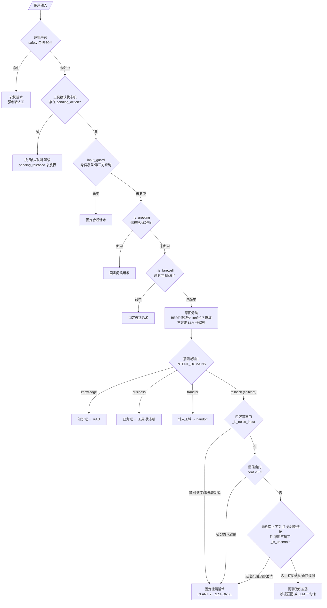

# 意图分类 · 按银行信用卡客服业务 SOP 拆解设计规范（意图 × 槽位两级结构）

> 版本：draft-0.3（阶段 A 验收稿，尚未落地）
> 变更：draft-0.2 的 14 域 × **304 子意图**收敛为 14 域 × **149 意图 + 每意图槽位清单**（−51%）。
> 收敛依据五条合并原则（§0.2），逐条合并记录见 §1.15 对照表，供验收逐条复审。
> 状态：**待验收（SOP 主表 / 合并对照表 / 兼容映射 / 影响面 / 架构演进）后进入阶段 B**
> 关联代码：`agent/lumio/shared/models.py:46`（IntentLabel）、`agent/lumio/services/common/classifier.py`、`agent/lumio/services/bot/slot_tracker.py`、`agent/data/intent_classification/seed_dataset.json`

---

## 0. 背景与目标

现状：扁平 10 类封闭单标签（`faq / bill_query / transaction_query / limit_query / installment_inquiry / reward_query / card_loss / complaint / transfer_agent / chitchat`），按 `decision_path`（`knowledge / business / fallback`）路由。

draft-0.2 曾把意图拆成 14 域 × 304 子意图，但复审发现三类结构问题：

1. **参数被误当意图**：同一「对象 × 动作」按参数拆出多类（账单查询按周期/粒度拆 6 类、额度查询按口径拆 4 类、转人工按专线拆 14 类），违背「L2 槽位承担参数」的既定架构，且摊薄每类种子。
2. **跨域重复**：「最低还多少」「还能刷多少」「分期手续费率」「怎么还款」等同义触发语料出现在 2~3 个域，分类器面对无差别样本必然摇摆。
3. **与运行时不一致**：非业务域 9 类里，问候/道别/确认在运行时被 `_is_greeting`/`_is_farewell`/`pending_action` 前置拦截（§7），根本到不了分类器；`faq` 域则把年费/利息/激活等主题类知识问法从主题域里重复抽走了一遍。

draft-0.3 的目标调整为**可落地的意图 × 槽位两级结构**：

- **一级业务域（14 个）**＝SOP 的顶层业务主题，对接决策路径，保持路由稳定（域边界不变）。
- **二级意图（149 个）**＝每域内互斥的「对象 × 动作」；参数一律不进意图，进槽位。
- **三级槽位清单**＝每个合并类意图挂载的槽位（周期、口径、动作、渠道、专线、原因…），供 `slot_tracker` 扩展与槽位级种子标注。
- **四级下游动作**＝工具编排 / 槽位+确认状态机 / 紧急转人工 / RAG，与 draft-0.2 相同。

### 0.1 关键架构演进：149 意图 + 槽位，仍必须分层，不能单模型硬扛

149 个封闭单标签依然超出小 BERT(24M) 单模型的可靠判别能力（类间区分度不足、每类 ≥12 条种子即 1800+ 标注、top-1 精度随类别数骤降）。落地在**四级分层架构**上：

| 层级 | 做什么 | 承担者 | 产出去向 |
|---|---|---|---|
| **L0 域粗分** | 输入先判 14 个一级业务域 | 规则 + 小 BERT（域级，~14 类）或 LLM 一次 | 落到某业务域 |
| **L1 域内意图** | 域内再判具体意图（每域 3~15 类） | 域级专用小 BERT / 规则 + 域级 LLM | 具体意图 |
| **L2 槽位抽取** | 合并类意图的参数差异在此消解（周期/口径/动作/渠道/专线/原因） | `slot_tracker` 扩展（意图→槽位 schema + 抽取） | 槽位值 |
| **L3 下游装配** | 意图 × 槽位 → 工具、状态机、转人工、RAG | 既有 slot_tracker / tool_selection / transfer | 下游执行 |

- L0/L1 两级都判小 BERT——域级与意图级各是一个类别数 3~15 的小模型，完全可行。
- 规则层（`_RULES`）负责高频意图快路径；`decision_path` 在 L0 就定了一部分（knowledge/business/risk/…）。
- `closed_loop.json` 的 `CLS_BERT_ENABLED` 仍控制快路径是否启用；精度不足的新域可先只走规则 + LLM。
- **代价声明**：合并把部分判别压力从「分类」转移到「槽位抽取」（L2）。槽位级种子与 `slot_tracker` schema 是阶段 B 的新增工作量，见 §6 风险。

### 0.2 合并五原则（draft-0.2 → 0.3 的收敛依据）

1. **参数分裂合并**：同一「对象 × 动作」按参数拆的（周期、口径、金额方式、币种、渠道、专线类型、原因类型），合并为单意图，参数入槽位清单。
2. **跨域重复唯一归属**：同一触发语料出现在多域（含 `faq` 域与主题域），定唯一归属域；`faq` 域收窄为「通用政策/渠道/合规」等无主题归属的问题。
3. **与运行时拦截对齐**：门禁/拦截层已前置处理的（问候、道别、乱码、纯表情、pending_action 确认），不再作为分类器目标集里的独立类。
4. **动作差异保留**：开 vs 关、办 vs 撤、冻结 vs 解冻等真动作差异不合并（动作差异大、确认流程不同、训练样本不重叠）。
5. **域内粒度均衡**：每域 3~15 类，避免单域 25 类的寡头域与 9 类的弱势域并存。

---

## 1. SOP 分解主表（14 域 × 149 意图）

> 阅读约定：
> - **decision_path（runtime）**＝运行时代码 `INTENT_DOMAINS` 接入路径：`knowledge`=RAG、`business`=业务/工具、`transfer`=转人工、`fallback`=模板/兜底、`risk`=风险合规、`complain`=投诉。
> - **槽位**＝合并类意图的参数清单（`{值1/值2}`）；「—」表示单义意图无槽位。阶段 B 据此扩展 `slot_tracker._INTENT_SLOTS`。
> - **下游**：`工具`=MCP 编排、`状态机`=槽位+确认状态机、`转人工`=紧急直排、`RAG`=知识检索、`模板`=模板回复。
> - 每行「代表触发」为落地种子阶段的示例语料，非穷举。
> - 合规底线：凡「**紧急转人工/URGENT**」意图（标 ⚠️），主表决不允许走工具或 RAG 兜底；判定用 `in {集合}`（见 §3.2）。

### 1.1 账户与账单域（account，10 类）

| 子意图 | 中文名 | 代表触发 | 路径 | 槽位 | 下游 |
|---|---|---|---|---|---|
| account_bill_query | 账单查询 | 这月一共欠多少 | business | 周期{本期/上期/历史/未出}·粒度{总额/明细}·币种{本币/外币} | 工具 |
| account_e_bill_set | 电子账单设置 | 开通电子账单 | business | 动作{开通/换邮箱/退订} | 工具/状态机 |
| account_paper_bill_reissue | 纸质账单补寄 | 补寄纸质账单 | business | — | 工具 |
| account_stmt_query | 对账核对 | 帮我核对下账 | business | — | 工具 |
| account_stmt_dispute | 对账差错反馈 | 账上这笔记错了 | complain | — | 转人工 |
| account_bill_export | 账单导出下载 | 导出账单 PDF | business | — | 工具 |
| account_bill_repay_split_set | 合并/拆分还款设置 | 两张卡一起还 | business | 动作{合并/拆分} | 工具 |
| account_bill_alert_set | 账单提醒设置 | 出账提醒我 | business | 渠道{邮箱/短信/App} | 工具 |
| account_balance_query | 欠款总余额查询 | 现在总共欠多少 | business | 口径{总欠款/结清状态} | 工具 |
| account_forex_rate_query | 汇率查询 | 账单按什么汇率 | knowledge | 口径{账单汇率/汇率政策} | RAG |

### 1.2 交易与消费域（transaction，10 类）

| 子意图 | 中文名 | 代表触发 | 路径 | 槽位 | 下游 |
|---|---|---|---|---|---|
| txn_query | 交易查询 | 最近消费流水 | business | 过滤{时间/商户/金额/单笔/渠道/币种}·状态{入账/待入账} | 工具 |
| txn_cash_advance_query | 取现/预借现金交易 | 取现扣了啥 | business | — | 工具 |
| txn_auto_debit_set | 自动扣款签约 | 开通自动扣款 | business | 动作{开通/变更/解约} | 工具/状态机 |
| txn_auto_debit_query | 自动扣款/代扣协议查询 | 自动扣了啥 | business | — | 工具 |
| txn_refund_query | 退款查询 | 退款到没 | business | 口径{到账/进度} | 工具 |
| txn_receipt_get | 交易凭证获取 | 给我签购单 | business | — | 工具/转人工 |
| txn_currency_set | 结算币种设置 | 换结算币种 | business | — | 状态机 |
| txn_overseas_lock | 境外锁卡/解锁 | 境外卡锁了刷不了 | business | 动作{锁定/解锁}·场景{设置/故障} | 工具/转人工 |
| txn_category_stat | 消费分类统计 | 这月花在餐饮多少 | business | — | 工具 |
| txn_export | 消费明细导出 | 导出交易清单 | business | — | 工具 |

### 1.3 还款与还款日域（repay，14 类）

| 子意图 | 中文名 | 代表触发 | 路径 | 槽位 | 下游 |
|---|---|---|---|---|---|
| repay_plan_query | 本期还款查询 | 哪天还款 | business | 口径{还款日/应还金额/最低额/到账} | 工具 |
| repay_record_query | 历史还款记录 | 前几次还款 | business | — | 工具 |
| repay_calc | 还款试算 | 最低还多少 | business | 方式{最低/全额} | 工具 |
| repay_method_query | 还款方式咨询 | 怎么还款 | knowledge | 渠道{本行/跨行/ATM/App} | RAG |
| repay_auto_set | 自动还款设置 | 开通自动还款 | business | 动作{开通/调整/关闭} | 工具 |
| repay_early | 提前还款 | 提前全还了 | business | 金额{全额/部分} | 工具 |
| repay_grace_period | 宽限期咨询 | 有没有宽限期 | knowledge | — | RAG |
| repay_overdue_query | 逾期状态查询 | 我逾期了吗 | business | — | 工具 |
| repay_overdue_relief | 逾期减免申请 | 滞纳金能免吗 | complain | — | 转人工 |
| repay_overdue_plan | 逾期协商计划 | 逾期能分期还吗 | risk | 对象{账单逾期/分期逾期} | 转人工 |
| repay_appointment | 预约/延后还款 | 能晚几天还吗 | risk | — | 转人工 |
| repay_voucher | 还款凭证获取 | 还了要回单 | business | — | 工具 |
| repay_settle | 账单结清操作 | 把这单结清 | business | — | 工具 |
| repay_deduction_order | 扣款顺序设置 | 先扣哪张卡 | business | — | 工具 |

### 1.4 额度与授信域（limit，9 类）

| 子意图 | 中文名 | 代表触发 | 路径 | 槽位 | 下游 |
|---|---|---|---|---|---|
| limit_query | 额度查询 | 我卡额度多少 | business | 口径{固定/可用/已用/临额/现金/境外/附属卡} | 工具 |
| limit_apply_increase | 提额申请 | 想提高额度 | business | 类型{固定/临时} | 状态机 |
| limit_apply_decrease | 降额申请 | 帮我降额度 | business | — | 状态机 |
| limit_policy_query | 调额规则咨询 | 什么时候自动提额 | knowledge | 口径{自动调额/节假日临额/拒批原因} | RAG |
| limit_history_query | 额度调整历史/临额有效期 | 之前提过多少次 | business | 口径{历史/临额到期} | 工具 |
| limit_apply_status | 提额申请进度/撤销 | 提额到哪步 | business | 动作{查询/撤销} | 工具/状态机 |
| limit_tying_query | 额度占用/恢复咨询 | 退款占的额度啥时回 | knowledge | — | RAG |
| limit_pool_query | 共用额度池咨询 | 家庭共享额度 | knowledge | — | RAG |
| limit_usage_alert_set | 额度使用提醒 | 快刷爆提醒我 | business | — | 工具 |

### 1.5 分期业务域（installment，11 类）

| 子意图 | 中文名 | 代表触发 | 路径 | 槽位 | 下游 |
|---|---|---|---|---|---|
| inst_apply | 分期申请 | 账单帮我分期 | business | 对象{账单/单笔消费} | 状态机 |
| inst_param_query | 分期参数咨询 | 分 12 期费率 | knowledge | 参数{费率/期数范围} | RAG |
| inst_calc | 分期试算 | 分几期还多少 | business | 类型{手续费/还款计划} | 工具 |
| inst_status_query | 分期进度查询 | 分期生效没 | business | — | 工具 |
| inst_early_settle | 提前结清 | 一次性结清分期 | business | 金额{全额/部分} | 状态机 |
| inst_change_set | 分期变更 | 改成分 6 期 | business | 对象{期数/还款日/金额} | 状态机 |
| inst_cancel | 分期取消 | 不分期了 | business | — | 状态机 |
| inst_refund_rule | 分期退款规则 | 退货运费谁来 | knowledge | — | RAG |
| inst_forex | 外币分期咨询 | 美元账单能分期吗 | knowledge | — | RAG |
| inst_promotion | 分期优惠咨询 | 分期有什么活动 | knowledge | — | RAG |
| inst_contract | 分期协议说明 | 分期协议内容 | knowledge | — | RAG |

### 1.6 积分与权益域（points，13 类）

| 子意图 | 中文名 | 代表触发 | 路径 | 槽位 | 下游 |
|---|---|---|---|---|---|
| points_balance_query | 积分余额查询 | 我积分多少 | business | — | 工具 |
| points_redeem | 积分兑换 | 兑个水杯 | business | 目标{礼品/现金/里程/App权益} | 状态机 |
| points_expiry_query | 积分有效期查询 | 积分多久过期 | knowledge | — | RAG |
| points_expiry_alarm_set | 积分过期提醒 | 快过期提醒我 | business | — | 工具 |
| points_transfer | 积分转让/共享 | 积分能转吗 | business | — | 状态机 |
| points_rule_query | 积分规则咨询 | 生日几倍积分 | knowledge | 口径{商城/多倍/攒分} | RAG |
| points_order_query | 兑换订单查询 | 兑换到哪步 | business | 口径{进度/退款} | 工具 |
| benefit_query | 权益查询 | 我有啥权益 | business | 口径{我的权益/到账/有效期/使用政策} | 工具/RAG |
| benefit_claim | 权益申领 | 领接送机 | business | — | 状态机 |
| benefit_reassign | 权益转让/赠送 | 权益能送人吗 | business | — | 状态机 |
| benefit_upgrade | 权益升级咨询 | 怎么升级权益 | knowledge | — | RAG |
| campaign_query | 活动/商家优惠查询 | 这月星巴克活动 | knowledge | 口径{活动/规则} | RAG |
| campaign_signup | 活动报名 | 报名这个活动 | business | — | 状态机 |

### 1.7 卡片与生命周期域（card，15 类）

| 子意图 | 中文名 | 代表触发 | 路径 | 槽位 | 下游 |
|---|---|---|---|---|---|
| card_loss_report | 挂失申请 | 卡丢了挂失 | risk | — | 转人工 ⚠️ |
| card_loss_cancel | 取消挂失 | 找到卡解除挂失 | business | — | 状态机 |
| card_reissue | 补卡 | 补办一张 | business | — | 状态机 |
| card_apply_new | 新卡申请 | 帮我办张新卡 | business | 口径{申请/进度/撤销/资料} | 状态机/工具 |
| card_activate | 卡片激活 | 新卡怎么激活 | business | 场景{正常/失败} | 工具/流程 |
| card_expire_renew | 到期换卡 | 卡到期寄新卡吗 | business | — | 状态机 |
| card_cancel | 销户/注销 | 把卡注销 | business | 动作{注销/撤销} | 状态机（强确认） |
| card_status_query | 卡片状态查询 | 卡现在啥状态 | business | — | 工具 |
| card_freeze | 卡片冻结/解冻 | 冻结我卡 | risk | 动作{冻结/解冻/临时} | 转人工/工具 |
| card_pin_set | 密码设置/修改 | 设个密码 | business | 动作{设置/修改} | 状态机 |
| card_pin_forgot | 忘记密码/锁卡 | 忘记密码卡被锁 | risk | — | 转人工 ⚠️ |
| card_info_query | 卡面信息咨询 | 卡背面三位码 | knowledge | 口径{安全码/卡型材质} | RAG |
| card_supplementary | 附属卡申请 | 办张附属卡 | business | — | 状态机 |
| card_upgrade | 卡种升级/转换 | 升级成白金 | business | — | 状态机 |
| card_gift_query | 开卡礼咨询 | 开卡礼是啥 | knowledge | — | RAG |

### 1.8 支付与渠道域（payment，9 类）

| 子意图 | 中文名 | 代表触发 | 路径 | 槽位 | 下游 |
|---|---|---|---|---|---|
| pay_method_query | 支付方式查询 | 支持哪些支付 | knowledge | — | RAG |
| pay_wallet_bind | 钱包/付款码绑定 | 绑到微信 | business | 渠道{微信/支付宝/ApplePay/付款码} | 状态机 |
| pay_wallet_unbind | 钱包解绑 | 解绑支付宝 | business | — | 状态机 |
| pay_contactless | 闪付/小额免密 | 开通小额免密 | business | — | 状态机 |
| pay_large_verify | 大额验证/限额 | 大额要验证码 | business | — | 状态机 |
| pay_online_set | 网上支付设置 | 开通线上支付 | business | 动作{开通/关闭} | 状态机 |
| pay_password_online | 无卡支付密码设置 | 线上密码设置 | business | — | 状态机 |
| pay_pause | 卡暂停/恢复使用 | 暂停用这张卡 | business | 动作{暂停/恢复} | 状态机 |
| pay_magnetic_issue | 芯片/磁条通道问题 | 芯片刷不了 | business | — | 工具 |

### 1.9 费用与费率域（fee，13 类）

| 子意图 | 中文名 | 代表触发 | 路径 | 槽位 | 下游 |
|---|---|---|---|---|---|
| fee_annual | 年费标准与减免 | 年费怎么免 | knowledge | — | RAG |
| fee_interest | 利息与计息规则 | 循环利息咋算 | knowledge | 口径{循环利息/起算日/免息期} | RAG |
| fee_penalty | 违约金/滞纳金/逾期费 | 违约金怎么算 | knowledge | — | RAG |
| fee_overlimit | 超限费咨询 | 超了额度咋收 | knowledge | — | RAG |
| fee_service | 服务费咨询 | 服务费是什么 | knowledge | — | RAG |
| fee_overseas | 境外/外币相关费 | 境外刷卡费 | knowledge | 口径{兑换/刷卡/DCC} | RAG |
| fee_cash | 取现手续费 | 取现手续费 | knowledge | — | RAG |
| fee_transfer | 转账/还款手续费 | 跨行转账费 | knowledge | — | RAG |
| fee_card_material | 卡片工本费 | 办卡工本费 | knowledge | 口径{新办/补卡} | RAG |
| fee_rate_query | 费率标准速查/披露 | 各费率多少 | knowledge | — | RAG |
| fee_settle_inquiry | 结算周期咨询 | 费用多久结算 | knowledge | — | RAG |
| fee_charged_query | 已产生费用明细 | 我这单收了几项费 | business | — | 工具 |
| fee_appeal | 费用减免/异议申诉 | 手续费能免吗 | complain | — | 转人工 ⚠️ |

### 1.10 风险管理域（risk，13 类）

| 子意图 | 中文名 | 代表触发 | 路径 | 槽位 | 下游 |
|---|---|---|---|---|---|
| risk_fraud_report | 盗刷举报/核实 | 卡不是我刷的 | risk | 口径{线上/线下/核实/后续处理} | 转人工 ⚠️ |
| risk_cash_advance_warn | 套现风险提示 | 套现会被查吗 | risk | — | 转人工 |
| risk_money_laundry | 反洗钱核查 | 为啥让我填用途 | risk | — | 转人工 |
| risk_account_freeze | 账户冻结风险咨询 | 卡被冻了 | risk | — | 转人工 |
| risk_contact_warn | 诈骗识别提醒 | 有人冒充客服 | risk | — | 转人工 ⚠️ |
| risk_fraud_hotline | 反诈专线指引 | 反诈电话多少 | knowledge | — | RAG |
| risk_atm_anomaly | ATM 异常 | ATM 吞卡了 | risk | 口径{吞卡/取款异常} | 转人工 |
| risk_pos_anomaly | POS 刷卡异常 | 刷卡不成功 | business | — | 工具/转人工 |
| risk_kyc | KYC 更新/补资料 | 让我补身份资料 | knowledge | — | RAG |
| risk_sms_verify | 短信验证码风险 | 验证码被盗了 | risk | — | 转人工 ⚠️ |
| risk_pin_leak | 密码泄露评估 | 密码可能泄露 | risk | — | 转人工 ⚠️ |
| risk_overseas_travel | 出境用卡评估 | 出国用卡要注意啥 | knowledge | — | RAG |
| risk_wallet_safety | 第三方绑定安全 | 绑卡的 App 安全吗 | knowledge | — | RAG |

### 1.11 争议与投诉域（dispute，12 类）

| 子意图 | 中文名 | 代表触发 | 路径 | 槽位 | 下游 |
|---|---|---|---|---|---|
| dispute_submit | 投诉提交 | 我要投诉 | complain | 原因{费用/服务/产品/乱扣费}·方式{实名/匿名} | 转人工 ⚠️ |
| dispute_status | 投诉进度/结果/记录 | 我的投诉咋样 | business | — | 工具 |
| dispute_appeal | 申诉/升级 | 我不服这个结果 | complain | — | 转人工 ⚠️ |
| dispute_chargeback | 拒付争议 | 拒付这笔 | transfer | 口径{申请/进度} | 转人工 ⚠️ |
| dispute_regulate | 监管投诉渠道 | 银保监投诉 | knowledge | — | RAG/转人工 |
| dispute_hotline | 投诉热线 | 投诉电话 | knowledge | — | RAG |
| dispute_urge | 催办投诉 | 快点处理 | complain | — | 转人工 |
| dispute_withdraw | 撤销投诉 | 不投诉了 | business | — | 状态机 |
| dispute_material | 举证/补充材料 | 补交证据 | business | — | 状态机 |
| dispute_compensation | 赔偿/补偿申请 | 要赔偿 | complain | — | 转人工 |
| dispute_close | 投诉结案确认 | 确认处理完成 | business | — | 状态机 |
| dispute_policy | 争议处理政策 | 争议有啥流程 | knowledge | — | RAG |

### 1.12 转人工与人工服务域（handoff，8 类）

| 子意图 | 中文名 | 代表触发 | 路径 | 槽位 | 下游 |
|---|---|---|---|---|---|
| transfer_agent | 转人工客服 | 转人工 | transfer | 专线{通用/销售/争议/挂失/销户/反诈/投诉/境外/额度/分期/其他}·优先级{VIP} | 转人工 |
| handoff_queue_query | 排队/等待查询 | 前面多少人 | business | — | 工具 |
| handoff_hours_query | 人工服务时段 | 什么时候有人工 | knowledge | — | RAG |
| handoff_end | 结束人工 | 挂断吧 | fallback | — | 模板 |
| handoff_restart | 重连人工 | 刚才断线重连 | transfer | — | 转人工 |
| handoff_schedule | 预约人工回电 | 约个时间回电 | transfer | — | 转人工(状态机) |
| handoff_hotline | 人工专线号码 | 人工电话是多少 | knowledge | — | RAG |
| handoff_verify | 人工核身 | 输密码验证 | knowledge | 方式{密码/身份/短信} | RAG |

### 1.13 知识问答与政策域（faq，9 类）

> 本域收窄为「通用政策 / 渠道 / 合规」等无主题归属的问题；主题类知识问法（年费、利息、激活、还款方式…）一律归各自主题域（见 §1.15 迁移记录）。

| 子意图 | 中文名 | 代表触发 | 路径 | 槽位 | 下游 |
|---|---|---|---|---|---|
| faq_product | 一般产品功能 | 这卡能境外取现吗 | knowledge | — | RAG |
| faq_credit_report | 征信/信用记录 | 逾期上征信吗 | knowledge | — | RAG |
| faq_contract | 协议条款 | 协议在哪儿看 | knowledge | — | RAG |
| faq_notice | 公告/政策变更 | 有政策调整吗 | knowledge | — | RAG |
| faq_compliance | 监管合规政策 | 合规要求是啥 | knowledge | — | RAG |
| faq_data | 个人隐私 | 我信息怎么用 | knowledge | — | RAG |
| faq_channel | 渠道/App 功能 | App 咋用 | knowledge | — | RAG |
| faq_account_policy | 账户管理政策 | 名下卡怎么管 | knowledge | — | RAG |
| faq_any | 开放式通用问答 | 随便问个问题 | knowledge | — | RAG |

### 1.14 非业务域（nonbusiness，3 类）

> 本域与运行时拦截顺序对齐（§7）：问候/道别在 `_is_greeting`/`_is_farewell` 前置拦截，`pending_action` 确认在状态机前置拦截，均**不进分类器目标集**；乱码/纯表情**没有前置形状门，会流经分类器**（BERT 可能高置信误判），由 fallback 域的后置噪声门（形状/置信/分歧三道）最终裁决拦回澄清——详见 §7。

| 子意图 | 中文名 | 代表触发 | 路径 | 槽位 | 下游 |
|---|---|---|---|---|---|
| nb_chitchat | 闲聊兜底 | 聊点别的 | fallback | — | 模板 |
| nb_noise | 乱码/纯表情输入 | yrnn、😊 | fallback | — | 后置噪声门拦回澄清 |
| nb_help | 帮助引导 | 你能帮我干啥 | knowledge | — | RAG |

**主表合计：149 个意图（14 域）。**

### 1.15 合并对照表（draft-0.2 → 0.3，验收逐条复审用）

> 类型说明：**参数**=参数分裂合并入槽位；**去重**=跨域/域内重复语料唯一归属；**迁移**=域归属调整；**对齐**=与运行时拦截顺序对齐；**改名**=仅重命名；**保留**=1:1 未动。
> 本表逐条覆盖 draft-0.2 全部 304 个意图，无遗漏、无重复归属。

| 新意图（0.3） | 吸收的 draft-0.2 意图 | 类型 |
|---|---|---|
| account_bill_query | account_bill_total_query + account_bill_detail_query + account_bill_last_period_query + account_bill_history_query + account_bill_unbilled_query + account_bill_forex_query | 参数 |
| account_e_bill_set | account_e_bill_enable + account_e_bill_change_mail + account_e_bill_unsubscribe + account_bill_email_update | 参数+去重 |
| account_paper_bill_reissue | account_paper_bill_reissue | 保留 |
| account_stmt_query | account_stmt_reconcile_query | 改名 |
| account_stmt_dispute | account_stmt_discrepancy | 改名 |
| account_bill_export | account_bill_export | 保留 |
| account_bill_repay_split_set | account_bill_merge_repay + account_bill_split_repay | 参数 |
| account_bill_alert_set | account_bill_alert_set + account_bill_mobile_notify | 参数 |
| account_balance_query | account_balance_snapshot + account_due_state | 参数 |
| account_forex_rate_query | account_forex_rate_view + faq_currency | 参数+迁移 |
| txn_query | txn_flow_query + txn_single_query + txn_time_query + txn_merchant_query + txn_amount_query + txn_status_query + txn_pending_query + txn_forex_query + txn_channel_query | 参数 |
| txn_cash_advance_query | txn_cash_advance_query | 保留 |
| txn_auto_debit_set | txn_auto_debit_set + txn_auto_debit_change + txn_auto_debit_cancel + pay_agency + pay_agency_cancel | 参数+迁移 |
| txn_auto_debit_query | txn_recurring_query + pay_agency_query | 迁移去重 |
| txn_refund_query | txn_refund_query + txn_refund_status | 参数 |
| txn_receipt_get | txn_receipt_get + pay_receipt_ticket | 迁移去重 |
| txn_currency_set | txn_currency_select + pay_currency_swtich + repay_currency | 迁移去重 |
| txn_overseas_lock | txn_overseas_lock + risk_overseas_lock | 迁移去重 |
| txn_category_stat | txn_category_query | 改名 |
| txn_export | txn_export | 保留 |
| repay_plan_query | repay_due_date_query + repay_due_amount_query + repay_min_amount_query + repay_done_query | 参数 |
| repay_record_query | repay_history_query | 改名 |
| repay_calc | account_min_repay_calc + account_full_repay_calc | 迁移+参数 |
| repay_method_query | repay_method_query + repay_bank_transfer + repay_internal_transfer + pay_mobile_pay + pay_kiosk + faq_repay_process | 参数+迁移去重 |
| repay_auto_set | repay_auto_enable + repay_auto_edit + repay_auto_disable | 参数 |
| repay_early | repay_early_full + repay_early_partial | 参数 |
| repay_grace_period | repay_grace_period | 保留 |
| repay_overdue_query | repay_overdue_status | 改名 |
| repay_overdue_relief | repay_overdue_relief | 保留 |
| repay_overdue_plan | repay_overdue_plan + inst_overdue_treat | 迁移去重 |
| repay_appointment | repay_appointment | 保留 |
| repay_voucher | repay_force_retrieve | 改名 |
| repay_settle | repay_bill_settle | 改名 |
| repay_deduction_order | repay_deduction_order | 保留 |
| limit_query | limit_current_query + limit_available_query + limit_used_query + limit_temp_query + limit_cash + limit_overseas + limit_linked_card + account_credit_used_amount + account_available_balance | 参数+迁移去重 |
| limit_apply_increase | limit_apply_permanent + limit_apply_temp | 参数 |
| limit_apply_decrease | limit_apply_reduce | 改名 |
| limit_policy_query | limit_check_auto + limit_denied_apply + limit_implicit_temp | 参数 |
| limit_history_query | limit_adjust_history + limit_validity + limit_release_temp | 参数 |
| limit_apply_status | limit_apply_status + limit_apply_cancel | 参数 |
| limit_tying_query | limit_tying + limit_retention | 改名+去重 |
| limit_pool_query | limit_pool | 改名 |
| limit_usage_alert_set | limit_usage_alert | 改名 |
| inst_apply | inst_bill_apply + inst_consume_apply + inst_consume_single + repay_installment_transfer | 参数+迁移去重 |
| inst_param_query | inst_fee_query + inst_period_query + inst_min_period + inst_max_period + fee_installment + pay_installment_url | 参数+迁移去重 |
| inst_calc | inst_divided_format + inst_payoff_project + inst_fee_calc | 参数+去重 |
| inst_status_query | inst_status_query | 保留 |
| inst_early_settle | inst_early_full + inst_early_partial | 参数 |
| inst_change_set | inst_change_period + inst_change_day + inst_change_payment | 参数 |
| inst_cancel | inst_cancel | 保留 |
| inst_refund_rule | inst_refund_rule | 保留 |
| inst_forex | inst_forex | 保留 |
| inst_promotion | inst_award | 改名 |
| inst_contract | inst_contract | 保留 |
| points_balance_query | points_balance_query | 保留 |
| points_redeem | points_redeem_gift + points_redeem_cash + points_redeem_miles + points_redeem_app | 参数 |
| points_expiry_query | points_expiry_query | 保留 |
| points_expiry_alarm_set | points_expiry_alarm | 改名 |
| points_transfer | points_transfer | 保留 |
| points_rule_query | points_shop_query + points_double + points_extreme | 参数 |
| points_order_query | points_order_status + points_refund | 参数 |
| benefit_query | benefit_query + benefit_status + benefit_expiry + faq_benefit_policy | 参数+迁移 |
| benefit_claim | benefit_claim | 保留 |
| benefit_reassign | benefit_reassign | 保留 |
| benefit_upgrade | benefit_upgrade | 保留 |
| campaign_query | campaign_query + campaign_rule + faq_activity | 参数+迁移 |
| campaign_signup | campaign_signup | 保留 |
| card_loss_report | card_loss_report | 保留 ⚠️ |
| card_loss_cancel | card_loss_cancel | 保留 |
| card_reissue | card_reissue | 保留 |
| card_apply_new | card_new_apply + card_new_progress + card_new_cancel + faq_application | 参数+迁移 |
| card_activate | card_activate + card_activate_missed + faq_activation | 参数+迁移 |
| card_expire_renew | card_expire_renew | 保留 |
| card_cancel | card_cancel + card_cancel_restore | 参数 |
| card_status_query | card_status | 改名 |
| card_freeze | card_freeze + card_unfreeze + risk_freeze_temporary + risk_suspend_for_safety | 参数+迁移去重 |
| card_pin_set | card_pin_set + card_pin_change | 参数 |
| card_pin_forgot | card_pin_forgot | 保留 ⚠️ |
| card_info_query | card_cvv + card_supplement | 参数 |
| card_supplementary | card_attach_card | 改名 |
| card_upgrade | card_type_switch | 改名 |
| card_gift_query | card_gift | 改名 |
| pay_method_query | pay_method_query | 保留 |
| pay_wallet_bind | pay_qrcode + pay_wallet + pay_applepay + pay_alipay_qrcode | 参数+去重 |
| pay_wallet_unbind | pay_wallet_unbind | 保留 |
| pay_contactless | pay_contactless | 保留 |
| pay_large_verify | pay_large_verify | 保留 |
| pay_online_set | pay_online + pay_online_close | 参数 |
| pay_password_online | pay_password_online | 保留 |
| pay_pause | pay_pause + pay_resume | 参数 |
| pay_magnetic_issue | pay_magnetic | 改名 |
| fee_annual | fee_annual_query + fee_annual_exempt + faq_annual | 参数+迁移去重 |
| fee_interest | fee_interest_query + fee_round + faq_interest + faq_period | 参数+迁移去重 |
| fee_penalty | fee_penalty_query + fee_late + repay_overdue_penalty | 迁移去重 |
| fee_overlimit | fee_overlimit | 保留 |
| fee_service | fee_service | 保留 |
| fee_overseas | fee_forex + fee_overseas + fee_dynamic | 参数 |
| fee_cash | fee_cash | 保留 |
| fee_transfer | fee_transfer | 保留 |
| fee_card_material | fee_card_issuance + fee_reissue | 参数 |
| fee_rate_query | fee_ratio + fee_disclose + faq_fee_policy | 迁移去重 |
| fee_settle_inquiry | fee_settle_inquiry | 保留 |
| fee_charged_query | fee_calced_query | 改名 |
| fee_appeal | fee_waive_apply + fee_appeal | 参数 |
| risk_fraud_report | risk_fraud_report + risk_fraud_verify + risk_suspicious_txn + risk_online_fraud + risk_fraud_next + txn_dispute_submit | 参数+去重 |
| risk_cash_advance_warn | risk_cash_advance_warn | 保留 |
| risk_money_laundry | risk_money_laundry | 保留 |
| risk_account_freeze | risk_account_freeze | 保留 ⚠️ |
| risk_contact_warn | risk_contact_warn | 保留 ⚠️ |
| risk_fraud_hotline | risk_fraud_hotline | 保留 |
| risk_atm_anomaly | risk_card_swallow + risk_atm_anomaly | 参数 |
| risk_pos_anomaly | risk_pos_anomaly | 保留 |
| risk_kyc | risk_know_your_customer | 改名 |
| risk_sms_verify | risk_verify_sms | 改名 |
| risk_pin_leak | risk_pin_attack | 改名 |
| risk_overseas_travel | risk_overseas_travel + faq_overseas | 迁移去重 |
| risk_wallet_safety | risk_connect_wallet + faq_security | 迁移去重 |
| dispute_submit | dispute_submit + dispute_reason_fee + dispute_reason_service + dispute_reason_product + dispute_reason_charge + dispute_anonymous | 参数+去重 |
| dispute_status | dispute_status + dispute_result + dispute_log | 参数 |
| dispute_appeal | dispute_appeal + dispute_escalate | 参数 |
| dispute_chargeback | dispute_chargeback + dispute_chargeback_status + txn_dispute_status + txn_dispute_result + risk_chargeback_advise | 参数+迁移去重 |
| dispute_regulate | dispute_regulate | 保留 |
| dispute_hotline | dispute_hotline | 保留 |
| dispute_urge | dispute_complain_urge | 改名 |
| dispute_withdraw | dispute_withdraw | 保留 |
| dispute_material | dispute_followup + dispute_evidence | 参数+去重 |
| dispute_compensation | dispute_compensation | 保留 |
| dispute_close | dispute_close | 保留 |
| dispute_policy | faq_dispute_policy | 迁移 |
| transfer_agent | handoff_human + handoff_sales + handoff_chargeback + handoff_loss + handoff_cancel + handoff_fraud + handoff_dispute + handoff_overseas + handoff_priority + handoff_transfer_other + handoff_credit_line + handoff_installment + handoff_again + dispute_agent_hand | 参数+迁移 |
| handoff_queue_query | handoff_queue + handoff_expected + handoff_wait_block | 参数+去重 |
| handoff_hours_query | handoff_time | 改名 |
| handoff_end | handoff_end | 保留 |
| handoff_restart | handoff_restart | 保留 |
| handoff_schedule | handoff_schedule | 保留 |
| handoff_hotline | handoff_number | 改名 |
| handoff_verify | handoff_pwd + handoff_identity + handoff_sms_auth | 参数 |
| faq_product | faq_product | 保留 |
| faq_credit_report | faq_credit_report | 保留 |
| faq_contract | faq_contract | 保留 |
| faq_notice | faq_notice | 保留 |
| faq_compliance | faq_compliance | 保留 |
| faq_data | faq_data | 保留 |
| faq_channel | faq_channel | 保留 |
| faq_account_policy | faq_account_policy | 保留 |
| faq_any | faq_any | 保留 |
| nb_chitchat | nb_chitchat + nb_smalltalk + nb_off_topic + nb_gratitude + nb_greeting + nb_confirmation | 去重+对齐 |
| nb_noise | nb_noise + nb_emoji | 去重 |
| nb_help | nb_help | 保留 |

> **审阅提示**：合并力度最大的三处是 `txn_query`（9→1）、`transfer_agent`（14→1）、`risk_fraud_report`（6→1），均已参数槽位化；若验收认为某处动作差异大于参数差异（如「转挂失专线」与「转销售专线」需要独立确认流），可在 0.4 单独回退该项。

---

## 2. 下游动作契约

每个二级意图接入唯一主链路，避免路由模棱两可：

| 链路 | 接入位置 | 适用子意图 |
|---|---|---|
| MCP 工具编排 | `tool_selection.TOOL_INTENTS` + `config.MCPSettings.intent_tool_map` | 查询/办理类（account/txn/repay/limit/inst/points/benefit 等 `business` 路径） |
| 槽位 + 确认状态机 | `slot_tracker._INTENT_SLOTS` + bot 业务状态机 | 办理/申请类（分期、提额、兑换、挂失、销户、支付设置）+ 主表所有带槽位清单的意图 |
| 紧急转人工 / URGENT | `bot_agent._handle_business` / `transfer` / `decision.detect_scene` | **风险敏感写类**（挂失、盗刷/争议、投诉、冻结、反欺诈…，主表标 ⚠️） |
| 知识 RAG | `_handle_knowledge` | `knowledge` 域全部 |
| 模板/兜底 | `_handle_fallback` / `degradation._TEMPLATES` | 转人工、闲聊、结束会话、帮助 |

合规底线：主表标 ⚠️ 的意图**不允许**走工具或 RAG 兜底；判定用 `in {风险子意图集合}`（§3.2），不点对点精确比较。

---

## 3. 存量兼容映射

阶段 B 拆细后 `IntentLabel` 新增 139 个子意图、保留 `card_loss/complaint/transfer_agent/chitchat` 作别名，并替换 `faq/bill_query/…` 等 6 个 flat 值。存量 Redis/PG/回流样本存旧字符串，读取时**归一化后判定、不抛异常**。

### 3.1 旧 flat 值 → 新主意图 归一化表

| 旧 flat 值 | 新映射目标 | 处理方式 |
|---|---|---|
| `faq` | `faq_product`（主） | 归一化；`FAQ` 枚举保留为兜底默认 |
| `bill_query` | `account_bill_query` | 默认总额口径，明细靠槽位 |
| `transaction_query` | `txn_query` | 默认流水，单笔靠过滤槽位 |
| `limit_query` | `limit_query` | 默认固定口径，申请/可用靠槽位 |
| `installment_inquiry` | `inst_param_query` | 咨询默认费率，办理归 `inst_apply` |
| `reward_query` | `points_balance_query` | 默认积分余额，权益归 `benefit_query` |
| `card_loss` | 别名 → `card_loss_report` | 不变（风险集合一员） |
| `complaint` | 别名 → `dispute_submit` | 不变（风险集合一员） |
| `transfer_agent` | 保留 `transfer_agent` | 不变（专线靠槽位） |
| `chitchat` | 别名 → `nb_chitchat` | 不变 |

### 3.2 实现方案

- `IntentLabel` 保留旧常量（别名语义）+ 新增子意图；加 `normalize_intent(label: str) -> IntentLabel`（旧/新字符串→归一化主意图，`ValueError` 降级 `FAQ`）。
- 所有反序列化点改用 `normalize_intent`：`session.py:250/259/698/707`、`sample_backflow.py:130`、`bot_agent._build_result:1512`、`classifier._parse_intent:427`。
- `decision.py:142` 与 `transfer.py:140/143` 现有精确比较改为 `in {风险子意图集合}`（集合含：`card_loss_report、card_freeze、card_pin_forgot、risk_*（knowledge 类除外）、dispute_submit/dispute_appeal/dispute_chargeback/dispute_urge/dispute_compensation、account_stmt_dispute、fee_appeal` 等）。

### 3.3 为什么这么做

- 线上无损切换：旧会话接得住，新会话用新标签，不迁移 DB。
- 合规判定从「点对点」升级为「集合包含」，合并后风险类意图更集中，集合更短更稳（约 25 个 ⚠️ 意图，draft-0.2 约 40+）。
- 回流微调样本不被旧标签污染训练集。

---

## 4. 影响面清单（阶段 B 逐项改动）

### 4.1 枚举与兼容
- `models.py:46-58` `IntentLabel`：新增 139 子意图 + 保留旧别名 + `normalize_intent()`。

### 4.2 运行时分类
- `classifier.py:31-42` `INTENT_DOMAINS`：补全部新子意图域；查询类 `knowledge`/`business` 口径以运行时语义为准——**注解侧已对齐**（seed v0.3.2：查询类=`knowledge` 降级路由，工具编排经 `progressive_disclosure` 在 domain 分派前覆盖）。阶段 B 把查询类翻到 `business` 主路径时，**必须先给 business 路径补 RAG 兜底**（无工具时零上下文 LLM 生成对个人数据查询有编造风险）。
- `classifier.py:46-117` `_RULES`：为高频子意图补正则+关键词（触发语料来自主表）。
- `classifier.py:120-161` `_CLASSIFY_SYSTEM_PROMPT`：LLM 标签白名单改为**域级+意图级两段式**（149 标签塞进一个 prompt 仍不现实，L0 域粗分后只对该域列 3~15 个意图）。
- `classifier.py:427` `_parse_intent`：走 `normalize_intent`。

### 4.3 快路径模型（分层，不是 149 类单模型）
- 训练 **L0 域级分类器 + 每域意图分类器**：`scripts/intent_classifier_spike.py` 改为两段训练脚本（域级 + 域内）。
- `bert_classifier.py:25-36` `_CLASSES`：改为「域级清单 + 每域意图清单」两套，与训练 IDX 严格一致。
- 输出目录按域分：`out_intent_clf/`（域级）+ `out_intent_clf/{domain}/`（每域意图）。

### 4.4 下游装配
- `tool_selection.py:24-32` `TOOL_INTENTS`：新查询/办理意图加入白名单。
- `config.py:644-662` `intent_tool_map`：主表查询/办理意图映射到 MCP 工具名。
- `slot_tracker.py:34-59` `_INTENT_SLOTS`：**新增/扩展**——按主表槽位清单为每个合并类意图登记 SlotDef（draft-0.2 无此要求，draft-0.3 的核心增量）。
- `degradation.py:134-145` `_TEMPLATES`：为新增意图补降级话术（按域分默认 + 敏感类专案）。
- `few_shot.py`（`CoTIntent/FEW_SHOT_LIBRARY/_INTENT_KEYWORDS`）：补新意图案例与关键词。

### 4.5 合规精确比较改集合判断（**最高优先级**）
- `bot_agent.py:574/576/583/1611`、`transfer.py:140/143`、`decision.py:95-103/142`：精确枚举/字符串 → `in {风险子意图集合}`。

### 4.6 数据与文档
- `seed_dataset.json`：为每个新意图补 ≥12 条正样本（149×12 ≈ 1790 条，较 draft-0.2 的 3650 条减半）；**槽位级标注**（合并类意图的正样本需带槽位真值，如 `txn_query` 样本带 `过滤=时间`）；新增类间易混淆对；`meta.labels` 补定义；修正过期的 `meta.counts`；`meta.taxonomy` 改 149 描述。按域组织子数据集（分域文件）。
- `README.md`（意图分类）：分域标签表、版本历史更新。
- `test_golden_eval.py` / `test_classifier.py`：补新类真值 + 域断言；旧断言按新主表更新。

### 4.7 存量数据（零代码，仅兼容层兜底）
- Redis `last_intent`/`intent_stack`、PG `decision_log.intent`、回流样本：靠 `normalize_intent` 兼容读取。

---

## 5. 阶段划分与验收点

### 阶段 A（本批，已交付本文档）
- 验收点：SOP 主表（§1，149 类）、合并对照表（§1.15）、下游契约（§2）、兼容映射（§3）、影响面（§4）、**架构演进分层（§0.1）**、**槽位清单（主表槽位列）**。

### 阶段 B（批 1 已落地 ✅ 2026-08-25，批 2 待重训）
- **批 1（低风险）✅ 已落地**：枚举 149 主名 + 旧 flat 别名 + `normalize_intent` 归一化（持久化/路由/槽位/合规各边界入口）；合规集合改 draft-0.3 ⚠️ 集合（∪ 旧别名）；`INTENT_DOMAINS` 149 主表映射 + risk/complain/transfer 派发与 business 同路；business 路径补 RAG 兜底后查询类翻 business 主路径；`slot_tracker` 主名键登记 + 入口归一化；不变量测试 `test_intent_taxonomy.py`。
- **批 1 剩余**：few_shot 补新意图案例、degradation 按域话术、种子按域+槽位标注（回流渐进，不一次性标满）。
- **批 2（需重训）**：两段式（域级 + 域内）BERT 训练与落盘；`_CLASSES` 切两段；`CLS_BERT_ENABLED` 控制快路径；冒烟验证新意图路由 + 旧会话兼容；按路由差异先扩 20~30 高价值类再渐进到 149。
- 全程不 commit/push，等你显式要求。

---

## 6. 风险与取舍（给你审）

- **149 是「意图 × 槽位体系」，不是「一次训出 149 类的单模型」**：靠「域级 × 域内意图」两级分类器 + 槽位抽取落地，每级类别数 3~15，可行且可增量扩展（新意图只加域内清单 + 种子，不动其它域）。
- **合并把判别压力转移到 L2 槽位抽取**：`txn_query`（9→1）、`transfer_agent`（14→1）等大合并的正确性依赖 `slot_tracker` 槽位抽取精度；阶段 B 需配套槽位级种子与 golden 断言，否则槽位抽错会路由错工具。**若某合并意图的槽位抽取实测不可靠，按 §1.15 审阅提示单独回退该项。**
- **种子标注成本下降一半但结构变化**：149×12 ≈ 1790 条正样本 + 槽位真值 + 易混淆对；批 1 先用规则 + LLM 兜底跑通、边跑边用「四步自迭代闭环」采集真实样本回流扩充训练集。
- **口径漂移已修复（注解侧）**：运行时 `INTENT_DOMAINS` 查询类记 `knowledge`（无工具降级路由），seed v0.3.2 注解已对齐；工具编排经 `progressive_disclosure` 提前覆盖。阶段 B 翻转查询类到 `business` 主路径前，必须先为 business 路径补 RAG 兜底并回归验证。
- **批次内所有 149 意图未全配齐工具**：阶段 B 先为高频意图配 MCP 工具，长尾意图走 RAG/知识或转人工兜底，逐步补齐。
- **兼容层是本期新增复杂度**：`normalize_intent` 换线上无损切换；你若偏好「直接删旧值+一次性迁移」，可在验收时改 §3 策略。
- **模型重训与种子依赖**：批 2 依赖批 1 状态冻结；若种子不足，新域可不进 BERT、走规则+LLM，`CLS_BERT_ENABLED` 作逃生舱。

---

## 7. 运行时判定链路（闲聊 vs 随机无意义输入）

§1.14 的 3 个非业务意图最终落在 `fallback` 域运行时判定。核心区分一句话：**有可答内容 → 系统主动应答；不可作答 → 拒绝生成、回固定澄清话术（防 LLM 幻觉）**。判定顺序即 `bot_agent.run()` 的执行顺序（`agent/lumio/services/bot/bot_agent.py`）：

- `_is_greeting`（bot_agent.py:1573）与 `_is_farewell`（:1594）只做精确/收纳匹配，不走任何分类器，成本最低——故 draft-0.2 的 `nb_greeting`/`nb_gratitude` 在 0.3 中不再独立成类（合并原则 3）。
- 真正的"闲聊 vs 无意义"分水岭在 `fallback` 域的三道门（`_is_noise_input` :1619、`CLARIFY_CONFIDENCE_FLOOR=0.3` :1602、`_is_uncertain_intent` :1636 + `_has_grounding` :1605）：命中的一律**不交 LLM**，回固定 `CLARIFY_RESPONSE = "您的意思我还没太理解。"`（prompts/__init__.py:72），零幻觉、秒回。
- 三道门是为堵两个真实漏点：BERT 快路径会把纯数字（`"22"`）高置信误判成闲聊/FAQ（故有内容噪声门）；首句乱码（`"adb"`/`"889"`）会被 LLM 当成银行名编造（故有无检索上下文门）。
- 闲聊本身（`nb_chitchat`）走 `_handle_fallback`（:974）模板或 LLM 一句话，属"主动应答"，不是拒绝。`nb_noise`（乱码/纯表情）如实说明：没有前置形状门、会流经分类器，最终由 fallback 域的后置噪声门（形状/置信/分歧）拦回确定性澄清（§1.14，与三道门一致）。
